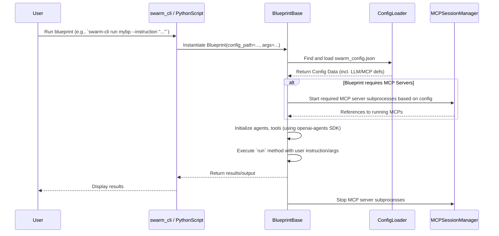
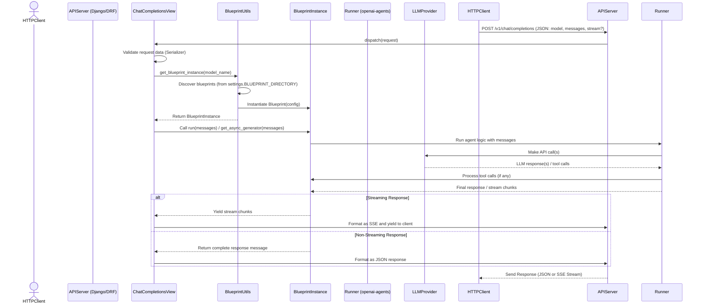

# Open Swarm: Development Documentation

This document provides an in-depth look at the **Open Swarm** framework’s internal architecture, component interactions, and development practices. It is intended for developers and contributors who wish to modify or extend the framework.

---

## Table of Contents

- [Core Architecture](#core-architecture)
- [Project Layout](#project-layout)
- [Configuration System](#configuration-system)
- [Blueprint Development](#blueprint-development)
- [MCP Server Integration](#mcp-server-integration)
- [Command-Line Interface (`swarm-cli`)](#command-line-interface-swarm-cli)
- [REST API (`swarm-api` / Django)](#rest-api-swarm-api--django)
- [Directory Structure (XDG Compliance)](#directory-structure-xdg-compliance)
- [Testing Strategy](#testing-strategy)
- [Docker Deployment Details](#docker-deployment-details)
- [Sequence Diagrams](#sequence-diagrams)

---

## Core Architecture

Open Swarm combines a command-line interface (`swarm-cli`) for local management and execution with a Django/DRF-based REST API (`swarm-api`) for network-accessible interaction.

*   **Agent Core:** Leverages the `openai-agents` SDK for defining agent behaviors, tool usage, and interaction logic.
*   **Blueprints (`BlueprintBase`):** Encapsulate the definition of an agent swarm, including agent setup, coordination logic, required configuration (LLMs, MCPs, environment variables), and potentially custom CLI arguments or Django extensions.
*   **Configuration (`swarm_config.json`):** Centralizes definitions for LLM provider profiles and MCP server configurations, allowing flexible swapping and management. Environment variables (via `.env`) are used for sensitive keys.
*   **`swarm-cli`:** Provides user-facing commands (built with `typer`) for managing the lifecycle of blueprints (add, list, run, install, delete) and editing the configuration file. Uses XDG directories for user-specific data. Installed via PyPI (`pip install open-swarm`).
*   **`swarm-api`:** A Django application exposing installed blueprints via an OpenAI-compatible REST API (`/v1/models`, `/v1/chat/completions`). Uses DRF for views and serializers. Authentication is handled via static API tokens. Deployed preferably via Docker.

---

## Project Layout

```
.
├── Dockerfile                  # Defines the container build process for swarm-api
├── docker-compose.yaml         # Base Docker Compose configuration for swarm-api
├── docker-compose.override.yaml.example # Example for swarm-api customizations
├── manage.py                   # Django management script (used by swarm-api)
├── pyproject.toml              # Project metadata and dependencies (for uv/pip, used by both CLI and API)
├── setup.py                    # Legacy setup file (consider removing if pyproject.toml is sufficient)
├── src/
│   └── swarm/
│       ├── __init__.py
│       ├── apps.py                 # Django app configuration (API)
│       ├── auth.py                 # API Authentication logic (API)
│       ├── blueprints/             # Default location for blueprints loaded by API server (API)
│       │   ├── README.md           # Overview of example blueprints
│       │   ├── echocraft/
│       │   └── ... (other blueprint directories)
│       ├── extensions/             # Core framework extensions (used by both CLI and API)
│       │   ├── __init__.py
│       │   ├── blueprint/          # Blueprint base class, discovery, utils
│       │   │   ├── __init__.py
│       │   │   ├── blueprint_base.py
│       │   │   ├── blueprint_discovery.py
│       │   │   └── blueprint_utils.py
│       │   ├── cli/                # swarm-cli implementation (CLI)
│       │   │   ├── __init__.py
│       │   │   ├── commands/       # Subcommands for blueprint/config management
│       │   │   ├── main.py         # Typer app definition (likely invoked by launcher)
│       │   │   └── utils.py
│       │   ├── config/             # Configuration loading logic (used by both)
│       │   │   ├── __init__.py
│       │   │   └── config_loader.py
│       │   └── launchers/          # Entry points defined in pyproject.toml/setup.py (CLI/API)
│       │       ├── __init__.py
│       │       ├── swarm_api.py    # Wrapper to launch Django API server (API)
│       │       ├── swarm_cli.py    # Main entry point for swarm-cli (CLI)
│       │       └── build_swarm_wrapper.py # Script using PyInstaller for `swarm-cli install` (CLI)
│       ├── management/             # Custom Django management commands (API)
│       ├── migrations/             # Django database migrations (API)
│       ├── models.py               # Django models (API, if any)
│       ├── permissions.py          # DRF API permissions (API)
│       ├── serializers.py          # DRF API serializers (API)
│       ├── settings.py             # Django settings (API)
│       ├── static/                 # Static files for Web UI (API)
│       ├── templates/              # Django HTML templates (API)
│       ├── urls.py                 # Django URL routing (API)
│       ├── views/                  # Django/DRF Views (API)
│       │   ├── __init__.py
│       │   ├── api_views.py        # Views for /v1/models etc.
│       │   ├── chat_views.py       # View for /v1/chat/completions
│       │   └── utils.py            # View utility functions (blueprint loading etc.)
│       └── wsgi.py                 # WSGI entry point (API)
├── tests/                      # Automated tests (run during development)
│   ├── api/                    # Tests for the REST API endpoints
│   ├── blueprints/             # Integration tests for specific blueprints
│   └── unit/                   # Unit tests for core components (config, utils, etc.)
├── .env.example                # Example environment variables file
└── swarm_config.json.example   # Example configuration file
```

---

## Configuration System

*   **Primary File:** `swarm_config.json`.
*   **Location:**
    *   **`swarm-cli`:** Uses XDG paths (default: `~/.config/swarm/swarm_config.json`).
    *   **`swarm-api` (Docker):** Typically mounted from the host (e.g., `./swarm_config.json` mapped to `/app/swarm_config.json`).
*   **Loading:** Handled by `swarm.extensions.config.config_loader`. It searches upwards from the current directory, then checks the default XDG path (primarily relevant for `swarm-cli`).
*   **Structure:** Contains top-level keys like `llm` (for LLM profiles) and `mcpServers`.
*   **Secrets:** Use environment variable placeholders (e.g., `"${OPENAI_API_KEY}"`) in `swarm_config.json` and define actual values in a `.env` file or the runtime environment.
*   **Management:** Use `swarm-cli config` commands to manage the default XDG config file (see `USERGUIDE.md`).

---

## Blueprint Development

*   **Inheritance:** Blueprints must inherit from `swarm.extensions.blueprint.blueprint_base.BlueprintBase`.
*   **Core Logic:** Implement the `run` method (often async) for agent orchestration using `openai-agents` SDK.
*   **Configuration:** Access loaded configuration via `self.config`, LLM profiles via `self.get_llm_profile("profile_name")`.
*   **MCP Servers:** Define requirements in metadata; access running instances via `self.mcp_servers["server_name"]`.
*   **Metadata:** Define `blueprint_name`, `description`, `required_env_vars`, `required_mcp_servers`.
*   **CLI Integration:** Define custom arguments in the blueprint's `main` method for `swarm-cli run`.

---

## MCP Server Integration

*   **Definition:** Defined in the `mcpServers` section of `swarm_config.json` (`command`, `args`, `env`, `cwd`).
*   **Lifecycle:** `BlueprintBase` starts/stops required MCP servers as subprocesses when run via `swarm-cli` or direct execution. (Note: Lifecycle management within the long-running API server might differ or require external management).
*   **Interaction:** Agents use tools provided by `openai-agents` library.

---

## Command-Line Interface (`swarm-cli`)

*   **Installation:** `pip install open-swarm`
*   **Framework:** `typer`.
*   **Entry Point:** Defined in `pyproject.toml` (points to `src/swarm/extensions/launchers/swarm_cli.py`).
*   **Commands:** Implemented in `src/swarm/extensions/cli/commands/`.
*   **Installation (`swarm-cli install`):** Uses `PyInstaller` to create standalone executables from managed blueprints.
*   **User Data Management:** Uses XDG paths (`platformdirs`).

---

## REST API (`swarm-api` / Django)

*   **Deployment:** Docker recommended (`docker compose up -d`). Can also be run locally via `uv run python manage.py runserver`.
*   **Framework:** Django + DRF.
*   **Core Views:** `ChatCompletionsView` (`/v1/chat/completions`), `ModelsListView` (`/v1/models`).
*   **Blueprint Loading:** Discovers blueprints from `settings.BLUEPRINT_DIRECTORY` (differs from `swarm-cli`'s XDG path). Use Docker volumes to provide blueprints.
*   **Authentication:** Static token via `SWARM_API_KEY` in `.env`.

---

## Directory Structure (XDG Compliance)

`swarm-cli` uses standard user directories managed via `platformdirs`:

*   **Configuration (`swarm_config.json`):** `~/.config/swarm/swarm_config.json`
*   **Managed Blueprint Sources:** `~/.local/share/swarm/blueprints/`
*   **Installed CLI Binaries:** `~/.local/share/swarm/bin/` (Needs to be in `PATH`)
*   **Build Cache (PyInstaller):** `~/.cache/swarm/build/`

---

## Testing Strategy

*   **Framework:** `pytest`.
*   **Structure:** `tests/unit/`, `tests/blueprints/`, `tests/api/`.
*   **Mocking:** Use `unittest.mock` for external services.
*   **Fixtures:** Use `pytest` fixtures for setup.
*   **Running:** `uv run pytest <path>`.

---

## Docker Deployment Details

*   **`Dockerfile`:** Builds the API service image. Installs dependencies via `pip install .`. Runs migrations and starts Django server via `CMD`.
*   **`docker-compose.yaml`:** Defines the `open-swarm` service using a pre-built image by default. Mounts `./blueprints`, `./swarm_config.json`, `./db.sqlite3` from host.
*   **`docker-compose.override.yaml`:** Allows user customization (additional volumes, local build, env vars).

---

## Sequence Diagrams

*(Diagrams remain the same as previous version)*

### 1. Blueprint Initialization (Direct Run / CLI)


### 2. API Request Handling (`/v1/chat/completions`)


---

*This document is a work in progress. Contributions and corrections are welcome.*
