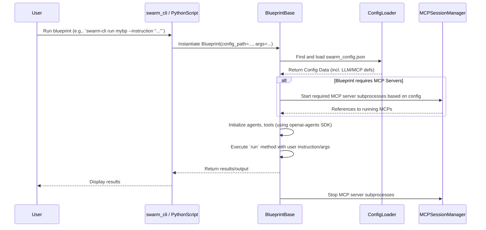
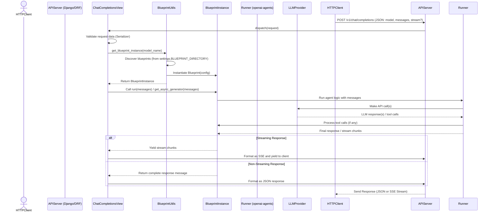

# Open Swarm: Development Documentation

This document provides an in-depth look at the **Open Swarm** framework’s internal architecture, component interactions, and development practices. It is intended for developers and contributors who wish to modify or extend the framework.

---

## Table of Contents

- [Core Architecture](#core-architecture)
- [Project Layout](#project-layout)
- [Configuration System](#configuration-system)
- [Blueprint Development](#blueprint-development)
- [MCP Server Integration](#mcp-server-integration)
- [Command-Line Interface (`swarm-cli`)](#command-line-interface-swarm-cli)
- [REST API (`swarm-api` / Django)](#rest-api-swarm-api--django)
- [Directory Structure (XDG Compliance)](#directory-structure-xdg-compliance)
- [Testing Strategy](#testing-strategy)
- [Docker Deployment Details](#docker-deployment-details)
- [Sequence Diagrams](#sequence-diagrams)

---

## Core Architecture

Open Swarm combines a command-line interface (`swarm-cli`) for local management and execution with a Django/DRF-based REST API (`swarm-api`) for network-accessible interaction.

*   **Agent Core:** Leverages the `openai-agents` SDK for defining agent behaviors, tool usage, and interaction logic.
*   **Blueprints (`BlueprintBase`):** Encapsulate the definition of an agent swarm, including agent setup, coordination logic, required configuration (LLMs, MCPs, environment variables), and potentially custom CLI arguments or Django extensions.
*   **Configuration (`swarm_config.json`):** Centralizes definitions for LLM provider profiles and MCP server configurations, allowing flexible swapping and management. Environment variables (via `.env`) are used for sensitive keys.
*   **`swarm-cli`:** Provides user-facing commands (built with `typer`) for managing the lifecycle of blueprints (add, list, run, install, delete) and editing the configuration file. Uses XDG directories for user-specific data.
*   **`swarm-api`:** A Django application exposing installed blueprints via an OpenAI-compatible REST API (`/v1/models`, `/v1/chat/completions`). Uses DRF for views and serializers. Authentication is handled via static API tokens.

---

## Project Layout

```
.
├── Dockerfile                  # Defines the container build process
├── docker-compose.yaml         # Base Docker Compose configuration
├── docker-compose.override.yaml.example # Example for user customizations
├── manage.py                   # Django management script
├── pyproject.toml              # Project metadata and dependencies (for uv/pip)
├── setup.py                    # Legacy setup file (consider removing if pyproject.toml is sufficient)
├── src/
│   └── swarm/
│       ├── __init__.py
│       ├── apps.py                 # Django app configuration
│       ├── auth.py                 # API Authentication logic
│       ├── blueprints/             # Default location for blueprints loaded by API server
│       │   ├── README.md           # Overview of example blueprints
│       │   ├── echocraft/
│       │   └── ... (other blueprint directories)
│       ├── extensions/             # Core framework extensions
│       │   ├── __init__.py
│       │   ├── blueprint/          # Blueprint base class, discovery, utils
│       │   │   ├── __init__.py
│       │   │   ├── blueprint_base.py
│       │   │   ├── blueprint_discovery.py
│       │   │   └── blueprint_utils.py
│       │   ├── cli/                # swarm-cli implementation
│       │   │   ├── __init__.py
│       │   │   ├── commands/       # Subcommands for blueprint/config management
│       │   │   ├── main.py         # Typer app definition (likely invoked by launcher)
│       │   │   └── utils.py
│       │   ├── config/             # Configuration loading logic
│       │   │   ├── __init__.py
│       │   │   └── config_loader.py
│       │   └── launchers/          # Entry points for CLI/API
│       │       ├── __init__.py
│       │       ├── swarm_api.py    # Wrapper to launch Django API server
│       │       ├── swarm_cli.py    # Main entry point for swarm-cli (uses typer)
│       │       └── build_swarm_wrapper.py # Script using PyInstaller for `swarm-cli install`
│       ├── management/             # Custom Django management commands
│       ├── migrations/             # Django database migrations
│       ├── models.py               # Django models (if any)
│       ├── permissions.py          # DRF API permissions
│       ├── serializers.py          # DRF API serializers
│       ├── settings.py             # Django settings
│       ├── static/                 # Static files for Web UI (CSS, JS, images)
│       ├── templates/              # Django HTML templates
│       ├── urls.py                 # Django URL routing
│       ├── views/                  # Django/DRF Views
│       │   ├── __init__.py
│       │   ├── api_views.py        # Views for /v1/models etc.
│       │   ├── chat_views.py       # View for /v1/chat/completions
│       │   └── utils.py            # View utility functions (blueprint loading etc.)
│       └── wsgi.py                 # WSGI entry point
├── tests/                      # Automated tests
│   ├── api/                    # Tests for the REST API endpoints
│   ├── blueprints/             # Integration tests for specific blueprints
│   └── unit/                   # Unit tests for core components (config, utils, etc.)
├── .env.example                # Example environment variables file
└── swarm_config.json.example   # Example configuration file
```

---

## Configuration System

*   **Primary File:** `swarm_config.json`.
*   **Location:** `swarm-cli` and blueprints run via `swarm-cli` look for it using XDG paths (defaulting to `~/.config/swarm/swarm_config.json`). The API server's config path might be different depending on deployment (e.g., mounted via Docker).
*   **Loading:** Handled by `swarm.extensions.config.config_loader`. It searches upwards from the current directory, then checks the default XDG path.
*   **Structure:** Contains top-level keys like `llm` (for LLM profiles) and `mcpServers`.
*   **Secrets:** Sensitive information like API keys should **not** be stored directly in `swarm_config.json`. Instead, use environment variable placeholders (e.g., `"${OPENAI_API_KEY}"`) and define the actual values in a `.env` file or the runtime environment. `os.path.expandvars` is used internally to substitute these values.
*   **Management:** Use `swarm-cli config` commands to manage the default XDG config file (see `USERGUIDE.md`).

---

## Blueprint Development

*   **Inheritance:** Blueprints must inherit from `swarm.extensions.blueprint.blueprint_base.BlueprintBase`.
*   **Core Logic:** Implement the `run` method (often async) which typically involves:
    *   Initializing agents using `openai-agents` SDK (`Agent`, `AssistantAgent`, etc.).
    *   Defining tools (using `@function_tool` or integrating MCP tools).
    *   Orchestrating agent interactions using `Runner`.
*   **Configuration:** Access loaded configuration via `self.config`. Access specific LLM profiles via `self.get_llm_profile("profile_name")`.
*   **MCP Servers:** Define required MCP servers in the blueprint's metadata. Access running MCP server instances via `self.mcp_servers["server_name"]`. The `BlueprintBase` handles starting/stopping configured MCP servers.
*   **Metadata:** Define class-level metadata like `blueprint_name`, `description`, `required_env_vars`, `required_mcp_servers`.
*   **CLI Integration:** Optionally define custom command-line arguments using `argparse` within the blueprint's `main` method (or a dedicated argument parsing method called by `main`). `swarm-cli run` passes extra arguments to this method.

---

## MCP Server Integration

*   **Definition:** MCP servers are defined in the `mcpServers` section of `swarm_config.json`. Each entry specifies the `command`, `args`, `env` variables, and potentially `cwd` needed to start the server process.
*   **Lifecycle:** When a blueprint requiring MCP servers is run (via `swarm-cli run` or direct execution), the `BlueprintBase` initialization logic:
    1.  Reads the required servers from the blueprint's metadata.
    2.  Looks up their definitions in the loaded `swarm_config.json`.
    3.  Starts each required MCP server as a subprocess using `asyncio.create_subprocess_exec`.
    4.  Manages the lifecycle of these subprocesses, ensuring they are terminated when the blueprint finishes.
*   **Interaction:** Agents within the blueprint interact with MCP servers using the tools provided by the `openai-agents` library, which handles the underlying communication protocol.

---

## Command-Line Interface (`swarm-cli`)

*   **Framework:** Built using `typer` for a clean command structure and automatic help generation.
*   **Entry Point:** `src/swarm/extensions/launchers/swarm_cli.py`.
*   **Commands:** Subcommands (e.g., `add`, `list`, `run`, `install`, `config`) are implemented in `src/swarm/extensions/cli/commands/`.
*   **Installation (`swarm-cli install`):** Uses `PyInstaller` (via `src/swarm/extensions/launchers/build_swarm_wrapper.py` or similar logic) to bundle a blueprint and its dependencies into a single executable.
*   **User Data Management:** Relies heavily on XDG paths (via `platformdirs`) to store blueprint sources, configuration, and installed binaries.

---

## REST API (`swarm-api` / Django)

*   **Framework:** Standard Django application using Django REST Framework (DRF).
*   **Launch:** Typically started via `uv run python manage.py runserver` or the `swarm-api` launcher script.
*   **Core Views:**
    *   `swarm.views.chat_views.ChatCompletionsView`: Handles POST requests to `/v1/chat/completions`. Supports streaming and non-streaming responses. Instantiates and runs the appropriate blueprint based on the `model` field in the request.
    *   `swarm.views.api_views.ModelsListView`: Handles GET requests to `/v1/models`. Lists available blueprints by discovering them from `settings.BLUEPRINT_DIRECTORY`.
*   **Blueprint Loading:** Uses `swarm.views.utils.get_available_blueprints` and `get_blueprint_instance` which rely on `swarm.extensions.blueprint.blueprint_discovery.discover_blueprints`. **Crucially, this discovers blueprints from the path specified in `settings.BLUEPRINT_DIRECTORY`, which is often different from the XDG path used by `swarm-cli`.**
*   **Authentication:** Uses `swarm.auth.StaticTokenAuthentication`. If `settings.ENABLE_API_AUTH` is `True` (based on `SWARM_API_KEY` in `.env`), it requires a valid `Authorization: Bearer <token>` header matching `settings.SWARM_API_KEY`.
*   **Serialization:** Uses DRF serializers (`swarm.serializers`) to validate incoming requests and format outgoing responses according to the OpenAI API specification.

---

## Directory Structure (XDG Compliance)

`swarm-cli` uses standard user directories managed via `platformdirs`:

*   **Configuration (`swarm_config.json`):**
    *   Default: `~/.config/swarm/swarm_config.json` (`$XDG_CONFIG_HOME/swarm/`)
*   **Managed Blueprint Sources:**
    *   Default: `~/.local/share/swarm/blueprints/` (`$XDG_DATA_HOME/swarm/blueprints/`)
*   **Installed CLI Binaries:**
    *   Default: `~/.local/share/swarm/bin/` (Subdir within user data dir)
    *   *Note: Users need to add this to their `PATH`.*
*   **Build Cache (PyInstaller):**
    *   Default: `~/.cache/swarm/build/` (`$XDG_CACHE_HOME/swarm/build/`)

*(Note: Exact paths on macOS/Windows might differ slightly. Full cross-platform testing is needed.)*

---

## Testing Strategy

*   **Framework:** `pytest` is the primary test runner.
*   **Structure:** Tests are organized by type:
    *   `tests/unit/`: Test individual functions, classes, or modules in isolation. Mock external dependencies (LLMs, file system, network calls).
    *   `tests/blueprints/`: Integration tests for specific blueprints. May involve mocking LLM calls but testing the interaction between agents and potentially mocked MCP servers.
    *   `tests/api/`: Test the Django REST API endpoints using `pytest-django` and DRF's test client. Test request/response formats, authentication, and integration with blueprint loading.
*   **Mocking:** Use `unittest.mock` (`MagicMock`, `patch`) extensively, especially for external services (LLMs, MCPs) and filesystem operations.
*   **Fixtures:** Utilize `pytest` fixtures to set up common test data, configurations, or mock objects (e.g., mock `swarm_config.json`, temporary directories).
*   **Running Tests:** Use `uv run pytest <path_to_tests>` (e.g., `uv run pytest tests/unit`).

---

## Docker Deployment Details

*   **`Dockerfile`:**
    *   Uses a Python slim base image.
    *   Installs system dependencies (`git`, build tools, `sqlite3`).
    *   Copies the entire project context.
    *   Installs Python dependencies using `pip install .` (leveraging `pyproject.toml`).
    *   Exposes the runtime `PORT`.
    *   The default `CMD` handles database migrations (`manage.py migrate`) and starts the Django server (`manage.py runserver`). Includes logic for swapfile creation and handling existing/empty databases.
*   **`docker-compose.yaml`:**
    *   Defines the `open-swarm` service (and potentially others like `redis`).
    *   Uses a pre-built image (`mhand79/open-swarm:latest`) by default.
    *   Maps the host `PORT` to the container `PORT`.
    *   Loads environment variables from the host's `.env` file.
    *   **Mounts Volumes:** Critically, it mounts `./blueprints`, `./swarm_config.json`, and `./db.sqlite3` from the host into the container at `/app/`. This overrides any bundled blueprints/config and makes the API server use the host's versions.
*   **`docker-compose.override.yaml`:**
    *   Users should rename `docker-compose.override.yaml.example` to this file.
    *   Allows adding *additional* volume mounts (e.g., for custom blueprint directories), overriding environment variables, or switching to building the image locally instead of using the pre-built one.

---

## Sequence Diagrams

*(Keep existing Mermaid diagrams or update/add new ones as needed to illustrate key flows like `swarm-cli install`, API request handling, etc.)*

### 1. Blueprint Initialization (Direct Run / CLI)


### 2. API Request Handling (`/v1/chat/completions`)


---

*This document is a work in progress. Contributions and corrections are welcome.*
