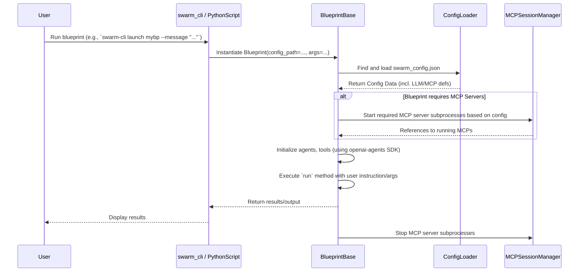
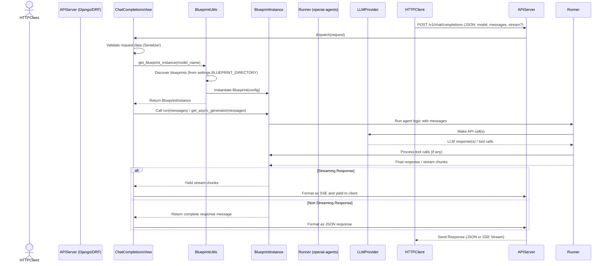

# Open Swarm: Development Documentation

This document provides an in-depth look at the **Open Swarm** framework’s internal architecture, component interactions, and development practices. It is intended for developers and contributors who wish to modify or extend the framework.

---

## Tech Stack

The primary design components, ordered by significance. Every entry is verified against `pyproject.toml`, `webui/frontend/package.json`, or actual imports in the tree.

| Component | Role | Where |
|---|---|---|
| **Python** (3.10+) | Primary language: framework core, blueprints, CLI, API server | `src/swarm/`, `pyproject.toml` |
| **TypeScript** | Language of the React SPA frontend | `webui/frontend/src/` |
| **Django 4.2 + DRF** | REST API (`/v1/*`), server-rendered template UI, auth, ORM | `src/swarm/settings.py`, `src/swarm/views/`, `src/swarm/urls.py` |
| **Django Channels** (+ Daphne) | Websocket chat (`/ws/ai-demo/`) over ASGI | `src/swarm/asgi.py`, `src/swarm/consumers.py`, `src/swarm/routing.py` |
| **React 18** (+ React Router 6) | SPA frontend, served by Django when `webui/frontend/dist/` is built | `webui/frontend/src/` |
| **openai-agents SDK** | Agent/tool/handoff core that blueprints orchestrate | blueprint implementations under `src/swarm/blueprints/` |
| **DaisyUI 5 + Tailwind CSS 4** | SPA component library and styling | `webui/frontend/package.json`, `webui/frontend/src/index.css` |
| **Vite 8** | SPA build and dev tooling | `webui/frontend/vite.config.ts` |
| **TanStack react-query 5** | SPA server-state fetching/caching against the REST API | `webui/frontend/src/main.tsx` and pages |
| **Typer** | `swarm-cli` command-line framework | `src/swarm/core/swarm_cli.py` |
| **pytest** (+ pytest-django, -asyncio, -timeout, …) | 600+ test suite, keyless via `SWARM_TEST_MODE` | `tests/`, `[dev]`/`[test]` extras in `pyproject.toml` |
| **uv** | Python environment / dependency management and task runner | `uv.lock`, README quickstarts, CI |
| **Playwright** | Headless Chromium for documentation screenshot captures (and SPA test tooling) | `scripts/capture_user_journey.py`, `webui/frontend` devDependencies |
| **Docker / docker compose** | Recommended deployment of the API server | `Dockerfile`, `docker-compose.yaml` |

---

## Table of Contents

- [Tech Stack](#tech-stack)
- [Core Architecture](#core-architecture)
- [Project Layout](#project-layout)
- [Configuration System](#configuration-system)
- [Blueprint Development](#blueprint-development)
- [MCP Server Integration](#mcp-server-integration)
- [Command-Line Interface (`swarm-cli`)](#command-line-interface-swarm-cli)
- [REST API (`swarm-api` / Django)](#rest-api-swarm-api--django)
- [Directory Structure (XDG Compliance)](#directory-structure-xdg-compliance)
- [Testing Strategy](#testing-strategy)
- [Docker Deployment Details](#docker-deployment-details)
- [Sequence Diagrams](#sequence-diagrams)

---

## Core Architecture

Open Swarm combines a command-line interface (`swarm-cli`) for local management and execution with a Django/DRF-based REST API (`swarm-api`) for network-accessible interaction.

*   **Agent Core:** Leverages the `openai-agents` SDK for defining agent behaviors, tool usage, and interaction logic.
*   **Blueprints (`BlueprintBase`):** Encapsulate the definition of an agent swarm, including agent setup, coordination logic, required configuration (LLMs, MCPs, environment variables), and potentially custom CLI arguments or Django extensions.
*   **Configuration (`swarm_config.json`):** Centralizes definitions for LLM provider profiles and MCP server configurations, allowing flexible swapping and management. Environment variables (via `.env`) are used for sensitive keys.
*   **`swarm-cli`:** Provides user-facing commands (built with `typer`) for managing blueprints. Commands available today: `list`, `launch`, `install`, `install-executable` (legacy commands such as `add`/`delete`/`config` referenced by older docs are not currently shipped — see ROADMAP.md). Uses XDG directories for user-specific data. Installed via PyPI (`pip install open-swarm`).
*   **`swarm-api`:** A Django application exposing installed blueprints via an OpenAI-compatible REST API (`/v1/models`, `/v1/chat/completions`). Uses DRF for views and serializers. Authentication is handled via static API tokens. Deployed preferably via Docker.

---

## Project Layout

```
.
├── Dockerfile                  # Defines the container build process for swarm-api
├── docker-compose.yaml         # Base Docker Compose configuration for swarm-api
├── docker-compose.override.yaml.example # Example for swarm-api customizations
├── manage.py                   # Django management script (used by swarm-api)
├── pyproject.toml              # Project metadata and dependencies (for uv/pip, used by both CLI and API)
├── setup.py                    # Legacy setup file (consider removing if pyproject.toml is sufficient)
├── src/
│   └── swarm/
│       ├── __init__.py
│       ├── apps.py                 # Django app configuration (API)
│       ├── auth.py                 # API Authentication logic (API)
│       ├── blueprints/             # Default location for blueprints loaded by API server (API)
│       │   ├── README.md           # Overview of example blueprints
│       │   ├── echocraft/
│       │   └── ... (other blueprint directories)
│       ├── extensions/             # Core framework extensions (used by both CLI and API)
│       │   ├── __init__.py
│       │   ├── blueprint/          # Blueprint base class, discovery, utils
│       │   │   ├── __init__.py
│       │   │   ├── blueprint_base.py
│       │   │   ├── blueprint_discovery.py
│       │   │   └── blueprint_utils.py
│       │   ├── cli/                # swarm-cli implementation (CLI)
│       │   │   ├── __init__.py
│       │   │   ├── commands/       # Subcommands for blueprint/config management
│       │   │   ├── main.py         # Typer app definition (likely invoked by launcher)
│       │   │   └── utils.py
│       │   ├── config/             # Configuration loading logic (used by both)
│       │   │   ├── __init__.py
│       │   │   └── config_loader.py
│       │   └── launchers/          # Entry points defined in pyproject.toml/setup.py (CLI/API)
│       │       ├── __init__.py
│       │       ├── swarm_api.py    # Wrapper to launch Django API server (API)
│       │       ├── swarm_cli.py    # Main entry point for swarm-cli (CLI)
│       │       └── build_swarm_wrapper.py # Script using PyInstaller for `swarm-cli install` (CLI)
│       ├── management/             # Custom Django management commands (API)
│       ├── migrations/             # Django database migrations (API)
│       ├── models.py               # Django models (API, if any)
│       ├── permissions.py          # DRF API permissions (API)
│       ├── serializers.py          # DRF API serializers (API)
│       ├── settings.py             # Django settings (API)
│       ├── static/                 # Static files for Web UI (API)
│       ├── templates/              # Django HTML templates (API)
│       ├── urls.py                 # Django URL routing (API)
│       ├── views/                  # Django/DRF Views (API)
│       │   ├── __init__.py
│       │   ├── api_views.py        # Views for /v1/models etc.
│       │   ├── chat_views.py       # View for /v1/chat/completions
│       │   └── utils.py            # View utility functions (blueprint loading etc.)
│       └── wsgi.py                 # WSGI entry point (API)
├── tests/                      # Automated tests (run during development)
│   ├── api/                    # Tests for the REST API endpoints
│   ├── blueprints/             # Integration tests for specific blueprints
│   └── unit/                   # Unit tests for core components (config, utils, etc.)
├── .env.example                # Example environment variables file
└── swarm_config.json.example   # Example configuration file
```

---

## Configuration System

*   **Primary File:** `swarm_config.json`.
*   **Location:**
    *   **`swarm-cli`:** Uses XDG paths (default: `~/.config/swarm/swarm_config.json`).
    *   **`swarm-api` (Docker):** Typically mounted from the host (e.g., `./swarm_config.json` mapped to `/app/swarm_config.json`).
*   **Loading:** Handled by `swarm.extensions.config.config_loader`. It searches upwards from the current directory, then checks the default XDG path (primarily relevant for `swarm-cli`).
*   **Structure:** Contains top-level keys like `llm` (for LLM profiles) and `mcpServers`.
*   **Secrets:** Use environment variable placeholders (e.g., `"${OPENAI_API_KEY}"`) in `swarm_config.json` and define actual values in a `.env` file or the runtime environment.
*   **Management:** Edit the config file directly (the `swarm-cli config` subcommands referenced by older docs are not currently shipped; see `USERGUIDE.md`).

---

## Blueprint Development

*   **Inheritance:** Blueprints must inherit from `swarm.extensions.blueprint.blueprint_base.BlueprintBase`.
*   **Core Logic:** Implement the `run` method (often async) for agent orchestration using `openai-agents` SDK.
*   **Configuration:** Access loaded configuration via `self.config`, LLM profiles via `self.get_llm_profile("profile_name")`.
*   **MCP Servers:** Define requirements in metadata; access running instances via `self.mcp_servers["server_name"]`.
*   **Metadata:** Define `blueprint_name`, `description`, `required_env_vars`, `required_mcp_servers`.
*   **CLI Integration:** Define custom arguments in the blueprint's `main` method; they apply when running the blueprint executable or its module entry point directly (`swarm-cli launch` itself only forwards `--message`).

---

## MCP Server Integration

*   **Definition:** Defined in the `mcpServers` section of `swarm_config.json` (`command`, `args`, `env`, `cwd`).
*   **Lifecycle:** `BlueprintBase` starts/stops required MCP servers as subprocesses when run via `swarm-cli` or direct execution. (Note: Lifecycle management within the long-running API server might differ or require external management).
*   **Interaction:** Agents use tools provided by `openai-agents` library.

---

## Command-Line Interface (`swarm-cli`)

*   **Installation:** `pip install open-swarm`
*   **Framework:** `typer`.
*   **Entry Point:** Defined in `pyproject.toml` (`swarm-cli = "swarm.core.swarm_cli:app"`).
*   **Commands:** `list`, `launch`, `install`, `install-executable` — implemented in `src/swarm/core/swarm_cli.py`. (A legacy CLI implementation also exists under `src/swarm/extensions/cli/`; consolidation is tracked in ROADMAP.md.)
*   **Installation (`swarm-cli install`):** Uses `PyInstaller` to create standalone executables from managed blueprints.
*   **User Data Management:** Uses XDG paths (`platformdirs`).
*   **ANSI/Styling & Terminal Support:** Use Rich's `Console` to detect terminal capabilities (`console.is_terminal` and `console.color_system`) and apply ANSI color/styling when supported, with graceful fallback.
*   **Hook Flags:** The `launch` command supports `--pre`, `--listen`, and `--post` flags to run additional blueprints before, during, and after the main invocation.
*   **Slash Commands:** Define slash commands in `swarm_config.json` under the `slashCommands` section; they’re available in the interactive shell for templated prompt invocations.
*   **Blueprint as Tool:** Use `blueprint_tool('name')` from `swarm.core.blueprint_utils` to invoke one blueprint from another synchronously, enabling composite workflows and guardrails.
*   **Unified UX Base:** All blueprints should use `print_search_progress_box` from `swarm.core.output_utils` for consistent spinners, progress updates, and result boxes, ensuring compliance under `SWARM_TEST_MODE`.

---

## REST API (`swarm-api` / Django)

*   **Deployment:** Docker recommended (`docker compose up -d`). Can also be run locally via `uv run python manage.py runserver`.
*   **Framework:** Django + DRF.
*   **Core Views:** `ChatCompletionsView` (`/v1/chat/completions`), `ModelsListView` (`/v1/models`).
*   **Blueprint Loading:** Discovers blueprints from `settings.BLUEPRINT_DIRECTORY` (differs from `swarm-cli`'s XDG path). Use Docker volumes to provide blueprints.
*   **Authentication:** Static token via `SWARM_API_KEY` in `.env`.

---

## Directory Structure (XDG Compliance)

`swarm-cli` uses standard user directories managed via `platformdirs`:

*   **Configuration (`swarm_config.json`):** `~/.config/swarm/swarm_config.json`
*   **Managed Blueprint Sources:** `~/.local/share/swarm/blueprints/`
*   **Installed CLI Binaries:** `~/.local/share/swarm/bin/` (Needs to be in `PATH`)
*   **Build Cache (PyInstaller):** `~/.cache/swarm/build/`

---

## Testing Strategy

*   **Framework:** `pytest`.
*   **Structure:** `tests/unit/`, `tests/blueprints/`, `tests/api/`.
*   **Mocking:** Use `unittest.mock` for external services.
*   **Fixtures:** Use `pytest` fixtures for setup.
*   **Running:** `uv run pytest <path>`.
*   **Config (`pytest.ini`):** coverage is auto-enabled (`--cov=src/swarm`,
    non-failing), so a bare `pytest` already reports coverage — no extra flags
    needed. A few heavy/legacy blueprint suites (`test_codey*`, `test_chatbot`)
    are excluded by default via `--ignore-glob`; run them explicitly by path.
*   **Keyless runs:** set `SWARM_TEST_MODE=1` for deterministic, network-free
    blueprint output (no provider keys required).
*   **OpenAI SDK types:** tool-call type imports guard for both `openai<1.99`
    (concrete `ChatCompletionMessageToolCall`) and `>=1.99` (Union +
    `ChatCompletionMessageFunctionToolCall`) — keep new imports version-tolerant.

---

## Docker Deployment Details

*   **`Dockerfile`:** Builds the API service image. Installs dependencies via `pip install .`. Runs migrations and starts Django server via `CMD`.
*   **`docker-compose.yaml`:** Defines the `open-swarm` service using a pre-built image by default. Mounts `./blueprints`, `./swarm_config.json`, `./db.sqlite3` from host.
*   **`docker-compose.override.yaml`:** Allows user customization (additional volumes, local build, env vars).

---

## Sequence Diagrams

*(Diagrams remain the same as previous version)*

### 1. Blueprint Initialization (Direct Run / CLI)

```mermaid
sequenceDiagram
    participant User
    participant swarm_cli / PythonScript
    participant BlueprintBase
    participant ConfigLoader
    participant MCPSessionManager

    User->>swarm_cli / PythonScript: Run blueprint (e.g., `swarm-cli launch mybp --message "..."`)
    swarm_cli / PythonScript->>BlueprintBase: Instantiate Blueprint(config_path=..., args=...)
    BlueprintBase->>ConfigLoader: Find and load swarm_config.json
    ConfigLoader-->>BlueprintBase: Return Config Data (incl. LLM/MCP defs)
    alt Blueprint requires MCP Servers
        BlueprintBase->>MCPSessionManager: Start required MCP server subprocesses based on config
        MCPSessionManager-->>BlueprintBase: References to running MCPs
    end
    BlueprintBase->>BlueprintBase: Initialize agents, tools (using openai-agents SDK)
    BlueprintBase->>BlueprintBase: Execute `run` method with user instruction/args
    BlueprintBase-->>swarm_cli / PythonScript: Return results/output
    swarm_cli / PythonScript-->>User: Display results
    BlueprintBase->>MCPSessionManager: Stop MCP server subprocesses
```

### 2. API Request Handling (`/v1/chat/completions`)

```mermaid
sequenceDiagram
    actor Client as HTTPClient
    participant APIServer (Django/DRF)
    participant ChatCompletionsView
    participant BlueprintUtils
    participant BlueprintInstance
    participant Runner (openai-agents)
    participant LLMProvider

    HTTPClient->>APIServer: POST /v1/chat/completions (JSON: model, messages, stream?)
    APIServer->>ChatCompletionsView: dispatch(request)
    ChatCompletionsView->>ChatCompletionsView: Validate request data (Serializer)
    ChatCompletionsView->>BlueprintUtils: get_blueprint_instance(model_name)
    BlueprintUtils->>BlueprintUtils: Discover blueprints (from settings.BLUEPRINT_DIRECTORY)
    BlueprintUtils->>BlueprintInstance: Instantiate Blueprint(config)
    BlueprintUtils-->>ChatCompletionsView: Return BlueprintInstance
    ChatCompletionsView->>BlueprintInstance: Call run(messages) / get_async_generator(messages)
    BlueprintInstance->>Runner: Run agent logic with messages
    Runner->>LLMProvider: Make API call(s)
    LLMProvider-->>Runner: LLM response(s) / tool calls
    Runner->>BlueprintInstance: Process tool calls (if any)
    Runner-->>BlueprintInstance: Final response / stream chunks
    alt Streaming Response
        BlueprintInstance-->>ChatCompletionsView: Yield stream chunks
        ChatCompletionsView->>APIServer: Format as SSE and yield to client
    else Non-Streaming Response
        BlueprintInstance-->>ChatCompletionsView: Return complete response message
        ChatCompletionsView->>APIServer: Format as JSON response
    end
    APIServer-->>HTTPClient: Send Response (JSON or SSE Stream)
```

---

### UX Improvements & Design Decisions

- **ANSI/Styling & Terminal Support:** Use Rich's `Console` for reliable detection of ANSI-capable terminals (`Console().is_terminal` and `Console().color_system`), enabling styled, colored CLI output when supported.
- **CLI Framework:** Built with Typer. We leverage `context_settings` (`allow_extra_args`, `ignore_unknown_options`) to support slash commands, pre-listen-post hooks, and other advanced UX features.
- **Pre-/Listener-/Post- Hooks:** The `launch` command accepts `--pre`, `--listen`, and `--post` flags (comma-separated blueprint names) to chain multiple blueprint invocations in a single CLI call.
- **Slash Commands:** Defined under `slashCommands` in `swarm_config.json`. Slash command definitions contain:
  - `blueprint`: target blueprint name
  - `promptTemplate`: Jinja-style template for the prompt (e.g. `"Compact: {{ history }}"`)
  - `llmProfile`: which LLM profile to use (defaults to `default`)
  
- **Blueprint as Tool:** `blueprint_tool(name)` returns a callable that wraps a blueprint as a sync tool; useful for injecting one blueprint’s logic into another.
   - **Unified UX Utilities:** All blueprints should use `print_search_progress_box` from `swarm.core.output_utils` for spinners, progress updates, and final result boxes. Under `SWARM_TEST_MODE`, outputs are deterministic for automated compliance.

   ---
   ## Multi-Agent Orchestration Workflows

   Blueprints can be composed into multi-agent pipelines:
   1. **Discovery:** Coordinator reads tasks (e.g., `TODO.md`) via `read_file_tool`.
   2. **Planning:** Coordinator uses `Runner.run()` to select the next task.
   3. **Dispatch:** Invoke a worker blueprint via `blueprint_tool('worker')`.
   4. **Verification:** Use another blueprint to verify results.
   5. **Update:** Coordinator writes back to `TODO.md` via `write_file_tool`.

   Example skeleton in ZeusBlueprint:
   ```python
   from swarm.core.blueprint_utils import blueprint_tool
   from swarm.core.blueprint_base import BlueprintBase

   class ZeusBlueprint(BlueprintBase):
       async def run(self, messages, **kwargs):
           todo = self.read_file_tool.func('TODO.md')
           task = blueprint_tool('suggestion')(f"Select one TODO: {todo}")
           result = blueprint_tool('codey')(task)
           verify = blueprint_tool('suggestion')(f"Verify '{task}': {result}")
           if 'yes' in verify.lower():
               updated = todo.replace(task, f"~{task}~ (done)")
               self.write_file_tool.func('TODO.md', updated)
           yield { 'messages': [{ 'role': 'assistant', 'content': "Task completed and TODO updated." }] }
   ```

   *This document is a work in progress. Contributions and corrections are welcome.*
