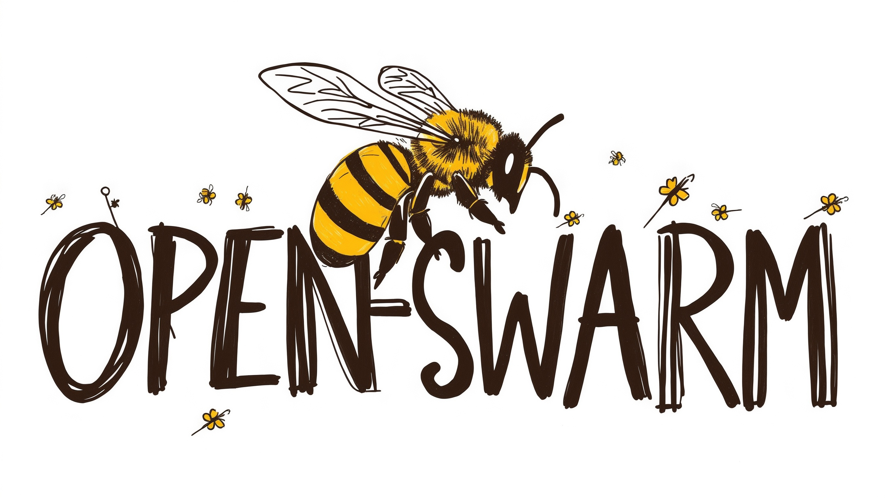

# 🚀 Open Swarm — S-Tier Onboarding

Welcome to Open Swarm! Orchestrate, manage, and run AI agent blueprints with S-tier onboarding and UX polish.

## Quickstart

1. List available blueprints:
   ```bash
   swarm-cli list
   ```
2. Install a blueprint as a standalone CLI executable (e.g., Codey):
```bash
swarm-cli install codey
# or install and manage via uv-run if developing locally:
# uv run swarm-cli install codey
```
3. Launch the installed blueprint (and optionally use pre-, listen-, and post- hooks):
   ```bash
   # Basic launch with a message
   swarm-cli launch codey --message "Hello, world!"

   # Composite workflow: run suggestion first, codey main task, then post-process with rue_code
   swarm-cli launch codey \
     --message "Generate a recursive algorithm example" \
     --pre suggestion \
     --listen suggestion \
     --post rue_code
   ```

For advanced features, see below or run `swarm-cli help`.

### Team Wizard (Create a New Team)

Open Swarm includes an interactive wizard to scaffold a new team blueprint and optionally install a CLI shortcut.

- Interactive:

  ```bash
  swarm-cli wizard
  ```

  Prompts for team name, description, agents, and whether to create a shortcut. If an LLM is configured (`OPENAI_API_KEY` or `LITELLM_API_KEY`), you may opt to refine the spec using a constrained JSON step.

- Non-interactive:

  ```bash
  swarm-cli wizard --non-interactive \
    -n "Demo Team" \
    -r "Coordinator:lead, Engineer:code" \
    --output-dir ./my_blueprints \
    --bin-dir ./my_bin
  ```

  Flags:
  - `--name/-n`: Team name
  - `--description/-d`: One-line description
  - `--abbreviation/-a`: CLI shortcut name (defaults to slugified name)
  - `--agents/-r`: Comma-separated `Name:role` entries
  - `--use-llm [--model]`: Use LLM with constrained JSON to refine the spec (requires API key)
  - `--no-shortcut`: Skip creating the CLI shortcut
  - `--output-dir`, `--bin-dir`: Control output locations (useful in sandboxes/CI)

Outputs:
- A Python file at `<output-dir>/<slug>/blueprint_<slug>.py` that subclasses `BlueprintBase`.
- Optionally a CLI shortcut at `<bin-dir>/<abbreviation>` that runs the blueprint.

Tips:
- If you’re new or don’t have config keys set yet, the launcher will hint: `swarm-cli wizard`.
- For reproducible paths in CI/containers, set `SWARM_USER_DATA_DIR` to override default platformdirs locations or use `--output-dir/--bin-dir`.

## Using Blueprints as Tools

Blueprints can now be invoked programmatically as tools within other blueprints. Use the `blueprint_tool` helper in your blueprint’s `tools` list:
```python
from swarm.core.blueprint_utils import blueprint_tool

class MyBlueprint(BlueprintBase):
    def create_starting_agent(...):
        suggestion_tool = blueprint_tool('suggestion')
        agent = Agent(
            name='MyAgent',
            model=..., 
            tools=[suggestion_tool],
            ...
        )
        return agent
```
This allows you to route sub-instructions to other blueprints and integrate their output seamlessly into your workflows.

## Sharing Blueprints via GitHub Topics

You can discover community blueprints and MCP config templates by leveraging GitHub topics instead of a centralized catalog. Repositories opt in by tagging their repo with topics like:

- `open-swarm-blueprint` — repository contains one or more Open Swarm blueprints
- `open-swarm-mcp-template` — repository contains MCP configuration templates (no secrets)

Our Web UI (and optional headless endpoints) can search GitHub for these topics and list items. Repos may include a top‑level `open-swarm.json` or per‑item manifests under `swarm/blueprints/<name>/manifest.json` or `swarm/mcp/<name>/manifest.json`. Manifests must be safe for publication (no secrets), using placeholders like `${VAR}`.

See `docs/github_marketplace.md` for the discovery plan and conventions.

## End‑to‑End: Marketplace → Local Config → Secure MCP

At a glance:
- Discover/import a blueprint (from GitHub topics or Wagtail editorials).
- Configure required MCP servers locally (per user; templates never include secrets).
- Expose local MCP tools under `/mcp/` (optional, behind `ENABLE_MCP_SERVER`).
- Secure MCP with the local IdP (SAML already scaffolded; OAuth/OIDC recommended for token‑based clients).
- Configure your MCP client to use the local `/mcp/` endpoint with a token and run tasks against the blueprint tools.

See `docs/architecture_marketplace_to_mcp.md` for the high‑level flow.

# Open Swarm

<div align="center">

</div>

**Open Swarm** is a Python framework for creating, managing, and deploying autonomous agent swarms. It leverages the `openai-agents` library for core agent functionality and provides a structured way to build complex, multi-agent workflows using **Blueprints**.

Open Swarm can be used in two primary ways:

1.  **As a CLI Utility (`swarm-cli`):** Manage, run, and install blueprints directly on your local machine. Ideal for personal use, testing, and creating standalone agent tools. (Recommended installation: PyPI)
2.  **As an API Service (`swarm-api`):** Deploy a web server that exposes your blueprints via an OpenAI-compatible REST API. Ideal for integrations, web UIs, and shared access. (Recommended deployment: Docker)

---

## Development Setup (Editable Install)

If you are working from a cloned repository or developing Open Swarm locally, install the package and its extras before using the CLI or API tools:

```bash
# Using pip:
pip install -e .[all-extras]

# Or, if you manage environments with the 'uv' tool:
uv add .[all-extras]
uv sync --all-extras
```

## Environment Variables

Open Swarm uses a `.env` file for runtime configuration. To get started:

```bash
cp .env.example .env
```

Edit `.env` and fill in the required values, such as:

- **Core Configuration**
  - `DEBUG`                — "True" or "False" for verbose logging
  - `HOST`                 — network interface (e.g., "0.0.0.0")
  - `PORT`                 — port number (e.g., "8000")

- **Database Configuration**
  - `DJANGO_DATABASE`      — e.g., "sqlite" or "postgres"
  - `SQLITE_DB_PATH`       — path to SQLite database file
  - (Postgres only) `POSTGRES_DB`, `POSTGRES_USER`, `POSTGRES_PASSWORD`, `POSTGRES_HOST`, `POSTGRES_PORT`

- **Core API Keys**
  - `OPENAI_API_KEY`       — your OpenAI API key
  - `BRAVE_API_KEY`        — (optional) API key for Brave search

- **Blueprint-specific Variables**
  - `WEATHER_API_KEY`      — (optional) weather blueprint key
  - `QDRANT_URL`           — (optional) Qdrant vector DB endpoint
  - `QDRANT_API_KEY`       — (optional) Qdrant API key
  - `FLOWISE_API_KEY`      — (optional) Flowise integration key
  - `FLOWISE_API_ENDPOINT` — (optional) Flowise service URL
  - `SERPAPI_API_KEY`      — (optional) SerpAPI key for search operations
  - `WP_SITES_PATH`        — (optional) path to WordPress sites JSON

- **Miscellaneous / Operational**
  - `ENABLE_ADMIN`         — "true"/"false" to enable Django admin UI
  - `ENABLE_WEBUI`         — "true"/"false" to enable web frontend
  - `STATEFUL_CHAT_ID_PATH`— JMESPath/file path for stateful chat IDs
  - `SWARM_BLUEPRINTS`     — comma-separated list of blueprints to enable
  - `DEFAULT_LLM`          — default LLM profile name (e.g., "default")
  - `SUPPRESS_DUMMY_KEY`   — "true"/"false" to suppress dummy-key warnings

Refer to `.env.example` for a full list of supported variables and blueprint-specific requirements.

## Building Standalone CLI Executables

You can generate standalone executables for your blueprints in one of three ways:

1. Using the built-in CLI installer:
   ```bash
   swarm-cli install <blueprint_name>
   # Installs a one-file executable in your user bin dir (e.g., ~/.local/share/swarm/bin/<blueprint_name>)
   ```

2. Using the provided helper script (example builds the `codey` blueprint):
   ```bash
   python build_blueprint_executables.py
   # By default this script packages the 'codey' blueprint into a standalone binary
   ```

3. Manually via PyInstaller:
   ```bash
   pip install pyinstaller
   pyinstaller --onefile --name <blueprint_name> \
       --distpath dist \
       --workpath build \
       --specpath . \
       src/swarm/blueprints/<blueprint_name>/blueprint_<blueprint_name>.py
   # Executable output: ./dist/<blueprint_name>
   ```
   
   Or use the provided PyInstaller spec files under `pyinstaller_specs/`. For example, to build `codey`:
   ```bash
   pyinstaller --onefile --specpath pyinstaller_specs \
       --distpath . pyinstaller_specs/codey.spec
   # Executable output: ./codey
   ```

This ensures that the `swarm-cli` and `swarm-api` commands point to the latest source code and are available in your PATH. After running this, you can use the CLI commands as described below.

---

## Configuration & Quickstart

See [CONFIGURATION.md](./CONFIGURATION.md) for a full guide to Swarm configuration—including LLM setup, MCP server integration, per-blueprint overrides, pricing, and CLI vs manual workflows.

You can configure everything interactively using `swarm-cli config` subcommands or by manually editing your config file (see guide for details and examples).

---

## Advanced Configuration

Open Swarm supports multiple LLM profiles and MCP server definitions in your central config (`~/.config/swarm/swarm_config.json`).

Example configuration:
```json
{
  "llm": {
    "openai_default": {
      "provider": "openai",
      "model": "gpt-4o",
      "base_url": "https://api.openai.com/v1",
      "api_key": "${OPENAI_API_KEY}"
    },
    "ollama_llama2": {
      "provider": "ollama",
      "model": "llama2",
      "base_url": "http://localhost:11434",
      "api_key": "${OLLAMA_API_KEY}"
    }
  },
  "mcpServers": {
    "filesystem": {
      "command": "npx",
      "args": ["-y", "@modelcontextprotocol/server-filesystem", "${ALLOWED_PATH}"],
      "env": { "ALLOWED_PATH": "${ALLOWED_PATH}" }
    }
  }
}
```

Add or update via CLI:
```bash
swarm-cli config add --section llm --name openai_default --json '{"provider":"openai","model":"gpt-4o","base_url":"https://api.openai.com/v1","api_key":"${OPENAI_API_KEY}"}'
swarm-cli config add --section llm --name ollama_llama2 --json '{"provider":"ollama","model":"llama2","base_url":"http://localhost:11434","api_key":"${OLLAMA_API_KEY}"}'
swarm-cli config add --section mcpServers --name filesystem --json '{"command":"npx","args":["-y","@modelcontextprotocol/server-filesystem","${ALLOWED_PATH}"],"env":{"ALLOWED_PATH":"${ALLOWED_PATH}"}}'
```

Select a profile for a run by setting the `DEFAULT_LLM` env var:
```bash
export DEFAULT_LLM=ollama_llama2
swarm-cli launch codey --message "Test with Llama2"
```
Or override at launch via blueprint-specific flags (e.g., Codey’s `--model`):
```bash
swarm-cli launch codey --message "Test with Llama2" --model llama2
```

---

## Slash Commands

You can define **slash commands** in your `swarm_config.json` to invoke blueprints or custom prompts directly from the CLI chat interface. Slash commands are top-level lines beginning with `/`, e.g. `/compact`.

Schema in `swarm_config.json`:
```json
{
  "slashCommands": {
    "compact": {
      "blueprint": "suggestion",
      "promptTemplate": "Compact the following conversation history:\n{{history}}",
      "llmProfile": "default"
    }
  }
}
```

Add a slash command via CLI:
```bash
swarm-cli config add \
  --section slashCommands \
  --name compact \
  --json '{  
    "blueprint":"suggestion",  
    "promptTemplate":"Compact the following conversation history:\n{{history}}",  
    "llmProfile":"default"  
}'
```

Usage example in interactive chat (after launching without a message):
```
# Installed executable:
codey
# Or launch without installing an executable:
swarm-cli launch codey
swarm> Hello, world!
<assistant> [normal response]
swarm> /compact
<assistant> [compact summary of conversation]
```

Tip (development with uv):
- List: `uv run swarm-cli list`
- Install: `uv run swarm-cli install codey`
- Launch: `uv run swarm-cli launch codey --message "..."`

Tip (development with uv):
- List: `uv run swarm-cli list`
- Install: `uv run swarm-cli install codey`
- Launch: `uv run swarm-cli launch codey --message "..."`

Tip: If you prefer uv in development:
- List: `uv run swarm-cli list`
- Install: `uv run swarm-cli install codey`
- Launch: `uv run swarm-cli launch codey --message "..."`

Slash commands use the configured `llmProfile` (defaulting to `default`) and apply the `promptTemplate`, injecting the current conversation history. You can override per-command or globally via environment variables.
  
# Bundled vs. Custom Blueprints

Open Swarm ships with **bundled blueprints** (e.g., `codey`, `suggestion`, `poets`) that you can run directly. To list, install, and launch these:
```bash
swarm-cli list
swarm-cli install codey
swarm-cli launch codey --message "Hello from bundled Codey"
```

To use your own custom blueprint source, add and launch from the managed blueprints directory:
```bash
swarm-cli add ./path/to/blueprint_custom.py --name custom
swarm-cli launch custom --message "Run custom logic"
```

If you prefer to invoke uninstalled REST or Python scripts directly:
```bash
python -m swarm.blueprints.custom.blueprint_custom --message "Hello direct"
```

> **Note:** In development mode, some CLI commands or features may differ from the published PyPI version. If you encounter issues, ensure you have run `pip install -e .` and that your environment is activated.

---

## Core Framework TODO

- [x] Unified interactive approval mode for all blueprints (core, CLI/API flag, boxed UX)
- [x] Enhanced ANSI/emoji output for search, analysis, and file ops (core BlueprintUX)
- [x] Custom spinner/progress messages (core and per-blueprint personality)
- [x] Persistent session logging/audit trail (core, opt-in per blueprint)
- [x] Automatic context/project file injection for agent prompts
- [x] User feedback/correction loop for agent actions
- [x] API/CLI flag for enabling/disabling advanced UX features
  - [x] Support desktop notifications (`--notify`)
  - [x] Support attaching image inputs (`--image`, `-i`)
  - [x] Support inspecting past sessions via `--view`, `-v`)
  - [x] Support opening instructions file with `--config`, `-c`)
  - [x] Support whitelisting sandbox write roots (`--writable-root`, `-w`)
  - [x] Support disabling project docs (`--no-project-doc`)
  - [x] Support full stdout (`--full-stdout`)
  - [x] Support dangerous auto-approve (`--dangerously-auto-approve-everything`)
  - [x] Support shell completion subcommand (`completion <bash|zsh|fish>`)
  - [x] Support full-context mode (`--full-context`, `-f`)
- [x] Model selection overlay and CLI/agent-specific support
- [x] Session/history management and overlays
- [x] Full-context mode for large refactor/analysis
- [x] Writable root/sandboxing CLI/config support
- [x] Command suggestions/typeahead/autocomplete for CLI and slash commands
- [x] Help and onboarding overlays
- [x] Desktop notification support (optional)
- [x] Dangerous auto-approve flag/UX
- [x] Output formatting/full stdout option
- [x] Image input (CLI/UX, future-proof)
- [ ] Security review: command sanitization, safe execution wrappers
- [ ] Documentation: core feature usage, extension points, UX guidelines

---

## 🚀 Unified Blueprint Search & Analysis UX

Open Swarm blueprints now deliver a consistent, branded, and user-friendly experience for all search and analysis operations. Each blueprint leverages:

- **ANSI/emoji result boxes** summarizing search/analysis results, parameters, and counts
- **Progress spinners** ("Generating...", "Taking longer than expected") with live line/progress updates
- **Distinct emoji branding** for each blueprint (e.g., 🌳 Family Ties, 🪶 Unapologetic Poets, 🦢 Gaggle)
- **Clear feedback** for subprocess management and onboarding

<!-- BLUEPRINT_TABLE_START -->
<!-- The following table is auto-generated. Do not edit manually. Run scripts/gen_blueprint_table.py to update. -->

| Emoji | Name | Description | Example Commands | Branding |
|-------|------|-------------|------------------|----------|
|  | `ChatbotBlueprint` | A basic conversational agent that responds to user input. |  |  |
| 😇 | `Chuck's Angels` | A blueprint for coordinating angelic tasks, Chuck Norris style. |  |  |
|  | `JeevesBlueprint` | Provides private web search (DuckDuckGo) and home automation (Home Assistant) via specialized agents (Jeeves, Mycroft, Gutenberg). |  |  |
|  | `MCPDemoBlueprint` | A scalable agent (Sage) demonstrating interaction with filesystem and memory MCP servers, supporting horizontal scaling and viral file operations. |  |  |
|  | `MissionImprobableBlueprint` | A cheeky team led by JimFlimsy (coordinator), CinnamonToast (strategist/filesystem), and RollinFumble (operative/shell). Uses SQLite for instructions. |  |  |
|  | `MonkaiMagicBlueprint` | A *Monkai Magic*-inspired crew managing AWS, Fly.io, and Vercel with pre-authenticated CLI tools and agent-as-tool delegation. |  |  |
|  | `NebulaShellzzarBlueprint` | A multi-agent blueprint inspired by The Matrix for system administration and coding tasks. |  |  |
|  | `OmniplexBlueprint` | Dynamically delegates tasks to agents (Amazo:npx, Rogue:uvx, Sylar:other) based on the command type of available MCP servers. |  |  |
|  | `RueCode` | Generates, executes code, and interacts with the file system. |  |  |
|  | `StewieBlueprint` | Manages WordPress content using Stewie (main agent) and other helpers as tools. |  |  |
|  | `StewieBlueprint` | Manages WordPress content using Stewie (main agent) and other helpers as tools. |  |  |
|  | `SuggestionBlueprint` | An agent that provides structured suggestions using Agent(output_type=...). |  |  |
|  | `WhiskeyTangoFoxtrotBlueprint` | Tracks free online services with SQLite and web search using a multi-tiered agent hierarchy. |  |  |
| 🤖 | `codey` | Code and semantic code search/analysis. Provides tools for code understanding, generation, and modification. | swarm-cli launch cdy --instruction "/codesearch recursion . 5"<br>swarm-cli launch cdy --instruction "/semanticsearch asyncio . 3" | Unified ANSI/emoji box UX, spinner, progress, summary |
|  | `dynamic-team` | A dynamically-registered team using a configured LLM profile |  |  |
<!-- BLUEPRINT_TABLE_END -->

- All commands support `/analyze` as well as `/search` (e.g., `/analyze beta . 5`).
- Try the commands above to see the new UX in action!

### Key Features
- **Result counts** and summaries in every result box
- **Live progress updates** during long-running operations
- **Custom spinner messages** for clear feedback
- **Fallback echo** for other commands, always in a result box

---

## 🚀 Unified Spinner and Result Output for Blueprints

All blueprints must use `print_search_progress_box` for spinner/progress/result output. See [`src/swarm/blueprints/blueprint_template.py`](src/swarm/blueprints/blueprint_template.py) for a canonical implementation.

- Distinguish between code and semantic search.
- Show spinner sequence: "Generating.", "Generating..", "Generating...", "Running...", and "Generating... Taking longer than expected".
- Update line numbers and result counts during progress.
- Always emit a summary/result box at the end.
- Pass all test suite checks for spinner/result output.

**Review Checklist:**
- [ ] Uses `print_search_progress_box` for all output
- [ ] Distinguishes code/semantic search
- [ ] Shows spinner sequence and “Taking longer than expected”
- [ ] Progress boxes update lines/results
- [ ] Passes all tests

---

## Continuous Compliance

This project uses an automated compliance audit for all blueprint metadata. Every push and pull request is checked for standards compliance via GitHub Actions. If any blueprint fails compliance, the build will fail.

- Audit script: `scripts/audit_blueprint_compliance.py`
- Workflow: `.github/workflows/compliance-audit.yml`

To run the audit locally:

```bash
python3 scripts/audit_blueprint_compliance.py
```

---

## Blueprint UX Compliance & Test Mode

Open Swarm blueprints must provide a consistent, user-friendly CLI experience. All blueprints must:
- Display custom spinner messages: `Generating.`, `Generating..`, `Generating...`, `Running...`, and `Generating... Taking longer than expected` for long operations.
- Use ANSI/emoji boxes to summarize operations, results, and parameters (see `print_search_progress_box`).
- Clearly distinguish between code search, semantic search, and analysis operations in the output.
- Test mode (`SWARM_TEST_MODE=1`) is only required for automated compliance tests; normal usage omits this.
- For more, see `docs/blueprint_standards.md` and `docs/blueprint_test_mode_ux.md`.

To check compliance or debug output, run:
```bash
uv run pytest -v tests/blueprints
```

For automated compliance checking, see `scripts/check_ux_compliance.py`.

---

## What to Try Next

- **Try Code Search:**
  - `swarm-cli codey /codesearch <keyword> <path> <max_results>`
  - Example: `swarm-cli codey /codesearch recursion . 5`
  - Try `/semanticsearch` for semantic code search with rich result boxes, result counts, and progressive spinner.

- **Try WhingeSurf Async UX:**
  - `swarm-cli whinge_surf !run sleep 2`
  - Then: `swarm-cli whinge_surf !status <process_id>`
  - Demonstrates async subprocess management and status polling.

- **Discover Blueprints:**
  - `swarm-cli info <blueprint>`
  - Shows blueprint description, usage, and onboarding tips.

- **Get Help:**
  - `swarm-cli --help` or `swarm-cli codey --help`
  - For onboarding, command list, and usage examples.

---

## Core Concepts

*   **Agents:** Individual AI units performing specific tasks, powered by LLMs (like GPT-4, Claude, etc.). Built using the `openai-agents` SDK.
*   **Blueprints:** Python classes (`BlueprintBase` subclasses) defining a swarm's structure, agents, coordination logic, and external dependencies (like required environment variables or MCP servers). They act as reusable templates for specific tasks (e.g., code generation, research, data analysis).
*   **MCP (Model Context Protocol) Servers:** Optional external processes providing specialized capabilities (tools) to agents, such as filesystem access, web browsing, database interaction, or interacting with specific APIs (Slack, Monday.com, etc.). Agents interact with MCP servers via a standardized communication protocol.
*   **Configuration (`swarm_config.json`):** A central JSON file defining available LLM profiles (API keys, models) and configurations for MCP servers. Typically managed via `swarm-cli` in `~/.config/swarm/`.
*   **`swarm-cli`:** A command-line tool for managing blueprints (adding, listing, running, installing) and the `swarm_config.json` file. Uses XDG directories for storing blueprints (`~/.local/share/swarm/blueprints/`) and configuration (`~/.config/swarm/`).
*   **`swarm-api`:** A launcher for the Django/DRF backend that exposes installed blueprints via an OpenAI-compatible REST API (`/v1/models`, `/v1/chat/completions`).

---

## Installation

### Option 1: Install from PyPI (Recommended for most users)

```bash
pip install open-swarm
```

This will install the `swarm-cli` and `swarm-api` command-line tools to your PATH (typically `~/.local/bin/` for user installs).

- Run `swarm-cli --help` or `swarm-api --help` to verify installation.

### Option 2: Install from Local Source (for development and testing)

Clone the repository and install in editable mode:

```bash
git clone https://github.com/matthewhand/open-swarm.git
cd open-swarm
pip install -e .
```

- This makes `swarm-cli` and `swarm-api` available from your local copy. Changes to the code are immediately reflected.
- You can now test your local changes before pushing to PyPI.

#### Local CLI Usage Example

```bash
swarm-cli --help
# Use the current commands:
swarm-cli list
swarm-cli install hello_world
swarm-cli launch hello_world --message "Hello from CLI!"
python src/swarm/blueprints/hello_world/blueprint_hello_world.py "Hello from CLI!"
./hello_world "Hello from CLI!"
# API usage documented in the Docker section below
```

If you do not see the commands in your PATH, ensure `~/.local/bin` is in your PATH:

```bash
export PATH="$HOME/.local/bin:$PATH"
```

---

## Configuration Management & Secrets

Open Swarm uses a modern, XDG-compliant config structure:

- Main config: `~/.config/swarm/swarm_config.json`
- Secrets: `~/.config/swarm/.env`
- Example config: `swarm_config.json.example` (in project root)

### Deploying/Initializing Config

1.  **Copy the advanced example config:**
   ```bash
   cp ./swarm_config.json ~/.config/swarm/swarm_config.json
   ```
2.  **Copy your .env file:**
   ```bash
   cp .env ~/.config/swarm/.env
   ```

### Config Structure (Advanced Example)

Your `swarm_config.json` can include rich LLM profiles, MCP server definitions, and blueprint metadata. Example:

```json
{
  "llm": {
    "default": {
      "provider": "openai",
      "model": "${LITELLM_MODEL}",
      "base_url": "${LITELLM_BASE_URL}",
      "api_key": "${LITELLM_API_KEY}"
    },
    ...
  },
  "mcpServers": {
    "git": {
      "description": "Provides Git operations via Docker.",
      "command": "docker",
      "args": ["run", "--rm", ...]
    },
    ...
  },
  "blueprints": {
    "defaults": { "max_llm_calls": 10 },
    "MyBlueprint": { "llm_profile": "default" }
  }
}
```
- **Secrets** (like API keys) are always referenced as `${ENV_VAR}` in the config and stored in `.env`.

### Editing Config with `swarm-cli`

- Use `swarm-cli` to add/edit/remove/list:
  - LLMs
  - MCP servers
  - Blueprints
- When prompted for secrets, they are stored in `~/.config/swarm/.env`, not in the JSON.

---

## Environment Variables

Open Swarm and its blueprints use a variety of environment variables for configuration, security, and integration with external services. Set these in your shell, `.env` file, Docker environment, or deployment platform as appropriate.

### Core Framework Environment Variables

| Variable                 | Description                                                      | Default / Required         |
|--------------------------|------------------------------------------------------------------|----------------------------|
| `OPENAI_API_KEY`         | API key for OpenAI LLMs (used by agents and blueprints)           | Required for OpenAI usage  |
| `SWARM_API_KEY`          | API key for securing API endpoints (swarm-api)                   | Optional (recommended)     |
| `LITELLM_BASE_URL`       | Override base URL for LiteLLM/OpenAI-compatible endpoints        | Optional                   |
| `LITELLM_API_KEY`        | API key for LiteLLM endpoints                                    | Optional                   |
| `SWARM_CONFIG_PATH`      | Path to the main Swarm config file (`swarm_config.json`)          | `../swarm_config.json`     |
| `BLUEPRINT_DIRECTORY`    | Directory containing blueprint files                              | `src/swarm/blueprints`     |
| `DJANGO_SECRET_KEY`      | Django secret key (for API mode)                                 | Auto-generated/dev default |
| `DJANGO_DEBUG`           | Enable Django debug mode                                         | `True`                     |
| `DJANGO_ALLOWED_HOSTS`   | Comma-separated allowed hosts for Django API                      | `localhost,127.0.0.1`      |
| `API_AUTH_TOKEN`         | Token for authenticating API requests                            | Optional                   |
| `DJANGO_LOG_LEVEL`       | Log level for Django app                                         | `INFO`                     |
| `SWARM_LOG_LEVEL`        | Log level for Swarm app                                          | `DEBUG`                    |
| `REDIS_HOST`             | Host for Redis (if used)                                         | `localhost`                |
| `REDIS_PORT`             | Port for Redis (if used)                                         | `6379`                     |
| `DJANGO_CSRF_TRUSTED_ORIGINS` | Comma-separated trusted origins for CSRF protection           | `http://localhost:8000,...`|
| `ENABLE_ADMIN`           | Enable admin web interface                                      | `false`                    |
| `ENABLE_API_AUTH`        | Require API authentication                                      | `true`                     |

#### Blueprint/Tool-Specific Variables
- Some blueprints and MCP tools may require additional env vars (e.g., Google API keys, Slack tokens, etc.).
- Refer to the blueprint's docstring or config for details.

#### Usage Example
```bash
export OPENAI_API_KEY="sk-..."
export SWARM_API_KEY="..."
export LITELLM_BASE_URL="https://open-litellm.fly.dev/v1"
# ... set other variables as needed
```

---

## Toolbox Functionality

Open Swarm ships with a growing toolbox of agent and blueprint utilities. All features listed below have robust, passing tests unless marked as **WIP** (Work In Progress).

### Task Scheduler Toolbox
- **Schedule jobs with `at`:**
  - Schedule a shell script or command to run at a specific time (uses the system `at` command).
  - **Test Status:** Passing
- **List scheduled `at` jobs:**
  - List all jobs currently scheduled with `at`.
  - **Test Status:** Passing
- **Remove `at` jobs:**
  - Remove a scheduled job by its job ID.
  - **Test Status:** Passing
- **Schedule jobs with `cron`:**
  - Schedule recurring jobs using cron expressions (uses the system `crontab`).
  - **Test Status:** Passing
- **List scheduled `cron` jobs:**
  - List all jobs currently scheduled with `crontab`.
  - **Test Status:** Passing
- **Remove `cron` jobs:**
  - Remove a scheduled cron job by its job ID.
  - **Test Status:** Passing

### Slash Command Framework
- **Global slash command registry:**
  - Blueprints can register and use slash commands (e.g., `/help`, `/agent`, `/model`).
  - Built-in demo commands: `/help`, `/agent`, `/model`.
  - **Test Status:** Passing
- **Blueprint Integration:**
  - Blueprints can access the global registry and add their own commands.
  - **Test Status:** Passing

#### Usage Example (Slash Commands)
```python
from swarm.extensions.blueprint.slash_commands import slash_command_registry

@slash_command_registry.register('/hello')
def hello_command(args):
    return f"Hello, {args}!"
```

#### Usage Example (Task Scheduler)
```python
from swarm.extensions.task_scheduler_toolbox import schedule_at_job, list_at_jobs, remove_at_job

job_id = schedule_at_job('/path/to/script.sh', run_time='now + 5 minutes')
jobs = list_at_jobs()
remove_at_job(job_id)
```

---

## CLI Reference

### swarm-cli Usage

Note on legacy commands:
- `swarm-cli blueprints list` → use `swarm-cli list`
- `swarm-cli run <name> [--instruction ...]` → use `swarm-cli launch <name> [--message ...]`

```shell
Usage: swarm-cli [OPTIONS] COMMAND [ARGS]...

Swarm CLI tool for managing blueprints.

Options:
  --install-completion          Install completion for the current shell.
  --show-completion             Show completion for the current shell, to copy it or customize the installation.
  --help                        Show this message and exit.

Commands:
  install   Install a blueprint by creating a standalone executable using PyInstaller.
  launch    Launch a blueprint (works with installed executables or directly without install).
  list      List available blueprints (bundled, user-provided) and installed executables.
```

Legacy note:
- Older docs may reference `swarm-cli blueprints list` and `swarm-cli run`. Use `swarm-cli list` and `swarm-cli launch` instead.

### swarm-api Usage

```shell
# (No standalone swarm-api binary was found in dist/; see Docker/API section below for usage.)
```

---

## Developer Notes
- System dependencies are mocked in tests for CI and portability.
- Any toolbox feature not listed as **Passing** above is considered **WIP** and may not be stable.
- Contributions and feedback are welcome!

---

## Blueprint Metadata: Developer Guide

All blueprints must define a class-level `metadata` property for onboarding, CLI discovery, and documentation automation. This property should be a Python dictionary and include the following keys:

- `name`: The blueprint's canonical name (string)
- `emoji`: The blueprint's emoji branding (string)
- `description`: Short description for CLI/docs (string)
- `examples`: List of CLI example commands (list of strings)
- `commands`: List of supported commands (list of strings)
- `branding`: Description of the UX/branding features (string)

**Example:**
```python
class FamilyTiesBlueprint(BlueprintBase):
    metadata = {
        "name": "family_ties",
        "emoji": "🌳",
        "description": "Genealogy/family data search and analysis.",
        "examples": [
            "swarm-cli family_ties /search Smith . 5",
            "swarm-cli family_ties /analyze Johnson . 3"
        ],
        "commands": ["/search", "/analyze"],
        "branding": "Unified ANSI/emoji box UX, spinner, progress, summary"
    }
```

This metadata is used by the CLI for discovery and docs automation. Ensure the metadata stays in sync with README examples and CLI output. **Always update the `metadata` property when adding or modifying a blueprint.**

---

## Test Database Setup (Django + SQLite)

- The Django test database is configured to use a file in `/tmp` to avoid permission issues:
  - Path: `/tmp/tmp.FwE9ucN97b/test_db.sqlite3`
- Journal mode is set to `DELETE` for maximum compatibility and to avoid WAL file locking issues in CI and local runs.
- Before running tests, the test DB file is deleted to prevent corruption or stale locks.
- **Automated cleanup:** Use `make test` or run `bash scripts/pretest_cleanup.sh` before tests to automatically remove any stale test DB files in `/tmp`.
- If you encounter `readonly database` or `disk I/O error` during tests:
  1. Delete the test DB file manually: `rm -f /tmp/tmp.FwE9ucN97b/test_db.sqlite3`
  2. Or use `make pretest-clean` to remove all test DBs.
  3. Re-run your tests.
- For CI, add a pre-test cleanup step to always remove the test DB file before running tests (see `scripts/pretest_cleanup.sh`).
- To prevent DB lock/readonly errors, ensure `/tmp` has free space and is not mounted read-only.

---

## Troubleshooting
- Ensure `/tmp` has free space and is not mounted read-only.
- If you see persistent DB errors, check for OS-level security restrictions or concurrent test runs.

---

## Security
- Never commit `.env` or sensitive config files to version control.
- Review environment variable usage for API keys and secrets.

---

## Acknowledgements

This project builds upon concepts and code from the `openai-agents` library and potentially other open-source projects. Specific acknowledgements can be found in `DEVELOPMENT.md` or individual source files.

---

## License

Open Swarm is provided under the MIT License. Refer to the [LICENSE](LICENSE) file for full details.

---

## Contributing

Contributions are welcome! Please refer to the `CONTRIBUTING.md` file (if available) or open an issue/pull request on the repository.

> Note: Some older docs or blog posts may reference legacy commands:
> - `swarm-cli blueprints list` → use `swarm-cli list`
> - `swarm-cli run <name> [--instruction ...]` → use `swarm-cli launch <name> [--message ...]`

---

## Quickstart for Contributors

- **Run all tests and check UX compliance:**
  ```bash
  uv run pytest -v tests/blueprints
  python scripts/check_ux_compliance.py
  ```
- **Check code style (lint):**
  ```bash
  ruff check .
  ```
- **Check coverage:**
  ```bash
  uv run pytest --cov=src --cov-report=term-missing tests/blueprints
  ```
- **Add new blueprints:**
  - Follow the standards in `docs/blueprint_standards.md` and `docs/blueprint_test_mode_ux.md`.
  - Ensure spinner/box/emoji/summary output is present in test mode (`SWARM_TEST_MODE=1`).
  - Add or update tests in `tests/blueprints/`.
- **CI/CD:**
  - All PRs are checked for spinner/box/emoji/summary compliance, lint, and coverage.
  - Warnings are surfaced for missing UX elements in test mode, but do not block merges.

See the docs and scripts for more details on compliance and extending Open Swarm.

---

## Quickstart 1: Using `swarm-cli` Locally (via PyPI)

This is the recommended way to use `swarm-cli` for managing and running blueprints on your local machine.

**Prerequisites:**
*   Python 3.10+
*   `pip` (Python package installer)

**Steps:**

1.  **Install `open-swarm` from PyPI:**
    ```bash
    pip install open-swarm
    ```
    *(Using a virtual environment is recommended: `python -m venv .venv && source .venv/bin/activate`)*

2.  **Initial Configuration (First Run):**
    *   The first time you run a `swarm-cli` command that requires configuration (like `run` or `config`), it will automatically create a default `swarm_config.json` at `~/.config/swarm/swarm_config.json` if one doesn't exist.
    *   You **must** set the required environment variables (like `OPENAI_API_KEY`) in your shell for the configuration to work. Create a `.env` file in your working directory or export them:
        ```bash
        export OPENAI_API_KEY="sk-..."
        # Add other keys as needed (GROQ_API_KEY, etc.)
        ```
    *   You can customize the configuration further using `swarm-cli config` commands (see `USERGUIDE.md`).

3.  **Add a Blueprint:**
    *   Download or create a blueprint file (e.g., `my_blueprint.py`). Example blueprints are available in the [project repository](https://github.com/matthewhand/open-swarm/tree/main/src/swarm/blueprints).
    *   Add it using `swarm-cli`:
        ```bash
        # Example: Adding a downloaded blueprint file
        swarm-cli add ./path/to/downloaded/blueprint_hello_world.py

        # Example: Adding a directory containing a blueprint
        swarm-cli add ./my_custom_blueprints/agent_smith --name agent_smith
        ```

4.  **Run the Blueprint:**
    *   **Single Instruction (recommended, no install required):**
        ```bash
        swarm-cli launch hello_world --message "Hello from CLI!"
        ```
    *   **Interactive Mode:**
        ```bash
        # Installed executable:
        hello_world
        # Or launch without installing:
        swarm-cli launch hello_world
        # Now you can chat with the blueprint interactively
        ```
    *   **Direct Python or Binary Execution:**
        ```bash
        python src/swarm/blueprints/hello_world/blueprint_hello_world.py "Hello from CLI!"
        ./hello_world "Hello from CLI!"
        ```

5.  **(Optional) Install as Command:**
    ```bash
    swarm-cli install hello_world
    # Now run (ensure ~/.local/share/swarm/bin is in your PATH):
    ./hello_world Hello from CLI!
    ```

---

## Quickstart 2: Deploying `swarm-api` Service (via Docker)

This section covers deploying the API service using Docker.

### Option A: Docker Compose (Recommended for Flexibility)

This method uses `docker-compose.yaml` and is best if you need to customize volumes, environment variables easily, or manage related services (like Redis).

**Prerequisites:**
*   Docker ([Install Docker](https://docs.docker.com/engine/install/))
*   Docker Compose ([Install Docker Compose](https://docs.docker.com/compose/install/))
*   Git

**Steps:**

1.  **Clone the Repository:** (Needed for `docker-compose.yaml` and config files)
    ```bash
    git clone https://github.com/matthewhand/open-swarm.git
    cd open-swarm
    ```

2.  **Configure Environment:**
    *   Copy `cp .env.example .env` and edit `.env` with your API keys (e.g., `OPENAI_API_KEY`, `SWARM_API_KEY`).

3.  **Prepare Blueprints & Config:**
    *   Place blueprints in `./blueprints`.
    *   Ensure `./swarm_config.json` exists and is configured.

4.  **Configure Overrides (Optional):**
    *   Copy `cp docker-compose.override.yaml.example docker-compose.override.yaml`.
    *   Edit the override file to mount additional volumes, change ports, etc.

5.  **Start the Service:**
    ```bash
    docker compose up -d
    # Wait for healthcheck (or watch logs)
    # docker compose logs -f open-swarm
    ```

6.  **Verify API:** (Default port 8000)
    - Models:
      ```bash
      curl -sf http://localhost:8000/v1/models | jq .
      ```
    - Chat (non-streaming):
      ```bash
      curl -sf http://localhost:8000/v1/chat/completions \
        -H "Content-Type: application/json" \
        -H "Authorization: Bearer ${SWARM_API_KEY:-dev}" \
        -d '{
          "model": "echocraft",
          "messages": [
            {"role":"user","content":"ping"}
          ]
        }' | jq .
      ```
    Notes:
    - docker-compose ships with a healthcheck that waits for `/v1/models`.
    - Set `SWARM_API_KEY` in `.env` if API auth is enabled.
    - The compose now exports `PORT` (default 8000) and an optional `SWARM_BLUEPRINTS` default of `echocraft`.

### Option B: Direct `docker run` (Simpler for Single Container)

This method runs the pre-built image directly from Docker Hub. Good for quick tests or simple deployments without cloning the repo. Customization requires careful use of `-v` (volume) and `-e` (environment) flags.

**Prerequisites:**
*   Docker ([Install Docker](https://docs.docker.com/engine/install/))

**Steps:**

1.  **Prepare Local Files (If Customizing):**
    *   Create a directory for your blueprints (e.g., `~/my_swarm_blueprints`).
    *   Create your `swarm_config.json` file locally (e.g., `~/my_swarm_config.json`).
    *   Create a `.env` file locally (e.g., `~/swarm.env`) with your API keys (`OPENAI_API_KEY`, `SWARM_API_KEY`, etc.).

2.  **Run the Container:**
    ```bash
    docker run -d \
      --name open-swarm-api \
      -p 8000:8000 \
      --env-file ~/swarm.env \
      -v ~/my_swarm_blueprints:/app/blueprints:ro \
      -v ~/my_swarm_config.json:/app/swarm_config.json:ro \
      -v open_swarm_db:/app/db.sqlite3 \
      --restart unless-stopped \
      mhand79/open-swarm:latest
    ```
    *   `-d`: Run detached (in background).
    *   `--name`: Assign a name to the container.
    *   `-p 8000:8000`: Map host port 8000 to container port 8000 (adjust if needed).
    *   `--env-file`: Load environment variables from your local file.
    *   `-v ...:/app/blueprints:ro`: Mount your local blueprints directory (read-only). **Required** if you want to use custom blueprints.
    *   `-v ...:/app/swarm_config.json:ro`: Mount your local config file (read-only). **Required** for custom LLM/MCP settings.
    *   `-v open_swarm_db:/app/db.sqlite3`: Use a named Docker volume for the database to persist data.
    *   `--restart unless-stopped`: Automatically restart the container unless manually stopped.
    *   `mhand79/open-swarm:latest`: The image name on Docker Hub.

3.  **Verify API:** (Same as Docker Compose)
    *   Models: `curl http://localhost:8000/v1/models`
    *   Chat: `curl http://localhost:8000/v1/chat/completions ...` (Add `-H "Authorization: Bearer <key>"` if needed).

---

## scripts/smoke_api.sh (Optional)

For repeatable verification of the Docker API:

```bash
bash scripts/smoke_api.sh
```

The script will:
- Wait until http://localhost:${PORT:-8000}/v1/models is healthy
- Print the models response (pretty-printed via jq if available)
- Send a non-streaming /v1/chat/completions test to model "echocraft" with payload {"messages":[{"role":"user","content":"ping"}]}

See the script header for overrides (PORT, HOST, SWARM_API_KEY, MODEL).

---

## Usage Modes Summary

*   **`swarm-api` (via Docker or `manage.py runserver`):** Exposes blueprints as an OpenAI-compatible REST API. Ideal for integrations. Requires `SWARM_API_KEY` for security in non-local deployments.
*   **`swarm-cli list` (via PyPI install):** Lists known and installed blueprints.
*   **`swarm-cli install` (via PyPI install):** Creates standalone command-line executables from managed blueprints.
*   **`swarm-cli launch` (via PyPI install):** Launches blueprints without requiring an installed executable.
*   **Direct Python Execution (via Git clone):** Running `uv run python <blueprint_file.py>` is mainly for development and testing individual files.

### Note on legacy commands in older docs or blog posts
If you encounter old examples using:
- `swarm-cli blueprints list` → use `swarm-cli list`
- `swarm-cli run <name> [--instruction ...]` → use `swarm-cli launch <name> [--message ...]`

---

## Further Documentation

This README provides a high-level overview and quickstart guides. For more detailed information, please refer to:

*   **User Guide (`USERGUIDE.md`):** Detailed instructions on using `swarm-cli` commands for managing blueprints and configuration locally.
*   **Development Guide (`DEVELOPMENT.md`):** Information for contributors and developers, including architecture details, testing strategies, project layout, API details, and advanced topics.
*   **Example Blueprints (`src/swarm/blueprints/README.md`):** A list and description of the example blueprints included with the framework, showcasing various features and integration patterns.
*   **Blueprint Patterns and Configuration (`blueprints/README.md`):** Guidance on creating and configuring blueprints, including best practices and common pitfalls. **Start here for blueprint usage and extension.**
*   **User Experience Standards (`UX.md`):** Guidelines for creating a consistent and user-friendly experience across blueprints and the Swarm framework.
*   **User Experience Standards (`UX.md`)**: Guidelines for creating a consistent and user-friendly experience across blueprints and the Swarm framework.

---

## Blueprint Compliance Report

To generate a Markdown compliance report for all blueprints, run:

```bash
python3 scripts/generate_blueprint_report.py
```

This will output `BLUEPRINT_COMPLIANCE_REPORT.md` in the project root, summarizing compliance, test coverage, spinner/continuation command usage, and missing fields for every blueprint.

---

## Blueprint Scaffolding

To create a new, fully compliant blueprint with metadata, README, and test stub, run:

```bash
python3 scripts/scaffold_blueprint.py
```

This script will prompt for the blueprint name and description, set up all required files, and ensure compliance fields are present from the start.

---

## Blueprint Compliance & Automation

Open Swarm enforces high standards for all blueprints. The following scripts help automate compliance and quality:

- `scripts/list_blueprints.py [--missing-descriptions]` — List all blueprints, or only those missing meaningful descriptions.
- `scripts/check_blueprint_descriptions.py` — Check for missing or placeholder descriptions in blueprint metadata.
- `scripts/fix_blueprint_descriptions.py [--auto-fill]` — Batch-remediate missing descriptions interactively or with an auto-filled template.
- `scripts/check_blueprint_tests.py` — Ensure every blueprint has an associated test file.
- `scripts/check_stub_tests.py` — Flag test files that only contain stubs (e.g., `assert True` or TODOs).
- `scripts/check_spinner_compliance.py` — Verify required spinner messages and continuation commands are present.
- `scripts/check_ux_compliance.py` — Ensure all blueprints have required UX/CLI compliance fields (`agentic`, `ux_ansi_emoji`, `spinner`, `fallback`).
- `scripts/generate_blueprint_report.py` — Generate a Markdown compliance report including stub test and description status.

### Continuous Integration

All compliance scripts are integrated into CI via GitHub Actions. PRs and pushes are checked for:
- Required blueprint metadata fields
- Non-placeholder descriptions
- Presence of test files
- Required spinner/UX/CLI fields
- Absence of stub-only tests (warning)

### Improving Test Coverage
Blueprints flagged with stub-only tests should have their test files expanded to cover real functionality. See the compliance report for guidance.

## Blueprint Scaffolding

Automate new blueprint creation with:
- `scripts/scaffold_blueprint.py` — Scaffold a new, compliant blueprint with all required files and metadata.

## CLI Tools

- `scripts/list_blueprints.py` — Discover and filter blueprints.
- `scripts/generate_blueprint_report.py` — Generate and review compliance status.

## Contributing

Please ensure all blueprints and contributions pass compliance and quality checks before submitting PRs.
