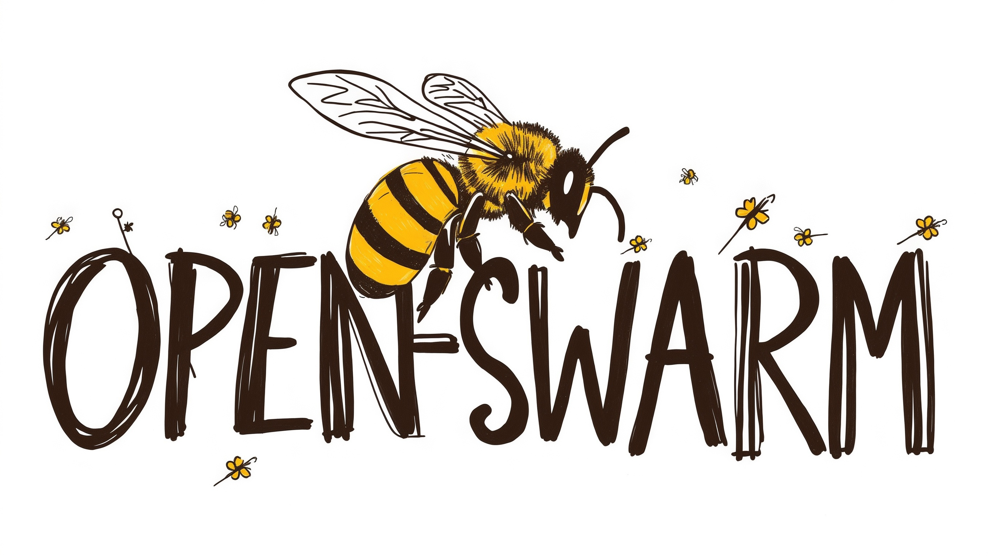
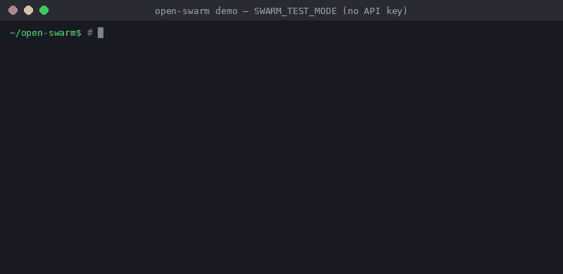

# Open Swarm

<div align="center">

</div>

**Open Swarm** is a Python framework for building, running, and deploying multi-agent AI workflows. Agent teams are defined as **Blueprints** — self-contained, discoverable Python modules — and can be used two ways:

1. **As a CLI tool (`swarm-cli`):** run blueprints locally, interactively or one-shot, and optionally compile them into standalone executables.
2. **As an API service (`swarm-api`):** serve blueprints over an **OpenAI-compatible REST API** (`/v1/models`, `/v1/chat/completions`), so any OpenAI client — SDKs, chat UIs, integrations — can talk to your agents.

Built on the [openai-agents SDK](https://github.com/openai/openai-agents-python). Derivative of OpenAI's experimental [Swarm](https://github.com/openai/swarm) (see [Attribution](#acknowledgements--attribution)).

**Elevator pitch:** define a team of AI agents once — as a *blueprint* — and run it anywhere: as a local CLI command, a compiled standalone executable, or behind an OpenAI-compatible API that any OpenAI client, SDK, or chat UI can talk to. Web dashboard, live websocket chat, MCP tool integration, and opt-in agent memory included.

<div align="center">

<br/><em>The dashboard — take the full <a href="docs/GUIDED_TOUR.md">guided tour</a>.</em>
</div>

<div align="center">

<br/><em>One blueprint — CLI and OpenAI-compatible API.</em>
</div>

> **Status: beta.** Core framework, CLI, OpenAI-compatible REST API, websocket chat, and both web UIs are working, covered by an 860+ test suite and verified in Docker. Remaining gaps are listed honestly in [Roadmap](#roadmap--unfinished-features).

---

## Quickstart (CLI)

```bash
# Install from source (PyPI package: open-swarm)
git clone https://github.com/matthewhand/open-swarm.git
cd open-swarm
uv sync --all-extras          # or: pip install -e .[dev]

# Configure an LLM key
export OPENAI_API_KEY="sk-..."

# List bundled blueprints
uv run swarm-cli list

# Run one
uv run swarm-cli launch codey --message "Explain this repo's structure"

# Compile a blueprint into a standalone executable (PyInstaller)
uv run swarm-cli install codey
```

`swarm-cli` commands available today: `list`, `launch`, `install`, `install-executable`.

## Quickstart (API server)

```bash
cp .env.example .env          # set OPENAI_API_KEY, API_AUTH_TOKEN, DJANGO_SECRET_KEY
docker compose up -d

curl -sf http://localhost:8000/v1/models | jq .
curl -sf http://localhost:8000/v1/chat/completions \
  -H "Content-Type: application/json" \
  -H "Authorization: Bearer ${API_AUTH_TOKEN}" \
  -d '{"model": "suggestion", "messages": [{"role":"user","content":"ping"}]}' | jq .
```

The `model` field selects which blueprint handles the request. Streaming is supported. A Django web UI (teams, blueprint library, agent creator, settings, websocket chat) is served at `/` — built with server-rendered templates + HTMx; it is the supported UI.

---

## Core Concepts

* **Agents** — individual AI workers powered by LLMs, built on the `openai-agents` SDK (agents, tools, handoffs).
* **Blueprints** — `BlueprintBase` subclasses defining a team: its agents, coordination logic, tools, and required MCP servers/env vars. Discovered by directory scan; each blueprint is independently runnable, testable, and compilable. Blueprints can call other blueprints as tools (`swarm.core.blueprint_utils.blueprint_tool`).
* **MCP servers** — external tool providers (filesystem, search, databases, …) declared **in config, not code**; agents get their tools at runtime via the Model Context Protocol.
* **Configuration** — one JSON file (`~/.config/swarm/swarm_config.json`) holding named LLM profiles and MCP server definitions, with `${ENV_VAR}` placeholders so secrets stay in the environment / `.env`.

### Example `swarm_config.json`

```json
{
  "llm": {
    "default": {
      "provider": "openai",
      "model": "gpt-4o",
      "base_url": "https://api.openai.com/v1",
      "api_key": "${OPENAI_API_KEY}"
    },
    "local": {
      "provider": "ollama",
      "model": "llama3",
      "base_url": "http://localhost:11434"
    }
  },
  "mcpServers": {
    "filesystem": {
      "command": "npx",
      "args": ["-y", "@modelcontextprotocol/server-filesystem", "${ALLOWED_PATH}"],
      "env": { "ALLOWED_PATH": "${ALLOWED_PATH}" }
    }
  }
}
```

Select a profile per run with `DEFAULT_LLM=local swarm-cli launch codey ...`. Any OpenAI-compatible endpoint works (Ollama, LiteLLM, vLLM, …). See [CONFIGURATION.md](./CONFIGURATION.md) for the full guide.

---

## Bundled Blueprints

Flagship blueprints (maintained, with the unified spinner/result-box CLI UX):

| Blueprint | What it does |
|---|---|
| `codey` | Code generation, code/semantic search, file ops; approval-mode workflow |
| `geese` | Multi-agent coordination with memory; researcher/coordinator pattern |
| `jeeves` | Private web search (DuckDuckGo) + home automation via agent delegation |
| `suggestion` | Structured-output suggestions (`Agent(output_type=...)`) |
| `whinge_surf` | Async subprocess management — launch, poll, review jobs |
| `rue_code` | Code execution / file-system interaction |
| `zeus` | General-purpose team launcher |
| `poets` | SQLite-backed creative-writing agents |

More live under `src/swarm/blueprints/` (see its README); some are demos or Django-app experiments of varying maturity. Scaffold a new compliant blueprint with `python3 scripts/scaffold_blueprint.py`.

---

## Environment Variables

Set in `.env` (copy `.env.example`). Security-critical ones first:

| Variable | Description | Default |
|---|---|---|
| `OPENAI_API_KEY` | LLM API key (or key for your OpenAI-compatible endpoint) | required for real runs |
| `API_AUTH_TOKEN` | Bearer token for the REST API. **If unset, API auth is disabled** — required for any non-local deployment | unset ⚠️ |
| `DJANGO_SECRET_KEY` | Django secret. **Required when `DJANGO_DEBUG` is not true** (server refuses to start without it) | dev-only fallback in debug |
| `DJANGO_DEBUG` | Django debug mode — never `true` in production | `false` |
| `DJANGO_ALLOWED_HOSTS` | Comma-separated allowed hosts | `localhost,127.0.0.1` |
| `DEFAULT_LLM` | Name of the LLM profile to use from config | `default` |
| `SWARM_CONFIG_PATH` | Path to `swarm_config.json` | XDG config dir |
| `BLUEPRINT_DIRECTORY` | Where blueprints are discovered | `src/swarm/blueprints` |
| `SWARM_BLUEPRINTS` | Comma-separated allow-list of blueprints to expose | all |
| `SWARM_TEST_MODE` | Deterministic canned output for tests/CI — never set in production | unset |
| `ENABLE_ADMIN` | Enable Django admin UI | `false` |

Feature-flag variables for experimental subsystems (`ENABLE_MCP_SERVER`, `ENABLE_GITHUB_MARKETPLACE`) exist but gate unfinished features — see [Roadmap](#roadmap--unfinished-features).

---

## Development

```bash
uv sync --all-extras                  # install with all extras
uv run pytest -q --timeout=120       # full suite (860+ tests, no API keys needed)
uv run python manage.py check         # Django sanity
ruff check .                          # lint
```

* Tests run keyless via `SWARM_TEST_MODE` — blueprints emit deterministic spinner/result-box output that the suite asserts against.
* Blueprint UX standards (spinner sequences, ANSI/emoji result boxes) are codified in `docs/blueprint_standards.md` and checked by `scripts/check_ux_compliance.py` plus CI compliance workflows.
* The optional React frontend lives in `webui/frontend/` (Node >= 22, `npm install && npm run build`); Django serves the built `dist/` automatically when present and falls back to the template UI otherwise. **The React UI is experimental** — see Roadmap.
Documentation map:

* [USERGUIDE.md](./USERGUIDE.md) — task-oriented `swarm-cli` reference.
* [docs/USER_JOURNEY.md](./docs/USER_JOURNEY.md) — screenshot-illustrated end-to-end story (install → CLI → web UI → API) with real transcripts.
* [docs/GUIDED_TOUR.md](./docs/GUIDED_TOUR.md) — visual page-by-page tour of the web UI (React SPA + Django templates).
* [docs/SCREENSHOTS.md](./docs/SCREENSHOTS.md) — screenshot capture registry; regenerate with `scripts/capture_user_journey.py`.
* [DEVELOPMENT.md](./DEVELOPMENT.md) — tech stack and internal architecture; [ROADMAP.md](./ROADMAP.md) — honest feature status.

---

## Roadmap / Unfinished Features

Detailed nested progress lives in [ROADMAP.md](./ROADMAP.md); per-feature evidence in [FEATURE_STATUS.md](./FEATURE_STATUS.md). The honest short list of what is **not** done:

- [ ] **React SPA full parity with the Django UI** — dashboard, chat, teams, blueprints, agent-creator, and settings pages are live on real APIs, but the Django templates UI remains the supported surface until per-page parity is complete
- [ ] **MCP server mode** (`ENABLE_MCP_SERVER`) — aspirational; the flag warns loudly and [docs/mcp_server_mode.md](./docs/mcp_server_mode.md) documents real adoption options
- [ ] **Memory** — mem0 is wired into the agent loop (opt-in) and documented in [CONFIGURATION.md](./CONFIGURATION.md), but not yet validated against a live mem0 end-to-end; letta/langmem are placeholders
- [ ] **Deprecation-shim sunset** — 7 import shims from the consolidation get removed in the release after v0.3.x

## Acknowledgements & Attribution

Open Swarm is a derivative of OpenAI's experimental [Swarm](https://github.com/openai/swarm) framework — it began as an extension of the original Swarm concept (lightweight multi-agent orchestration via agents and handoffs) and has since migrated to the [openai-agents SDK](https://github.com/openai/openai-agents-python), Swarm's production-ready successor, which provides the core agent, tool, and handoff functionality.

Further acknowledgements live in `DEVELOPMENT.md` and individual source files.

## License

MIT — see [LICENSE](LICENSE). Attribution and vendored-asset notices live in [NOTICE](NOTICE) (the project uses a single NOTICE file rather than per-file license headers).

## Contributing

Issues and PRs welcome. Before submitting: run the test suite, lint, and the blueprint compliance scripts (`scripts/check_ux_compliance.py`, `scripts/audit_blueprint_compliance.py`); CI enforces blueprint metadata and UX standards. See [DEVELOPMENT.md](./DEVELOPMENT.md) and [ROADMAP.md](./ROADMAP.md) for where help is most useful.

Dev setup, test commands, and PR guidelines: [CONTRIBUTING.md](./CONTRIBUTING.md).
