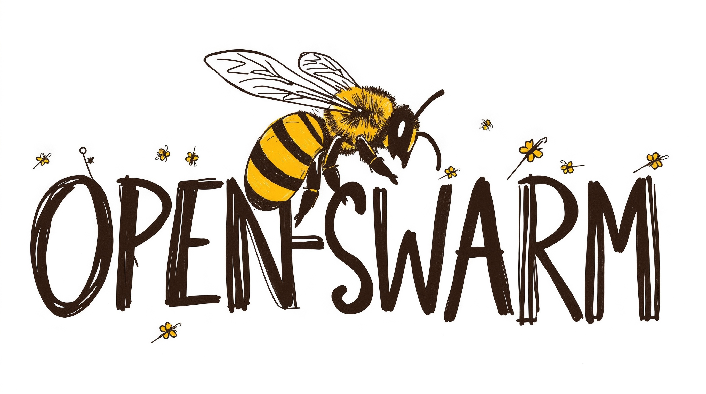
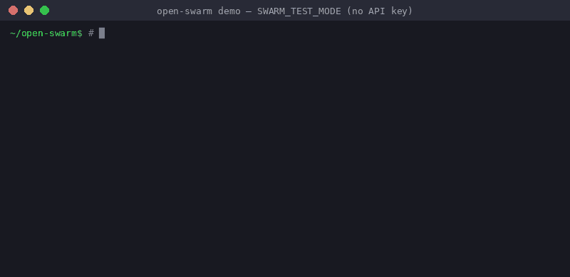
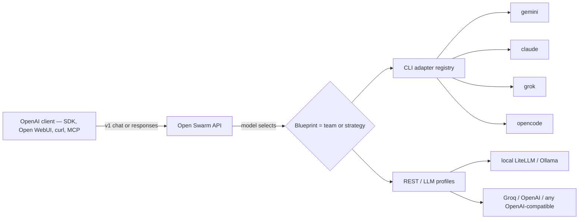
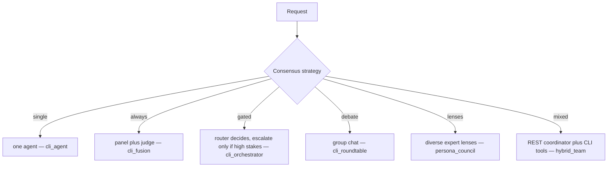
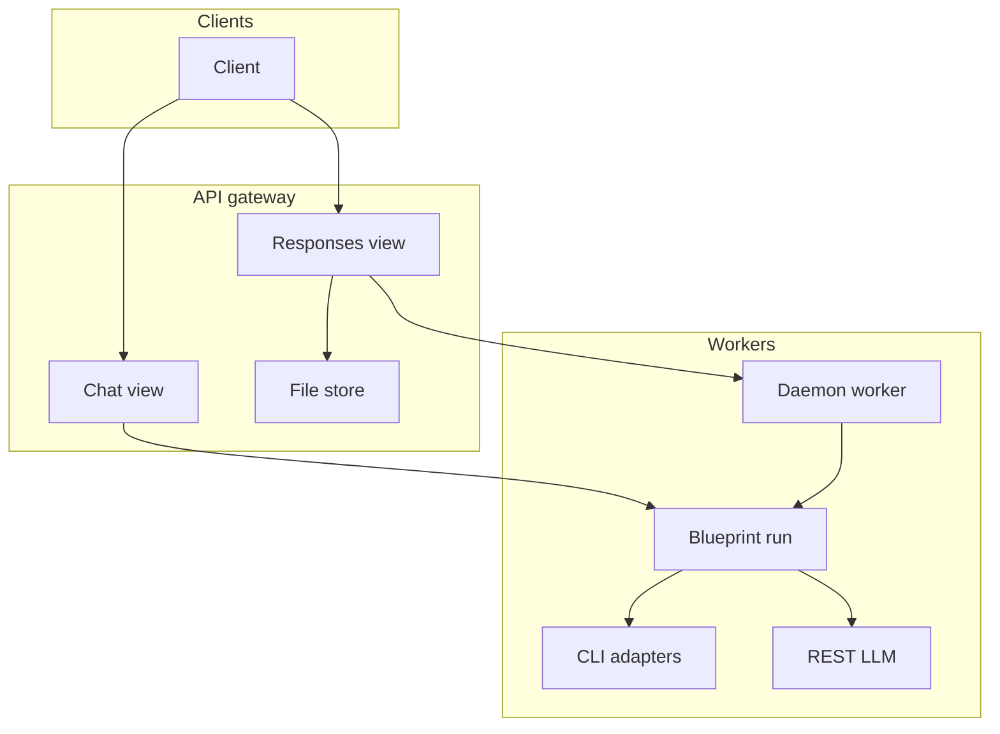
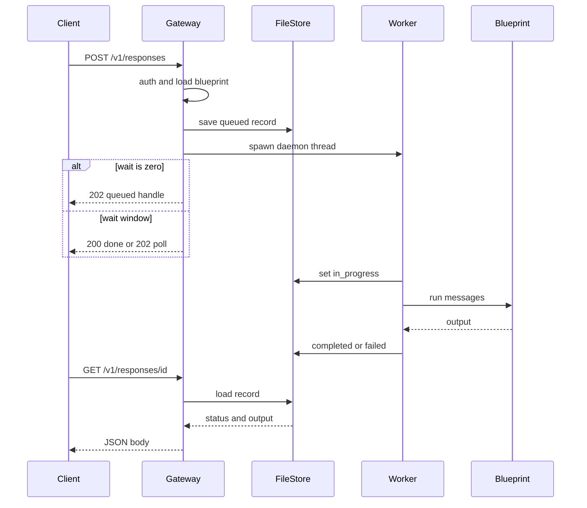
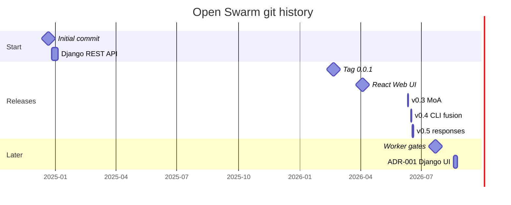

# Open Swarm

<div align="center">

</div>

**Open Swarm** is a Python framework for building, running, and deploying multi-agent AI workflows. Agent teams are defined as **Blueprints** — self-contained, discoverable Python modules — and can be used two ways:

1. **As a CLI tool (`swarm-cli`):** run blueprints locally, interactively or one-shot, and optionally compile them into standalone executables.
2. **As an API service (`swarm-api`):** serve blueprints over an **OpenAI-compatible REST API** (`/v1/models`, `/v1/chat/completions`, `/v1/responses`), so any OpenAI client — SDKs, chat UIs, integrations — can talk to your agents. The OpenAPI spec is served at `/api/schema/` (with Swagger UI at `/api/schema/swagger-ui/`).

Built on the [openai-agents SDK](https://github.com/openai/openai-agents-python). Derivative of OpenAI's experimental [Swarm](https://github.com/openai/swarm) (see [Attribution](#acknowledgements--attribution)).

**Elevator pitch:** define a team of AI agents once — as a *blueprint* — and run it anywhere: as a local CLI command, a compiled standalone executable, or behind an OpenAI-compatible API that any OpenAI client, SDK, or chat UI can talk to. Web dashboard, live websocket chat, MCP tool integration, and opt-in agent memory included.

<div align="center">

<br/><em>The dashboard — take the full <a href="docs/GUIDED_TOUR.md">guided tour</a>.</em>
</div>

<div align="center">

<br/><em>One blueprint — CLI and OpenAI-compatible API.</em>
</div>

> **Status: beta.** Core framework, CLI, OpenAI-compatible REST API, websocket chat, and both web UIs are working, covered by an 1100+ test suite and verified in Docker. Remaining gaps are listed honestly in [Roadmap](#roadmap--unfinished-features).

> 🧭 **Start with the [Vision](docs/VISION.md)** — where Open Swarm is going (one OpenAI-compatible endpoint that *adapts and orchestrates* your agentic CLIs), with an honest built-vs-remaining table and live cross-CLI proofs. Pattern mechanics with sequence diagrams: [Orchestration Patterns](docs/ORCHESTRATION_PATTERNS.md).

---

## Quickstart (CLI)

```bash
# Install from source (PyPI package: open-swarm)
git clone https://github.com/matthewhand/open-swarm.git
cd open-swarm
uv sync --all-extras          # or: pip install -e .[dev]

# Configure an LLM key
export OPENAI_API_KEY="sk-..."

# List bundled blueprints
uv run swarm-cli list

# Run one
uv run swarm-cli launch codey --message "Explain this repo's structure"

# Compile a blueprint into a standalone executable (PyInstaller)
uv run swarm-cli install codey
```

`swarm-cli` commands available today: `list`, `launch`, `install` / `install-executable`, `uninstall`, `add`, `delete`, `config` (list/add/remove LLM profiles, MCP servers, and remotes), `remotes` (Hermes / OpenMausBot / Rakazo — persist, health, operate, and place in a handoff Team; see [docs/REMOTE_HARNESSES.md](docs/REMOTE_HARNESSES.md)), `cli-agents` (alias `agents`) — autodiscovers which of your installed agentic CLIs are configured, installed, and (with `--check-auth`) authenticated — `skills` (reusable `SKILL.md` capabilities via the `cli_agent` `skill=` param), `wizard`, `moa` (Mixture of Agents consensus; optional `--team --workdir` for post-consensus specialists without openai-agents), and `moa-init`. See [docs/MOA.md](docs/MOA.md).

**MoA team path** — multi-seat read-only consensus, then optional scripted specialists (no openai-agents required):

```bash
# Consensus only
swarm-cli moa "How should we rate-limit?" --backend fake --json

# Consensus → team (specialists write under --workdir)
swarm-cli moa "Ship rate limiting?" --backend fake --team \
  --workdir /tmp/moa-team \
  --team-tasks 'implementer:Apply|tester:Verify|docs:ADR'
```

Full details: [docs/MOA.md](docs/MOA.md).

## Quickstart (API server)

```bash
cp .env.example .env          # set OPENAI_API_KEY, API_AUTH_TOKEN, DJANGO_SECRET_KEY
docker compose up -d

curl -sf http://localhost:8000/v1/models | jq .
curl -sf http://localhost:8000/v1/chat/completions \
  -H "Content-Type: application/json" \
  -H "Authorization: Bearer ${API_AUTH_TOKEN}" \
  -d '{"model": "suggestion", "messages": [{"role":"user","content":"ping"}]}' | jq .

# OpenAI Responses API (input as a string or a message array):
curl -sf http://localhost:8000/v1/responses \
  -H "Content-Type: application/json" \
  -H "Authorization: Bearer ${API_AUTH_TOKEN}" \
  -d '{"model": "suggestion", "input": "ping"}' | jq .
```

The `model` field selects which blueprint handles the request. Streaming is supported. **Wrapping your CLIs:** install + authenticate your agentic CLIs, run `swarm-cli cli-agents --init --write` to generate the `cli_agents` config, then call with `model: "cli_fusion"` (one agent, consensus across your CLIs) or `model: "cli_map"` (many agents, each one CLI). See [docs/CLI_FUSION.md](docs/CLI_FUSION.md). **Web UI:** when `webui/frontend/dist/` is built, `/` prefers that React SPA dashboard (falls back to Django templates otherwise). Day-to-day operator UI is Django server-rendered + HTMx at trailing-slash routes (`/teams/`, `/blueprint-library/`, `/agent-creator/`, `/settings/`, `/sessions/`, …). The SPA is experimental and not at parity with those pages — see [USERGUIDE.md](./USERGUIDE.md) and [docs/GUIDED_TOUR.md](./docs/GUIDED_TOUR.md).

---

## Architecture

One OpenAI-compatible endpoint. Point any client at it; the `model` field selects
a **blueprint** (a team/strategy), which runs the request over your **CLI agents**
(`gemini`/`claude`/`grok`/`opencode` — each self-authenticated) and/or **REST/LLM
profiles** (any OpenAI-compatible backend — local LiteLLM, Ollama, Groq, OpenAI).


```mermaid
flowchart LR
    Client["OpenAI client — SDK, Open WebUI, curl, MCP"] -->|v1 chat or responses| API[Open Swarm API]
    API -->|model selects| BP{Blueprint = team or strategy}
    BP --> REG[CLI adapter registry]
    BP --> LLM["REST / LLM profiles"]
    REG --> g[gemini]
    REG --> c[claude]
    REG --> k[grok]
    REG --> o[opencode]
    LLM --> lite["local LiteLLM / Ollama"]
    LLM --> cloud["Groq / OpenAI / any OpenAI-compatible"]
```

The blueprints are **examples of a composition system** — you assemble your own
personas, teams, and consensus rules. The architectural choice that matters most
is **how consensus is invoked**: always, or only when an orchestration agent
decides it's worth the spend.


```mermaid
flowchart TB
    Q[Request] --> MODE{Consensus strategy}
    MODE -->|single| S["one agent — cli_agent"]
    MODE -->|always| F["panel plus judge — cli_fusion"]
    MODE -->|gated| R["router decides, escalate only if high stakes — cli_orchestrator"]
    MODE -->|debate| D["group chat — cli_roundtable"]
    MODE -->|lenses| P["diverse expert lenses — persona_council"]
    MODE -->|mixed| H["REST coordinator plus CLI tools — hybrid_team"]
```

📖 **All the recipes are in [docs/EXAMPLES.md](docs/EXAMPLES.md)** — two sections:
**Team examples** (consensus blueprints + persona councils, with curl for each)
and **CLI + REST config** (wiring `cli_agents`, `llm` profiles, and the mix).
Diagrams + sequence flows for every pattern: [docs/ORCHESTRATION_PATTERNS.md](docs/ORCHESTRATION_PATTERNS.md).

---

## Core Concepts

Vocabulary for the v1 cut: [docs/GLOSSARY.md](docs/GLOSSARY.md) · UI boundary: [docs/ADR-001-primary-ui.md](docs/ADR-001-primary-ui.md).

* **Agents** — individual AI workers powered by LLMs, built on the `openai-agents` SDK (agents, tools, handoffs).
* **Blueprints** — `BlueprintBase` subclasses defining a multi-agent (or single-agent) workflow: agents, coordination logic, tools, and required MCP servers/env vars. Discovered by directory scan; each blueprint is independently runnable, testable, and compilable. Blueprints can call other blueprints as tools (`swarm.core.blueprint_utils.blueprint_tool`).
* **Team** — API agents, CLI agents, and **remote** agents (Hermes / OpenMausBot / Rakazo) that **see and talk** via openai-agents handoff / as_tool. Place remotes with `swarm-cli remotes place|unplace` or `PATCH /v1/agent-team/`. Blueprint: `remote_harness`. See [docs/GLOSSARY.md](docs/GLOSSARY.md).
* **Profiles (`/v1/teams`)** — a dynamic **LLM-profile alias** (`id` / `description` / `llm_profile` in `teams.json`), also editable under Django `/teams/`. Appears as an OpenAI-compatible model id and proxies chat through `DynamicTeamBlueprint`. Prefer this name in new copy; the URL still says teams (name collision with Team above).
* **Team roster (`/v1/team-rosters`)** — composition contract in `team_rosters.json`: members (`api` / `cli` / `remote`) + per-team `handoff` / `as_tool` wires. SPA chat-header **Compose team** overlay (not a top-nav Teams tab). See [docs/TEAM_ROSTERS.md](docs/TEAM_ROSTERS.md).
* **Persona / MoA** — two multi-agent styles: MoA = read-only consensus seats then orchestrator act (`swarm-cli moa`); Persona = openai-agents coordinator switching specialists (`persona_council` and most coding blueprints). See [docs/SWARM_WORKFLOWS.md](docs/SWARM_WORKFLOWS.md).
* **MCP servers** — external tool providers (filesystem, search, databases, …) declared **in config, not code**; agents get their tools at runtime via the Model Context Protocol.
* **CLI agents & fusion** — wrap your installed agentic CLIs (`grok`/`agent`, `claude`, `gemini`, `codex`, `opencode`, …) as subagents behind the OpenAI API, and compose them four ways:
  * `model: "cli_agent"` — run a single CLI as one agent.
  * `model: "cli_fusion"` — fan a prompt to a panel in parallel, then judge and synthesize the answers (a bounded master plan can iterate the panel).
  * `model: "cli_orchestrator"` — a cheap router CLI answers directly and escalates only high-stakes questions to a consensus panel (fusion as a granular tool, not a whole-request mode).
  * `model: "cli_map"` — decompose a task, distribute the subtasks across worker CLIs in parallel, and reduce the results into one answer.

  Consensus can be framework-driven (self-consensus: the same persona N times; or a multi-persona panel) **or** delegated to a CLI's own built-in mode where one exists (e.g. grok's `--best-of-n N`) — and the two compose. `grok` is the preferred default for judge/router/planner roles. See [docs/CLI_FUSION.md](docs/CLI_FUSION.md). Worked 3-CLI consensus transcripts — each showing every agent's individual contribution, the judge's analysis, and the synthesis (including where the panel *disagrees*) — live in [docs/examples/](docs/examples/).
* **Skills** — reusable capabilities packaged as `SKILL.md` directories (YAML frontmatter + instructions, optionally bundled scripts), following Anthropic's [Agent Skills](https://platform.claude.com/docs/en/agents-and-tools/agent-skills/overview) open standard so they're portable to Claude Code / the Skills API. List them with `swarm-cli skills`; apply one to any CLI with the `cli_agent` `skill=<name>` param — it prepends the skill's instructions and stages any bundled assets into the workdir for a write-mode CLI to run. Skills are CLI-agnostic: the same skill works on grok, claude, or gemini. Bundled examples: `conventional-commit`, `reviewing-code`, `writing-changelog`, `counting-lines` (ships an executable `count.py`).
* **Inference profiles** — a blueprint can declare *what kind of thinking it wants* — `intelligence`, `speed`, `cost` as 0–1 priorities — instead of hard-coding a model. Each backend is tagged with capability traits (defaults you override per-agent), and the best match is chosen automatically. So a reasoning-heavy blueprint routes to whatever *you* labelled smart (e.g. `claude opus 4.8 → intelligence 1.0`); a high-volume one routes to your fast/cheap CLI. Keeps blueprints portable across hosts. See [docs/CLI_FUSION.md](docs/CLI_FUSION.md#inference-profiles--say-what-you-want-not-which-model).
* **Configuration** — one JSON file (`~/.config/swarm/swarm_config.json`) holding named LLM profiles and MCP server definitions, with `${ENV_VAR}` placeholders so secrets stay in the environment / `.env`.

### Example `swarm_config.json`

```json
{
  "llm": {
    "default": {
      "provider": "openai",
      "model": "gpt-4o",
      "base_url": "https://api.openai.com/v1",
      "api_key": "${OPENAI_API_KEY}"
    },
    "local": {
      "provider": "ollama",
      "model": "llama3",
      "base_url": "http://localhost:11434"
    }
  },
  "mcpServers": {
    "filesystem": {
      "command": "npx",
      "args": ["-y", "@modelcontextprotocol/server-filesystem", "${ALLOWED_PATH}"],
      "env": { "ALLOWED_PATH": "${ALLOWED_PATH}" }
    }
  }
}
```

Select a profile per run with `DEFAULT_LLM=local swarm-cli launch codey ...`. Any OpenAI-compatible endpoint works (Ollama, LiteLLM, vLLM, …). See [CONFIGURATION.md](./CONFIGURATION.md) for the full guide.

---

## Bundled Blueprints

Flagship blueprints (maintained, with the unified spinner/result-box CLI UX):

| Blueprint | What it does |
|---|---|
| `codey` | Code generation, code/semantic search, file ops; approval-mode workflow |
| `geese` | Multi-agent coordination with memory; researcher/coordinator pattern |
| `jeeves` | Private web search (DuckDuckGo) + home automation via agent delegation |
| `suggestion` | Structured-output suggestions (`Agent(output_type=...)`) |
| `whinge_surf` | Async subprocess management — launch, poll, review jobs |
| `rue_code` | Code execution / file-system interaction |
| `zeus` | General-purpose team launcher |
| `poets` | SQLite-backed creative-writing agents |

CLI Agent Fusion blueprints (wrap your installed agentic CLIs — see [docs/CLI_FUSION.md](docs/CLI_FUSION.md)):

| Blueprint | What it does |
|---|---|
| `cli_agent` | Run a single installed CLI (`grok`, `claude`, `gemini`, …) as one agent |
| `cli_fusion` | Fan a prompt to a panel of CLIs in parallel, then judge and synthesize |
| `cli_orchestrator` | Cheap router CLI answers directly; escalates hard questions to a consensus panel |
| `cli_map` | Decompose a task, distribute subtasks across worker CLIs, reduce to one answer |

More live under `src/swarm/blueprints/` (see its README); some are demos or Django-app experiments of varying maturity. Scaffold a new team blueprint with `swarm-cli wizard` (or the Agent Creator in the web UI).

---

## Environment Variables

Set in `.env` (copy `.env.example`). Security-critical ones first:

| Variable | Description | Default |
|---|---|---|
| `OPENAI_API_KEY` | LLM API key (or key for your OpenAI-compatible endpoint) | required for real runs |
| `API_AUTH_TOKEN` | Bearer token for the REST API. **If unset, API auth is disabled** — required for any non-local deployment | unset ⚠️ |
| `DJANGO_SECRET_KEY` | Django secret. **Required when `DJANGO_DEBUG` is not true** (server refuses to start without it) | dev-only fallback in debug |
| `DJANGO_DEBUG` | Django debug mode — never `true` in production | `false` |
| `DJANGO_ALLOWED_HOSTS` | Comma-separated allowed hosts | `localhost,127.0.0.1` |
| `DEFAULT_LLM` | Name of the LLM profile to use from config | `default` |
| `SWARM_CONFIG_PATH` | Path to `swarm_config.json` | XDG config dir |
| `BLUEPRINT_DIRECTORY` | Where blueprints are discovered | `src/swarm/blueprints` |
| `SWARM_BLUEPRINTS` | Comma-separated allow-list of blueprints to expose | all |
| `SWARM_TEST_MODE` | Deterministic canned output for tests/CI — never set in production | unset |
| `ENABLE_ADMIN` | Enable Django admin UI | `false` |

Feature-flag variables for experimental subsystems (`ENABLE_MCP_SERVER`, `ENABLE_GITHUB_MARKETPLACE`) exist but gate unfinished features — see [Roadmap](#roadmap--unfinished-features).

---

## Developer

Runtime maps from the code. GitHub-safe Mermaid: short plain labels, no HTML, no markdown links in nodes. Dates are from git tags and the commits that added each surface.

### Gateway vs workers

Block view below uses flowchart subgraphs (GitHub Mermaid; `block-beta` is not reliable there). The API process is the gateway: `swarm.core.swarm_api` starts uvicorn on `swarm.asgi:application`. Default is one uvicorn worker (`SWARM_UVICORN_WORKERS=1`; `swarm.core.concurrency.resolved_uvicorn_workers` refuses more unless `SWARM_ENFORCE_SINGLE_WORKER` is false). Inflight slots for async work are process-local (`SWARM_MAX_INFLIGHT`). Long `/v1/responses` jobs run in a daemon thread (`_spawn_worker` in `swarm.views.responses_views`), not extra uvicorn workers. The blueprint then calls host CLI adapters or REST/LLM profiles.


```mermaid
flowchart TB
  subgraph clients [Clients]
    C[Client]
  end
  subgraph gateway [API gateway]
    CH[Chat view]
    RV[Responses view]
    ST[File store]
  end
  subgraph workers [Workers]
    DW[Daemon worker]
    BP[Blueprint run]
    CLI[CLI adapters]
    LLM[REST LLM]
  end
  C --> CH
  C --> RV
  RV --> ST
  RV --> DW
  CH --> BP
  DW --> BP
  BP --> CLI
  BP --> LLM
```

### Request sequence

`POST /v1/responses` (`ResponsesView.post` in `swarm.views.responses_views`): authenticate, resolve the blueprint from `model`, persist a queued record (`swarm.core.responses_store`), spawn the daemon worker, then return 200 if the wait window hits completion or 202 to poll. `GET /v1/responses/{id}` reads the store. Chat `background:true` reuses the same worker (`ChatCompletionsView._handle_background_chat`).


```mermaid
sequenceDiagram
    participant Client
    participant Gateway
    participant FileStore
    participant Worker
    participant Blueprint

    Client->>Gateway: POST /v1/responses
    Gateway->>Gateway: auth and load blueprint
    Gateway->>FileStore: save queued record
    Gateway->>Worker: spawn daemon thread
    alt wait is zero
        Gateway-->>Client: 202 queued handle
    else wait window
        Gateway-->>Client: 200 done or 202 poll
    end
    Worker->>FileStore: set in_progress
    Worker->>Blueprint: run messages
    Blueprint-->>Worker: output
    Worker->>FileStore: completed or failed
    Client->>Gateway: GET /v1/responses/id
    Gateway->>FileStore: load record
    FileStore-->>Gateway: status and output
    Gateway-->>Client: JSON body
```

### History

Real dates only (git). The changelog `0.1.0` row dated 2024-01-01 is not a tag and is omitted.


```mermaid
gantt
    title Open Swarm git history
    dateFormat YYYY-MM-DD
    axisFormat %Y-%m
    section Start
    Initial commit           :milestone, 2024-12-21, 0d
    Django REST API          :2024-12-26, 2025-01-04
    section Releases
    Tag 0.0.1                :milestone, 2026-02-20, 0d
    React Web UI             :milestone, 2026-04-04, 0d
    v0.3 MoA                 :2026-06-11, 2026-06-12
    v0.4 CLI fusion          :2026-06-16, 2026-06-17
    v0.5 responses           :2026-06-18, 2026-06-19
    section Later
    Worker gates             :milestone, 2026-07-22, 0d
    ADR-001 Django UI        :2026-08-18, 2026-08-24
```

| Date | What | Evidence |
|---|---|---|
| 2024-12-21 | Initial commit | git root commit |
| 2024-12-26 | Django REST API | commit `c3a092c4` |
| 2026-02-20 | Tag 0.0.1 | git tag |
| 2026-04-04 | React Web UI | commit `9077902b` |
| 2026-06-11 | v0.3.0 MoA | tag `v0.3.0` |
| 2026-06-16 | CLI fusion | commit `976cbd49` |
| 2026-06-18 | `/v1/responses` | commit `50492380` |
| 2026-06-19 | v0.5.4 | tag `v0.5.4` |
| 2026-07-22 | Worker gates | commit `ff014180` |
| 2026-08-18 | ADR-001 | commit `3d870d62` |

## Development

```bash
uv sync --all-extras                  # install with all extras
uv run pytest -q --timeout=120       # full suite (1100+ tests, no API keys needed)
uv run python manage.py check         # Django sanity
ruff check .                          # lint
```

* Tests run keyless via `SWARM_TEST_MODE` — blueprints emit deterministic spinner/result-box output that the suite asserts against.
* Blueprint UX standards (spinner sequences, ANSI/emoji result boxes) are checked by `scripts/check_ux_compliance.py` and `scripts/lint_blueprints.py` plus CI compliance workflows.
* The optional React frontend lives in `webui/frontend/` (Node >= 22, `npm install && npm run build`). When `dist/` is built, `/` serves that SPA dashboard + `/chat`; without it, `/` falls back to Django templates. **Supported operator UI** is the Django trailing-slash pages (`/teams/`, `/blueprint-library/`, `/settings/`, …); SPA Chat is retained per [ADR-001](docs/ADR-001-primary-ui.md) — see Roadmap.
Documentation map:

* [docs/GLOSSARY.md](./docs/GLOSSARY.md) — v1 product vocabulary (Blueprint vs Team alias, MoA/Persona, Operator UI vs SPA Chat).
* [USERGUIDE.md](./USERGUIDE.md) — task-oriented `swarm-cli` reference.
* [docs/DEPLOYMENT.md](./docs/DEPLOYMENT.md) — runbook for deploying a CLI-wrapping OpenAI-compatible server (pull → configure → prove).
* [docs/AUTH.md](./docs/AUTH.md) — auth & trust model (Bearer vs session, WS 4401, Explorer bridge, workdir, blueprint sandbox, CSRF/prod CSP).
* [docs/USER_JOURNEY.md](./docs/USER_JOURNEY.md) — screenshot-illustrated end-to-end story (install → CLI → web UI → API) with real transcripts.
* [docs/GUIDED_TOUR.md](./docs/GUIDED_TOUR.md) — visual page-by-page tour of the web UI (React SPA + Django templates).
* [docs/SKILLS_AND_CONSENSUS_WALKTHROUGH.md](./docs/SKILLS_AND_CONSENSUS_WALKTHROUGH.md) — illustrated end-to-end walkthrough of skills + 3-CLI consensus, with real terminal captures.
* [docs/MOA.md](./docs/MOA.md) — Mixture of Agents consensus and consensus→team path.
* [docs/HERDR.md](./docs/HERDR.md) — Herdr members (`kind=herdr`): same-host CLI default, optional `--remote`, mocked in CI.
* [docs/SCREENSHOTS.md](./docs/SCREENSHOTS.md) — screenshot capture registry; regenerate with `scripts/capture_user_journey.py`.
* [Developer](#developer) — gateway vs workers, `/v1/responses` sequence, git-dated history.
* [DEVELOPMENT.md](./DEVELOPMENT.md) — tech stack and internal architecture; [ROADMAP.md](./ROADMAP.md) — honest feature status.
* [docs/TROUBLESHOOTING.md](./docs/TROUBLESHOOTING.md) — common issues (CLI/blueprint not found, API errors, the production `ImproperlyConfigured` startup crash) and fixes.

---

## Roadmap / Unfinished Features

Detailed nested progress lives in [ROADMAP.md](./ROADMAP.md); live per-feature evidence in [FEATURE_STATUS.md](./FEATURE_STATUS.md). The honest short list of what is **not** done:

- [x] **SPA scope (ADR-001)** — `/` + `/chat` only; Django trailing-slash UI is canonical (SPA↔Django parity rejected for v1)
- [ ] **MCP server mode** (`ENABLE_MCP_SERVER`) — aspirational; the flag warns loudly and [docs/mcp_server_mode.md](./docs/mcp_server_mode.md) documents real adoption options
- [ ] **Memory** — mem0 is wired into the agent loop (opt-in) and documented in [CONFIGURATION.md](./CONFIGURATION.md), but not yet validated against a live mem0 end-to-end; letta/langmem are placeholders
- [x] **Deprecation-shim sunset** — consolidation shims removed; use `swarm.core.*` / `swarm.ux.ansi_box` (ROADMAP §2.1)
- [ ] **CLI fusion follow-ups** — the `cli_agent`/`cli_fusion` blueprints work end-to-end ([docs/CLI_FUSION.md](./docs/CLI_FUSION.md)); next: extract the panel→judge→synthesize loop into a reusable `swarm.core.cli_fusion` service for the websocket/CLI front-ends, and add opt-in git-worktree isolation for write-mode panels

## Acknowledgements & Attribution

Open Swarm is a derivative of OpenAI's experimental [Swarm](https://github.com/openai/swarm) framework — it began as an extension of the original Swarm concept (lightweight multi-agent orchestration via agents and handoffs) and has since migrated to the [openai-agents SDK](https://github.com/openai/openai-agents-python), Swarm's production-ready successor, which provides the core agent, tool, and handoff functionality.

Further acknowledgements live in `DEVELOPMENT.md` and individual source files.

## License

MIT — see [LICENSE](LICENSE). Attribution and vendored-asset notices live in [NOTICE](NOTICE) (the project uses a single NOTICE file rather than per-file license headers).

## Contributing

Issues and PRs welcome. Before submitting: run the test suite, lint, and the blueprint compliance scripts (`scripts/check_ux_compliance.py`, `scripts/lint_blueprints.py`); CI enforces blueprint metadata and UX standards. See [DEVELOPMENT.md](./DEVELOPMENT.md) and [ROADMAP.md](./ROADMAP.md) for where help is most useful.

Dev setup, test commands, and PR guidelines: [CONTRIBUTING.md](./CONTRIBUTING.md).
