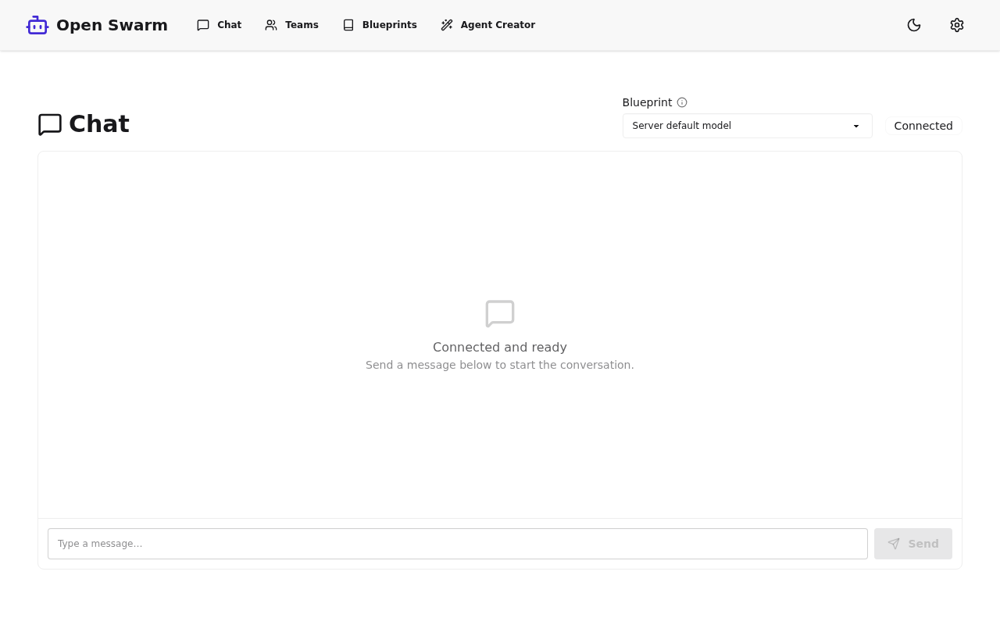
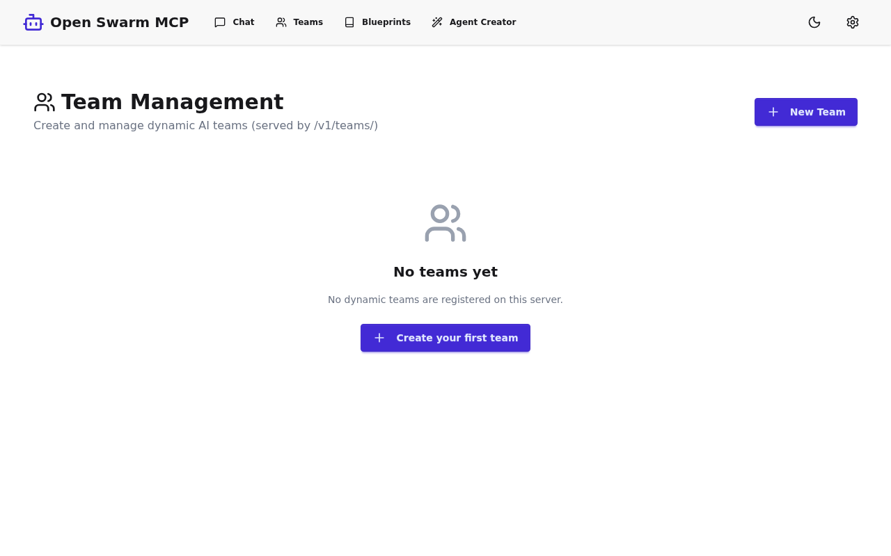
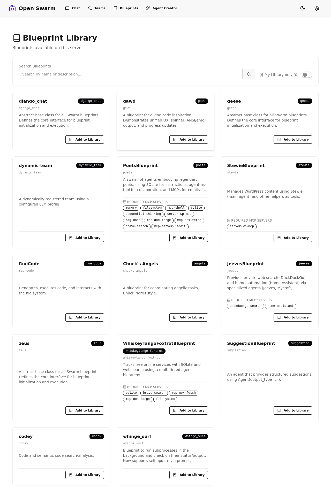
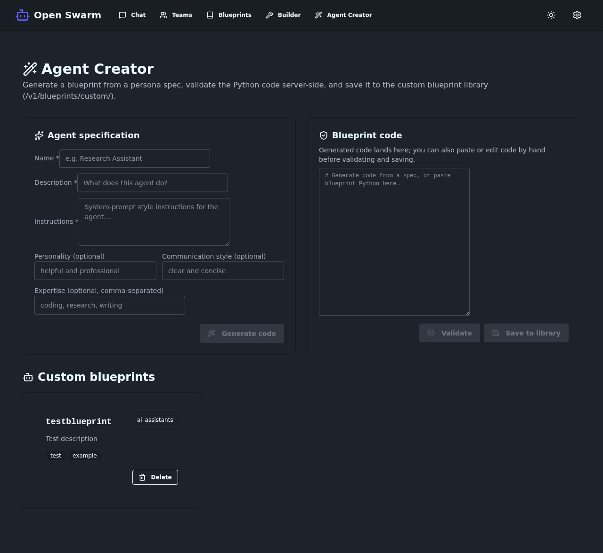
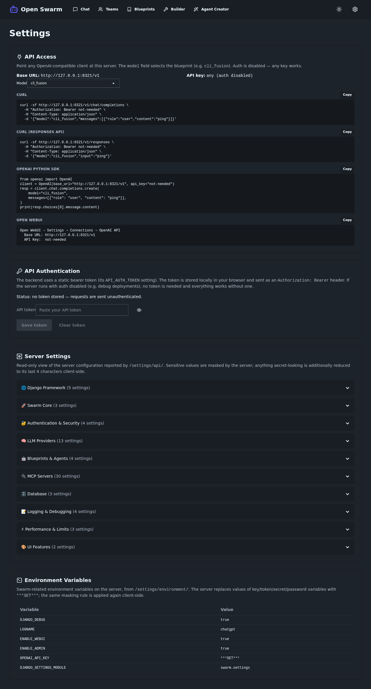

# Open Swarm: Guided Tour

A sequential, screenshot-per-page tour of the running Open Swarm web
application — first the React SPA, then the Django template UI (the supported
admin surface). Every image below is a real capture from a local development
server with a fresh database, taken 2026-06-11 by
[`scripts/capture_user_journey.py`](../scripts/capture_user_journey.py);
captions describe exactly what is shown, including empty states.

> **Documentation map:** [USERGUIDE.md](../USERGUIDE.md) is the `swarm-cli`
> reference, [USER_JOURNEY.md](./USER_JOURNEY.md) is the end-to-end CLI → web →
> API story, this file is the visual tour of the web UI, and
> [SCREENSHOTS.md](./SCREENSHOTS.md) is the capture registry.

---

## 1. Start the app

```bash
git clone https://github.com/matthewhand/open-swarm.git
cd open-swarm
uv sync --all-extras

# Build the React SPA (optional — without it, Django serves its template UI at /)
cd webui/frontend && npm install && npm run build && cd ../..

# Run the dev server. ENABLE_WEBUI=true enables the Django template pages.
ENABLE_WEBUI=true DJANGO_DEBUG=true uv run python manage.py runserver 8000
```

Then open <http://localhost:8000/>. When `webui/frontend/dist/` exists, `/`
serves the React SPA; otherwise you get the Django template index. The Django
template pages in part 3 are available either way at their own URLs.

No LLM API key is needed for anything in this tour — pages render against the
local server. Real agent runs (chat replies, team launches) additionally need
an LLM profile configured (see [USER_JOURNEY.md](./USER_JOURNEY.md) §1).

---

## 2. React SPA tour

Client-side routes (`/chat`, `/teams`, `/blueprints`, `/agent-creator`,
`/settings` — no trailing slash; Django owns the trailing-slash URLs in
part 3).

### Dashboard — `/`


*The SPA landing page. The Blueprints (14) and Models (14) counts are fetched
live from `/v1/blueprints/` and `/v1/models/`, and "Backend API: Online" is a
real health indicator. Quick Actions deep-link to the other SPA pages; a Dark
Mode toggle sits in the navbar.*

**What you can do:** check that the backend is up, see how many blueprints the
server exposes, and jump to the other pages.

### Chat — `/chat`



*Live chat over the backend websocket (`/ws/ai-demo/…`), captured with an
authenticated session — the "Connected" badge is real. The conversation is
empty because nothing has been sent yet. The blueprint selector is live: each
message carries your selection, so you can switch agents mid-conversation
(or arrive preselected via a team's Launch button).*

**What you can do:** pick a blueprint (or the server default) and stream
replies from it; switch blueprints between messages without reconnecting. **Honest note:** the websocket consumer rejects
anonymous connections, so chat requires a logged-in session — sign in via the
login page (part 3) first. Replies also require a working LLM profile.

### Teams — `/teams`



*Team management, wired to the JSON Teams API (`/v1/teams/`). Shown in its
fresh-database empty state — "No teams yet".*

**What you can do:** create a named team (it becomes an OpenAI-compatible
*model* served by `/v1/models`), delete teams, and **Launch** any team
straight into a preselected chat. The same data backs the Django Teams Admin
in part 3.

### Blueprints — `/blueprints`



*The blueprint library, listing every blueprint the server exposes (from
`/v1/blueprints/`) with description and required MCP servers per card, plus a
search box. Full-page capture, hence the tall image.*

**What you can do:** browse and search what's available, see each blueprint's
MCP requirements, **add blueprints to your library** (toast feedback,
In-Library state), and filter to "My Library only" — backed by the
`/v1/library/` API.

### Agent Creator — `/agent-creator`



*Generate a blueprint from a persona spec (name, description, instructions,
optional personality/expertise/communication style), validate the Python
server-side, and save it to the custom blueprint library
(`/v1/blueprints/custom/`). The "Custom blueprints" list below is empty on
this fresh database.*

**What you can do:** generate starter blueprint code from the form, edit or
paste code by hand, validate it, and save it to the server's library.

### Settings — `/settings`



*API-token storage (sent as a bearer header; "no token stored" on this open
dev server), a read-only view of server configuration from `/settings/api/`
grouped into categories, and swarm-related environment variables from
`/settings/environment/` with secrets masked (`OPENAI_API_KEY` shows
`***SET***`).*

**What you can do:** store a token for authenticated deployments and inspect —
not edit — the server's effective configuration.

---

## 3. Django template UI tour

The server-rendered admin surface (requires `ENABLE_WEBUI=true`). This is the
supported UI while the SPA matures.

### Login — `/accounts/login/`


*The login form — deliberately minimal and unstyled. The "testuser/testpass"
hint is baked into the dev template; that account only exists when the
dev-only auto-login flag is enabled. Logging in here is what enables the SPA
chat page's websocket session.*

### Teams Admin — `/teams/`


*Register a team (name, optional LLM profile, description). The "Registered
Teams" table says "No teams yet" because this is a fresh database. Once added,
a team appears in `/v1/models` and works as the `model` field with any OpenAI
client; JSON/CSV export and import are built in.*

### Team Launcher — `/teams/launch/`


*Pick a team blueprint (the bundled `django_chat` is pre-selected), optionally
override the model/profile, type a task, and stream the team's output in the
browser. The output panel is empty because nothing has been launched in this
fresh environment.*

### Blueprint Library — `/blueprint-library/`


*The bundled blueprint catalog with per-blueprint requirement badges
("MCP: OK" / "MCP: Missing") computed from the local environment, difficulty
labels, and add-to-library buttons. The summary tiles (5 available /
0 installed / 0 custom / 5 categories) reflect this fresh dev setup.
Full-page capture.*

### My Blueprints — `/blueprint-library/my-blueprints/`


*Your personal collection of installed and custom blueprints — shown in its
empty state (all counters at 0) with shortcuts to browse the library or create
a custom blueprint.*

### Agent Creator — `/agent-creator/`


*The template-based counterpart of the SPA agent creator: persona form
(name, description, personality, expertise, communication style, special
instructions, tags) on the left; the Generated Code panel on the right is
empty until you click "Generate Agent Code", after which you can validate and
save the agent.*

### Settings Dashboard — `/settings/`


*Configuration management grouped by category (Django, Swarm core, auth, LLM
providers, blueprints/agents, MCP servers, database, logging, performance, UI
features) with a configuration-progress meter and import/export. Values shown
are this dev machine's local configuration. Full-page capture.*

---

## 4. Where to go next

* **Run agents from the terminal** — [USERGUIDE.md](../USERGUIDE.md), the
  `swarm-cli` reference.
* **The full end-to-end story** (install → CLI → web → OpenAI-compatible API,
  with real terminal transcripts) — [USER_JOURNEY.md](./USER_JOURNEY.md).
* **Use the API directly** — `/v1/models` and `/v1/chat/completions`; see
  [USER_JOURNEY.md §4](./USER_JOURNEY.md#4-use-it-as-an-openai-compatible-api).
* **Regenerate or audit these screenshots** —
  [SCREENSHOTS.md](./SCREENSHOTS.md).
* **Hack on the framework** — [DEVELOPMENT.md](../DEVELOPMENT.md) (tech stack,
  architecture) and [ROADMAP.md](../ROADMAP.md) (honest status of unfinished
  features, including remaining SPA gaps).
