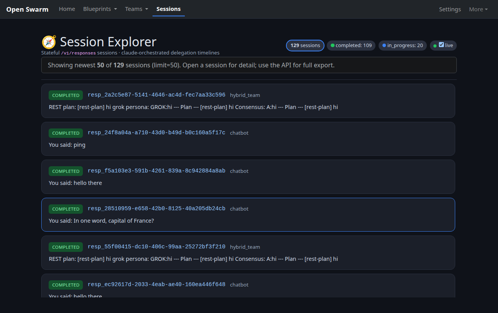
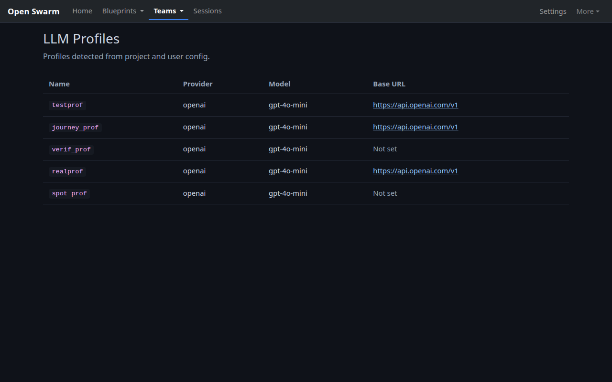

# Open Swarm: Guided Tour

A sequential, screenshot-per-page tour of the running Open Swarm web
application. The **operator UI is the Django shell** (trailing-slash routes).
The React SPA remains a lightweight dashboard at `/` plus experimental chat
at `/chat`. Bare paths such as `/teams`, `/blueprints`, `/settings`, and
`/agent-creator` **redirect** to their Django counterparts.

Every image below is a real Playwright capture from a local development
server, regenerated by
[`scripts/capture_user_journey.py`](../scripts/capture_user_journey.py)
(2026-07-21). Captions describe exactly what is shown, including empty states
and redirects.

> **Documentation map:** [USERGUIDE.md](../USERGUIDE.md) is the `swarm-cli`
> reference, [USER_JOURNEY.md](./USER_JOURNEY.md) is the end-to-end CLI → web →
> API story, this file is the visual tour of the web UI, and
> [SCREENSHOTS.md](./SCREENSHOTS.md) is the capture registry.

---

## 1. Start the app

```bash
git clone https://github.com/matthewhand/open-swarm.git
cd open-swarm
uv sync --all-extras

# Build the React SPA (dashboard + /chat). Without dist, `/` falls back to Django templates.
cd webui/frontend && npm install && npm run build && cd ../..

# Run the dev server. ENABLE_WEBUI=true enables Django operator pages.
ENABLE_WEBUI=true DJANGO_DEBUG=true uv run python manage.py runserver 8000
```

Then open <http://localhost:8000/>. Prefer the **Django** destinations in
part 3 for day-to-day operator work (library, sessions, creators, full
settings).

No LLM API key is needed to browse the tour pages. Real agent runs (chat
replies, team launches) need an LLM profile configured (see
[USER_JOURNEY.md](./USER_JOURNEY.md) §1).

---

## 2. Dashboard & SPA surfaces

### Dashboard — `/`


*Lightweight React dashboard. Counts load from the API when available
(`/v1/blueprints` / `/v1/models` may show a higher figure than the
Blueprint Library’s discoverable catalog count — different listings).
Quick Actions deep-link into **Django** (`/teams/launch/`,
`/blueprint-library/`, `/teams/`, `/settings/`). Banner text states that full
library, sessions, creators, and settings live on Django trailing-slash
paths.*

**What you can do:** confirm the API is reachable, jump into the operator UI.

### Chat — `/chat` (React SPA)


*Live chat over the backend websocket (`/ws/…`), served by the SPA. Requires
a logged-in session for the consumer; replies also need a working LLM
profile.*

**What you can do:** pick a blueprint and stream replies. Prefer Django Team
Launcher for scripted multi-agent runs.

### Bare SPA entry URLs (redirect to Django)

These captures open the **no-trailing-slash** URL, follow the redirect, and
(when regenerated via `capture_user_journey.py`) show a sticky **“Redirected:
/path → /canonical/”** banner so they are not pixel-identical to part 3.

| Capture | Entry URL | Lands on |
| --- | --- | --- |
| `spa-teams.png` | `/teams` | `/teams/launch/` Team Launcher |
| `spa-blueprints.png` | `/blueprints` | `/blueprint-library/` |
| `spa-settings.png` | `/settings` | `/settings/` Settings Dashboard |
| `spa-agent-creator.png` | `/agent-creator` | `/agent-creator/` Agent Creator |


*After redirect from `/teams`: Team Launcher with capture banner (not a
separate SPA product).*


---

## 3. Django operator UI (canonical)

Primary chrome: **Home · Blueprints · Teams · Sessions · Settings**, with
GitHub under **More**. Mobile uses a fixed five-tab bottom bar.

### Login — `/accounts/login/`


*Sign-in form for authenticated operator pages (sessions, settings, creators).*

### Teams Admin — `/teams/`


*Register dynamic teams as OpenAI-compatible model ids.*

### Team Launcher — `/teams/launch/`


*Select a team blueprint, enter a task, stream results. Default do-path under
Teams.*

### Blueprint Library — `/blueprint-library/`


*Catalog of discoverable blueprints. First paint paginates (e.g. 12 of N)
with **Show more**; denser cards and MCP status badges.*

### My Blueprints — `/blueprint-library/my-blueprints/`


*Installed/custom collection (empty on a fresh library).*

### Agent Creator — `/agent-creator/`


*Progressive disclosure: Identity essentials open; Persona/Tags optional
collapsed. Generate / validate custom agent blueprints.*

### Settings Dashboard — `/settings/`


*Full env/config operator surface (deeper than the SPA settings stub).*

### Session Explorer — `/sessions/`



*Stateful `/v1/responses` sessions. Default list limit 50 with truncation
banner; live poll uses the same limit so the list does not balloon.*

### LLM Profiles — `/profiles/`



*Profiles detected from project and user config (nested under Teams in the
nav).*

---

## 4. Regenerate screenshots

```bash
.venv/bin/python scripts/capture_user_journey.py            # desktop
.venv/bin/python scripts/capture_user_journey.py --mobile   # mobile
```

Update [SCREENSHOTS.md](./SCREENSHOTS.md) “Captured” dates and captions if
pages change. Mobile PNGs live under `docs/screenshots/mobile/`.
