# Open Swarm: Guided Tour

A sequential, screenshot-per-page tour of the running Open Swarm web
application. The **operator UI is the Django shell** (trailing-slash routes).
The React SPA remains a lightweight dashboard at `/` plus experimental chat
at `/chat`. Bare paths such as `/teams`, `/blueprints`, `/settings`, and
`/agent-creator` **redirect** to their Django counterparts.

Every image below is a real Playwright capture from a local development
server, regenerated by
[`scripts/capture_user_journey.py`](../scripts/capture_user_journey.py)
(2026-08-18). Captions describe exactly what is shown, including empty states
and redirects.

> **Documentation map:** [USERGUIDE.md](../USERGUIDE.md) is the `swarm-cli`
> reference, [USER_JOURNEY.md](./USER_JOURNEY.md) is the end-to-end CLI → web →
> API story, this file is the visual tour of the web UI, and
> [SCREENSHOTS.md](./SCREENSHOTS.md) is the capture registry.

---

## 1. Start the app

```bash
git clone https://github.com/matthewhand/open-swarm.git
cd open-swarm
uv sync --all-extras

# Build the React SPA (dashboard + /chat). Without dist, `/` falls back to Django templates.
cd webui/frontend && npm install && npm run build && cd ../..

# Run the dev server. ENABLE_WEBUI=true enables Django operator pages.
ENABLE_WEBUI=true DJANGO_DEBUG=true uv run python manage.py runserver 8000
```

Then open <http://localhost:8000/>. Prefer the **Django** destinations in
part 3 for day-to-day operator work (library, sessions, creators, full
settings).

No LLM API key is needed to browse the tour pages. Real agent runs (chat
replies, team launches) need an LLM profile configured (see
[USER_JOURNEY.md](./USER_JOURNEY.md) §1).

---

## 2. Dashboard & SPA surfaces

### Dashboard — `/`

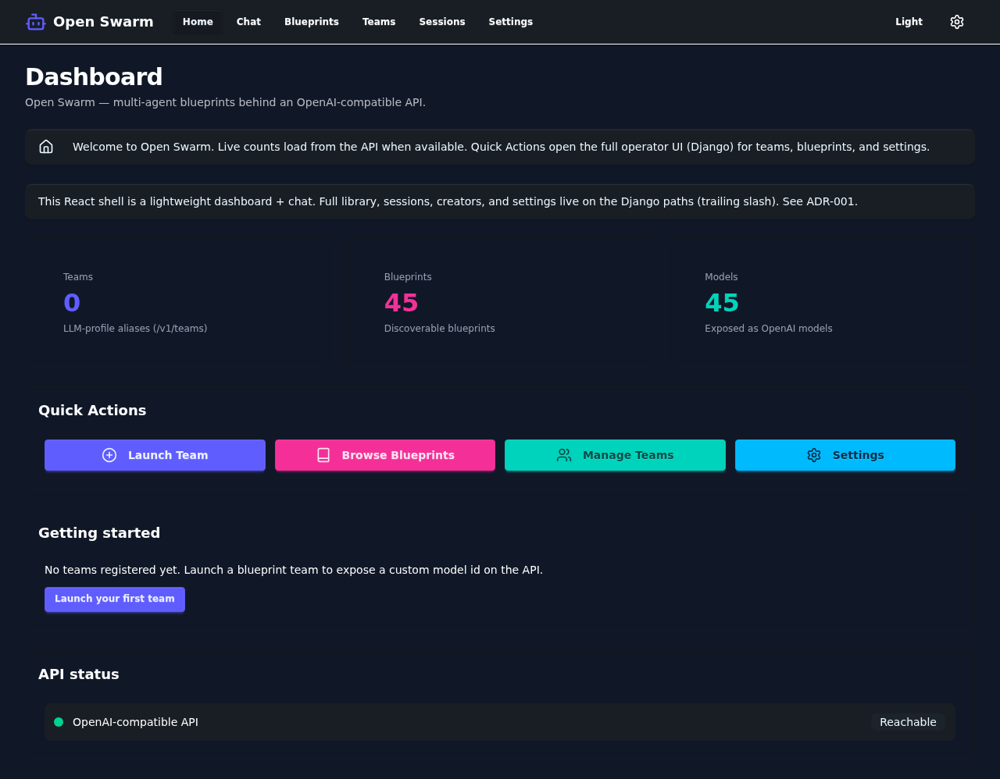

*Lightweight React dashboard. This capture shows Teams **0**, Blueprints
**55**, Models **55** (API listings — the Blueprint Library’s discoverable
catalog count can differ). Desktop top nav: **Home · Blueprints · Teams ·
Sessions · Settings**. Quick Actions: **Launch Team**, **Browse Blueprints**,
**Manage Teams**, **Settings**. Banner text points operators at Django
trailing-slash paths for library, sessions, creators, and settings.
Recaptured after `npm run build` on **2026-08-18**.

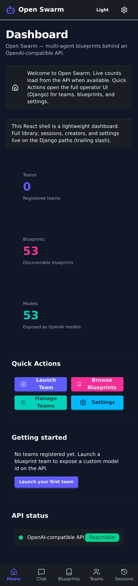

*Mobile twin (`screenshots/mobile/landing.png`): stacked cards and the **SPA
five-tab dock** (**Home · Chat · Blueprints · Teams · Sessions**; Home
active) from App.tsx. Django operator pages still use Home · Blueprints ·
Teams · Sessions · Settings — different chrome.*

**What you can do:** confirm the API is reachable, jump into the operator UI.

### Chat — `/chat` (React SPA)

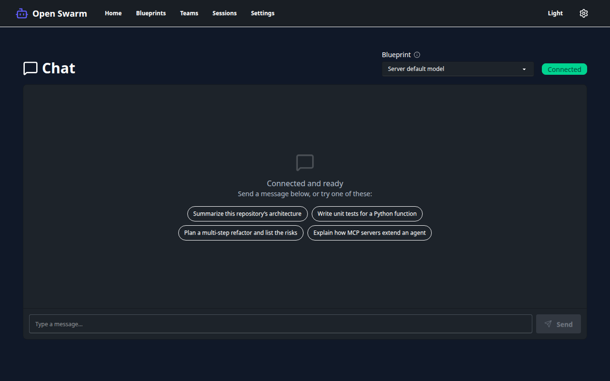

*SPA websocket chat (`/ws/…`). Journey capture logs in as `journey-admin`, so
desktop and mobile `spa-chat.png` show the **Connected** shell with blueprint
selector and empty-state prompts. Mobile dock is **Home · Chat · Blueprints ·
Teams · Sessions** with **Chat** active. If the socket fails, the page also
exposes a primary **Sign in** (returns to `/chat`) + **Reconnect** alert that
must not flex-shrink away in the fixed-height layout. Replies need a working
LLM profile.*

**What you can do:** pick a blueprint and stream replies. Prefer Django Team
Launcher for scripted multi-agent runs.

### Bare SPA entry URLs (redirect to Django)

These captures open the **no-trailing-slash** URL, follow the redirect, and
(when regenerated via `capture_user_journey.py`) show a sticky **“Redirected:
/path → /canonical/”** banner so they are not pixel-identical to part 3.

| Capture | Entry URL | Lands on |
| --- | --- | --- |
| `spa-teams.png` | `/teams` | `/teams/launch/` Team Launcher |
| `spa-blueprints.png` | `/blueprints` | `/blueprint-library/` |
| `spa-settings.png` | `/settings` | `/settings/` Settings Dashboard |
| `spa-agent-creator.png` | `/agent-creator` | `/agent-creator/` Agent Creator |

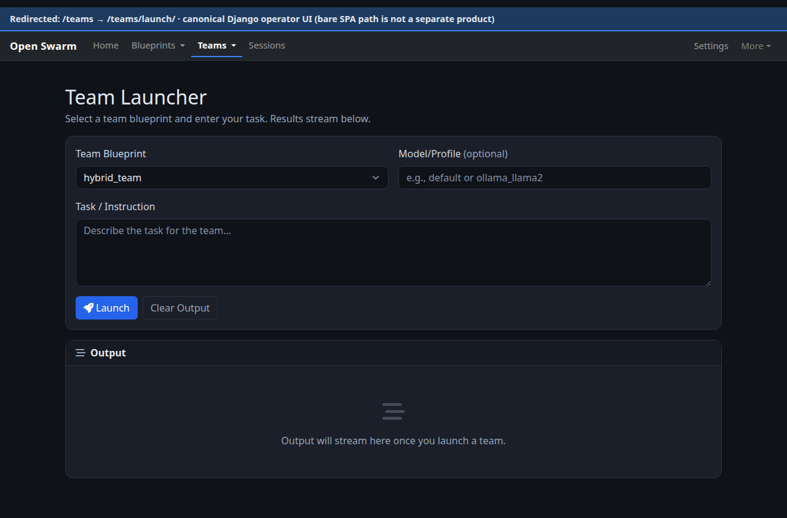

*After redirect from `/teams`: Team Launcher with capture banner (not a
separate SPA product).*

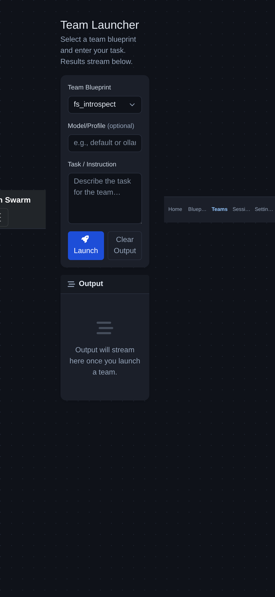

*Mobile twin (`screenshots/mobile/spa-teams.png`): sticky “Redirected:
/teams → /teams/launch/” banner over the Team Launcher with **`hybrid_team`**
selected; Django **five-tab** dock (Teams active).*

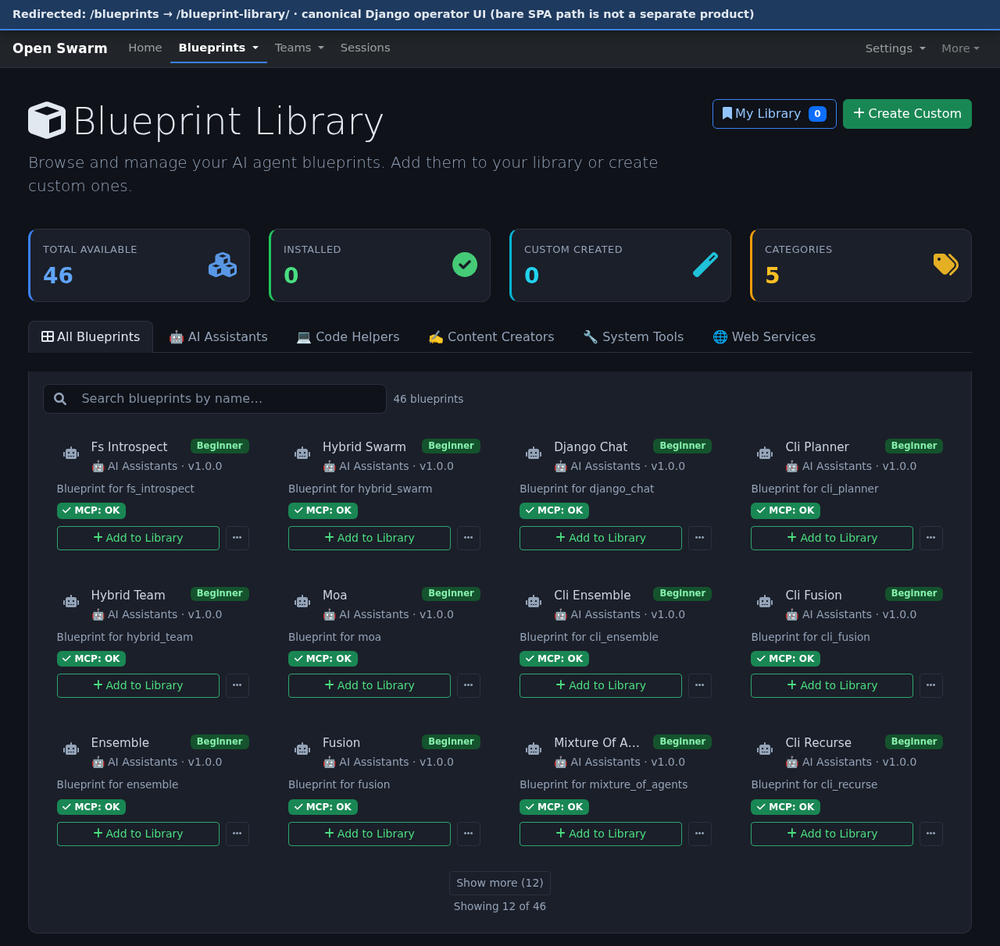

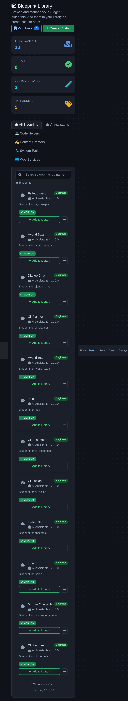

*Mobile twin (`screenshots/mobile/spa-blueprints.png`): sticky “Redirected:
/blueprints → /blueprint-library/” banner over single-column library cards;
Django **five-tab** dock (Blueprints active).*

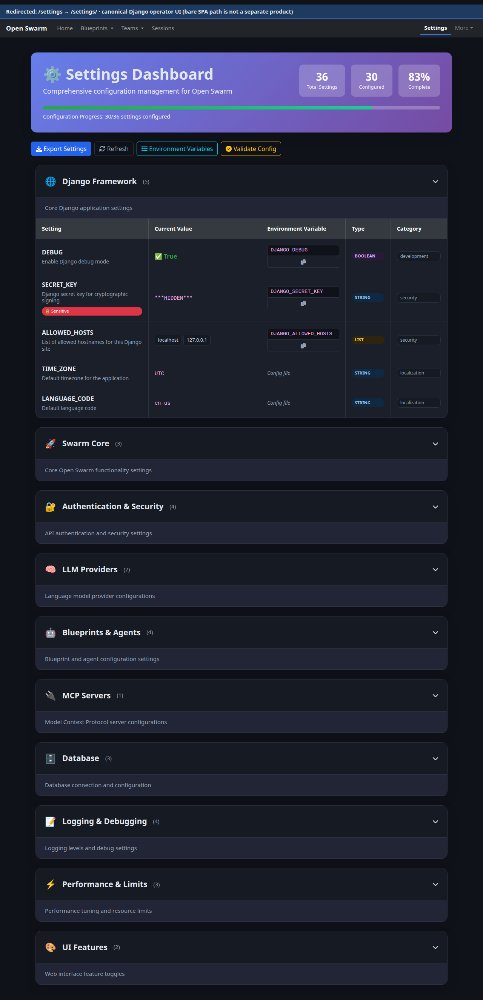

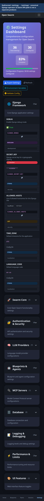

*Mobile twin (`screenshots/mobile/spa-settings.png`): same sticky “Redirected:
…” banner over the Settings Dashboard; Django **five-tab** dock (Settings
active).*

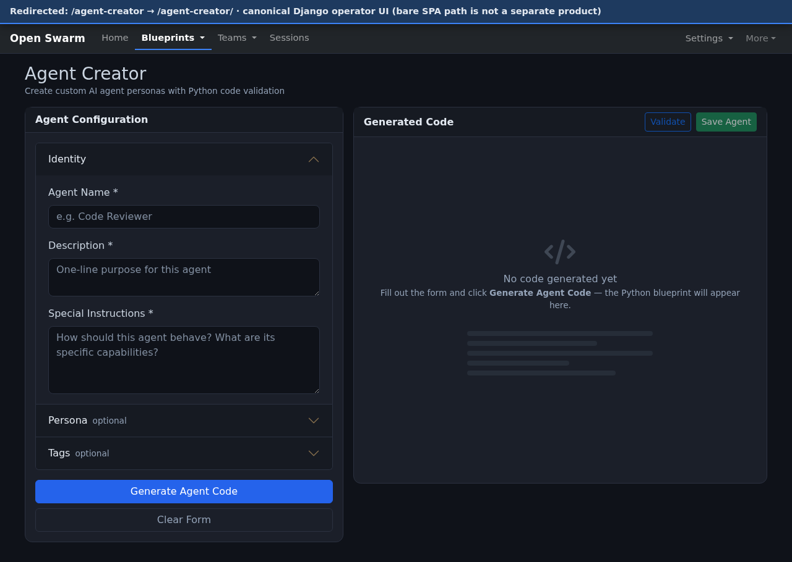

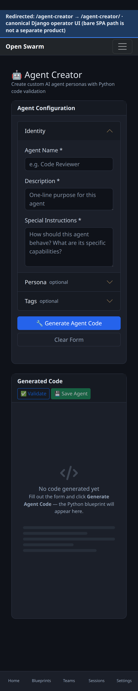

*Mobile twin (`screenshots/mobile/spa-agent-creator.png`): sticky “Redirected:
/agent-creator → /agent-creator/” banner over the Agent Creator essentials
form; Django **five-tab** dock (Blueprints active).*

---

## 3. Django operator UI (canonical)

Primary chrome for **Django** (and the SPA **desktop** top nav): **Home ·
Blueprints · Teams · Sessions · Settings**, with GitHub under **More** on
Django desktop only. The SPA **mobile** dock differs — **Home · Chat ·
Blueprints · Teams · Sessions** (Chat instead of Settings; Settings stays on
desktop top nav / gear). Mobile **Django** captures under `screenshots/mobile/`
(operator twins + `spa-*` redirects) keep the Django five-tab bar. After
bare-path redirects, `spa-*` captures show the Django shell plus the sticky
“Redirected: …” banner.

### Login — `/accounts/login/`

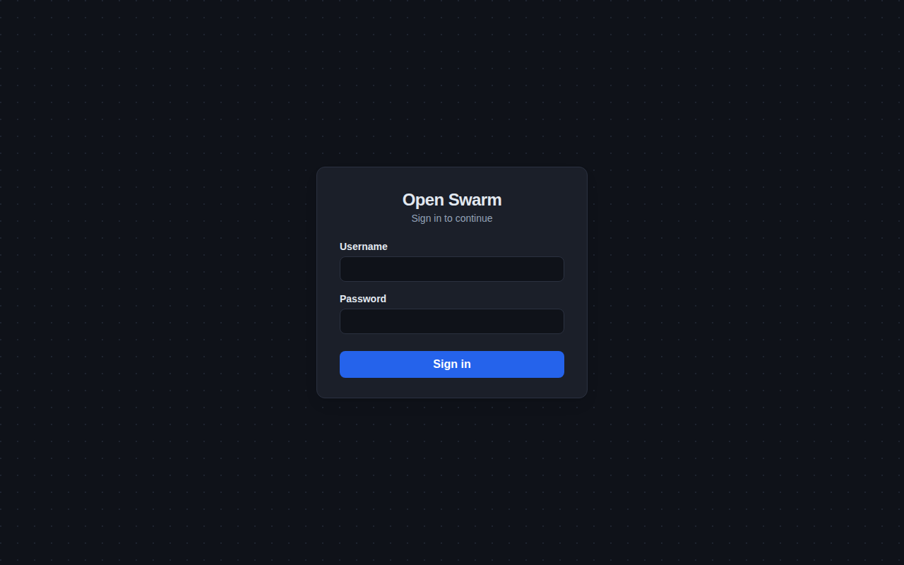

*Sign-in form for authenticated operator pages (sessions, settings, creators)
and SPA chat websockets. Session cookie ≠ REST Bearer — see
[AUTH.md](./AUTH.md).*

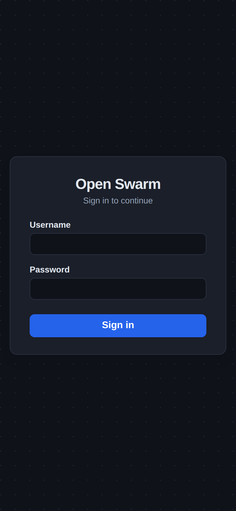

*Mobile twin (`screenshots/mobile/login.png`): full-width login card (no
bottom primary bar on the login page).*

### Teams Admin — `/teams/`

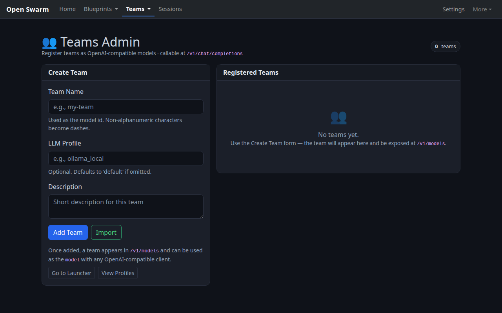

*Register dynamic teams as OpenAI-compatible model ids.*

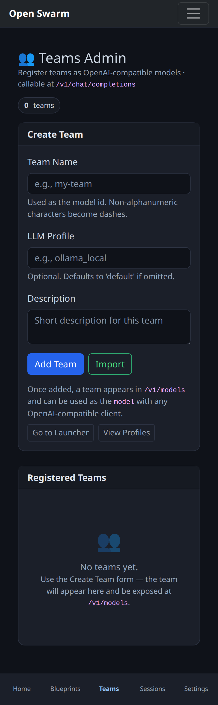

*Mobile twin: registration form wraps; Django **five-tab** dock (Teams
active).*

### Team Launcher — `/teams/launch/`

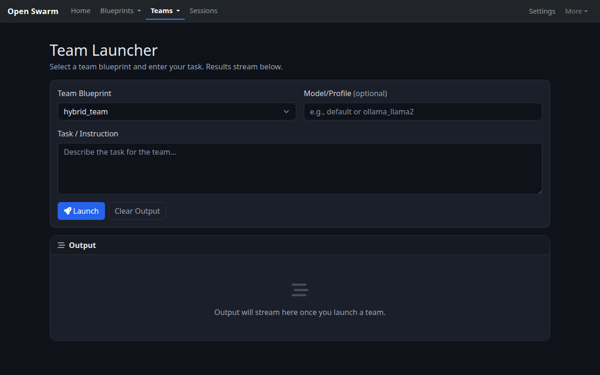

*Select a team blueprint, enter a task, stream results. Capture shows
**`hybrid_team`** selected (first bundled option in the dropdown) and an
empty output panel. Default do-path under Teams.*

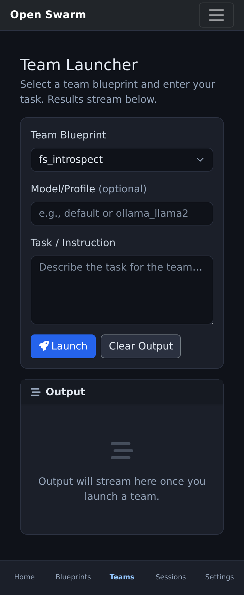

*Mobile twin: launcher full-width with **`hybrid_team`** selected (same first
dropdown option as desktop); Django **five-tab** dock (Teams active).*

### Blueprint Library — `/blueprint-library/`

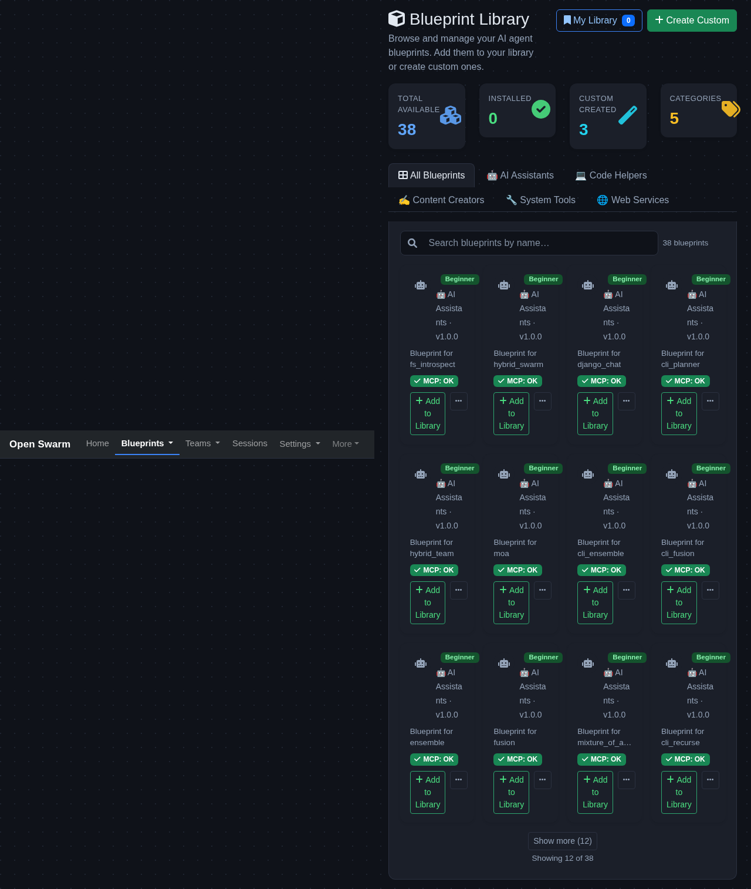

*Catalog of discoverable blueprints. First paint paginates (e.g. 12 of 55)
with **Show more**; denser cards and per-card MCP status badges (this capture
still shows the checking spinner labeled **MCP**).*

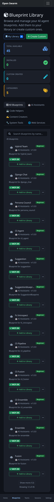

*Mobile twin: paginated cards stack in a single column; Django **five-tab**
dock (Blueprints active).*

### My Blueprints — `/blueprint-library/my-blueprints/`

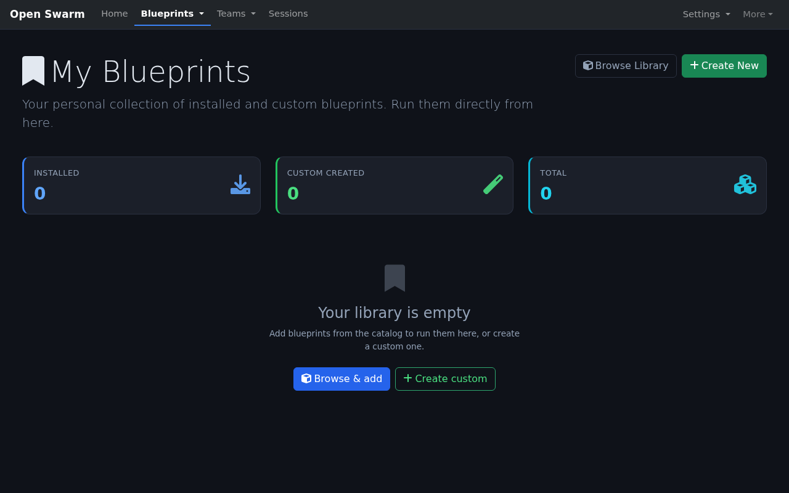

*Installed/custom collection (empty on a fresh library).*

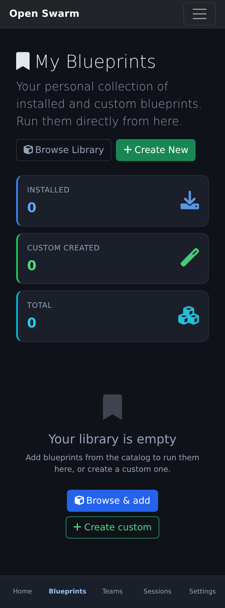

*Mobile twin (`screenshots/mobile/my-blueprints.png`): empty personal library
with **Create Agent** and **Browse Library** CTAs; Django **five-tab** dock
(Blueprints active).*

### Agent Creator — `/agent-creator/`

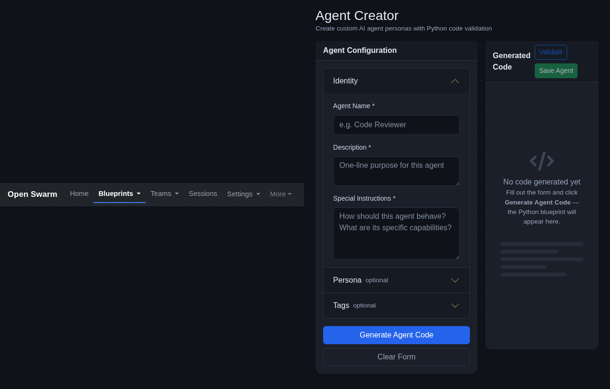

*Progressive disclosure: Identity essentials open; Persona/Tags optional
collapsed. Generate / validate custom agent blueprints.*

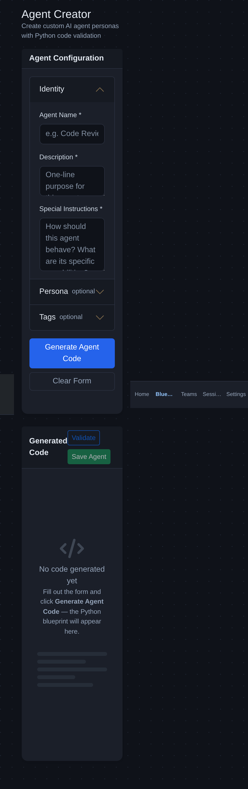

*Mobile twin (`screenshots/mobile/agent-creator.png`): Identity essentials
open in an accordion; **Generate Blueprint** / **Validate** actions; Django
**five-tab** dock (Blueprints active).*

### Settings Dashboard — `/settings/`

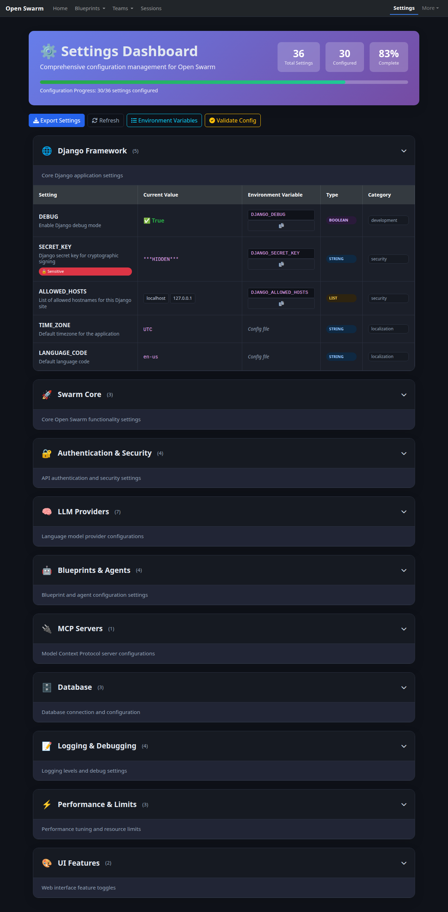

*Full env/config operator surface (deeper than the SPA settings stub).*

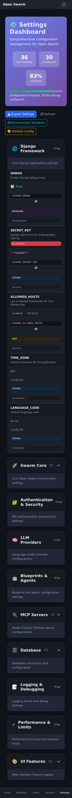

*Mobile twin: dashboard tiles wrap; Django **five-tab** dock (Settings
active).*

### Session Explorer — `/sessions/`


*Stateful `/v1/responses` sessions (**login required**, owner-scoped). This
fresh-db capture is empty: **0 sessions**, a **live** poll toggle, and “No
sessions for your account yet… This list shows only sessions you own.”
Per-status filter chips and
the “Showing newest N of M (limit=50)” truncation banner appear only once
sessions exist and the list is truncated — they are not in this PNG.*

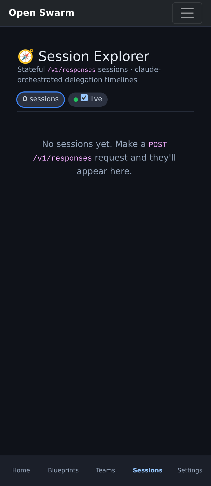

*Mobile twin: same empty-state chrome with the Django **five-tab** dock
(Sessions active).*

### Session detail — `/sessions/resp_journey_seed/`


*Seeded journey fixture (`resp_journey_seed`), not a live `hybrid_team` /
`POST /v1/responses` run. Capture script writes a minimal `hybrid_team`-shaped
JSON into an isolated `SWARM_RESPONSES_DIR` after the empty list PNG, then
screenshots the real Django Graph / timeline chrome. Synthetic record only —
see [SESSION_EXPLORER.md](./SESSION_EXPLORER.md).*

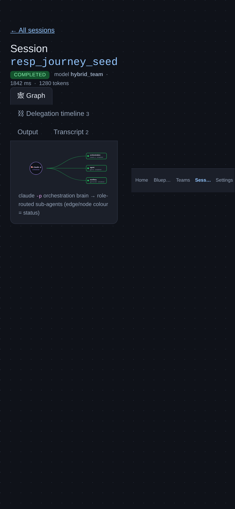

*Mobile twin (`screenshots/mobile/session-detail.png`): same seeded
`resp_journey_seed` Graph tab (orchestration → agents → aux) — **not** a live
`hybrid_team` run; Django **five-tab** dock (Sessions active).*

### LLM Profiles — `/profiles/`

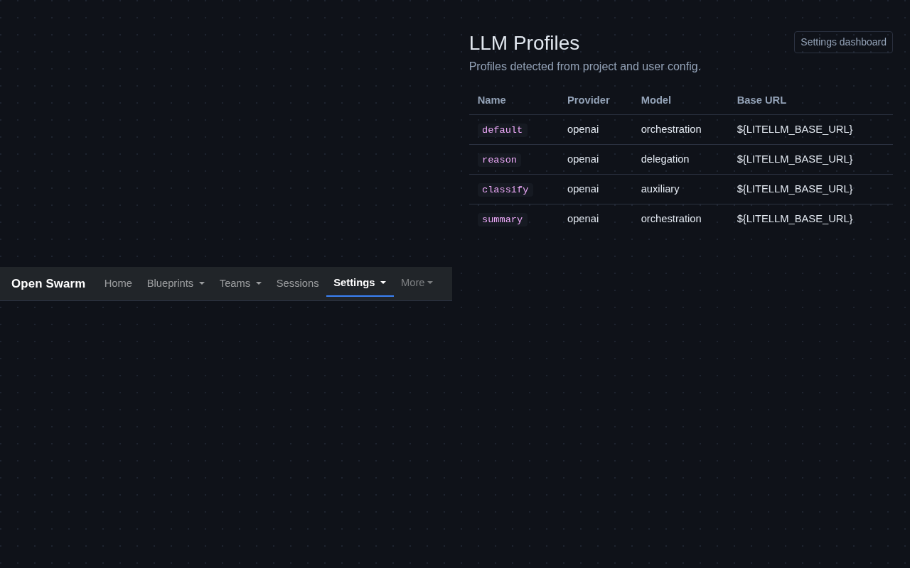

*Profiles detected from project and user config (openai, anthropic, google,
ollama, lmstudio, openrouter, …) with Source and Enabled columns. Nested
under **Settings → LLM profiles** (desktop Settings dropdown active; mobile
Settings bottom tab active).*

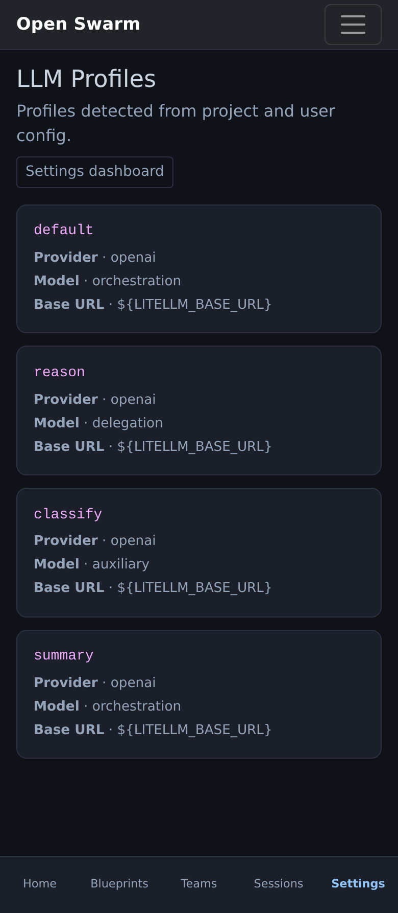

*Mobile twin (`screenshots/mobile/profiles.png`): same provider/model/source
table stacked for narrow width; Django **five-tab** dock (**Settings** active
— profiles nest under Settings).*

---

## 4. Regenerate screenshots

```bash
.venv/bin/python scripts/capture_user_journey.py            # desktop
.venv/bin/python scripts/capture_user_journey.py --mobile   # mobile
```

Update [SCREENSHOTS.md](./SCREENSHOTS.md) “Captured” dates and captions if
pages change. Mobile PNGs live under `docs/screenshots/mobile/`.
