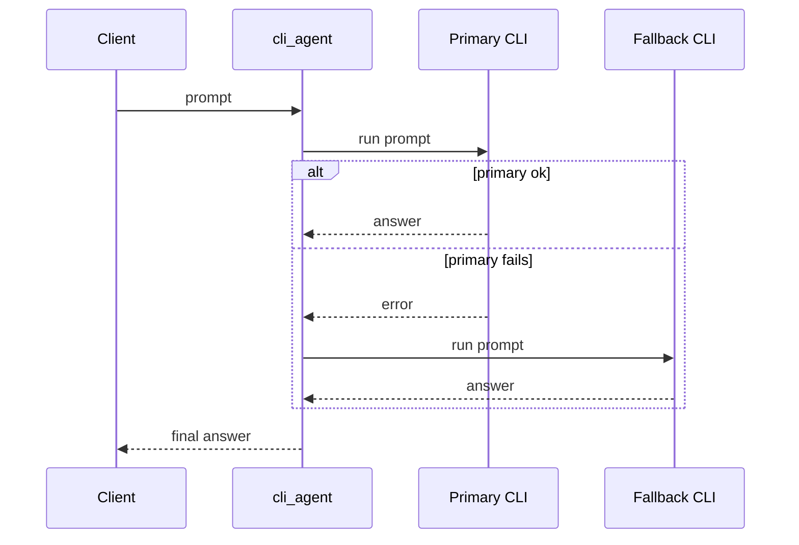
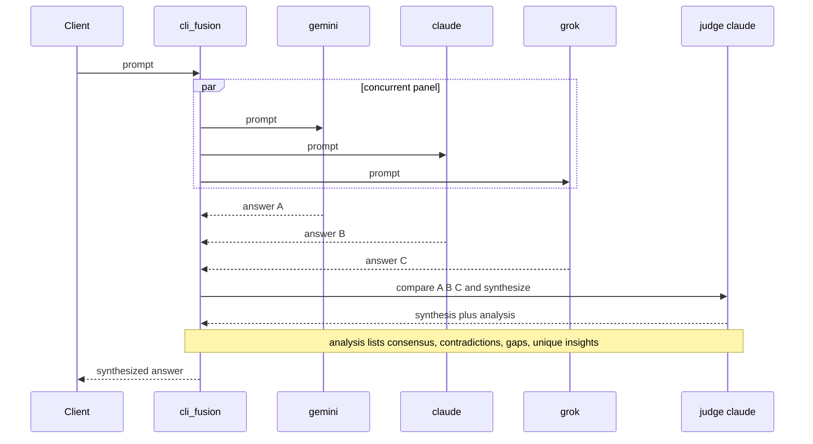
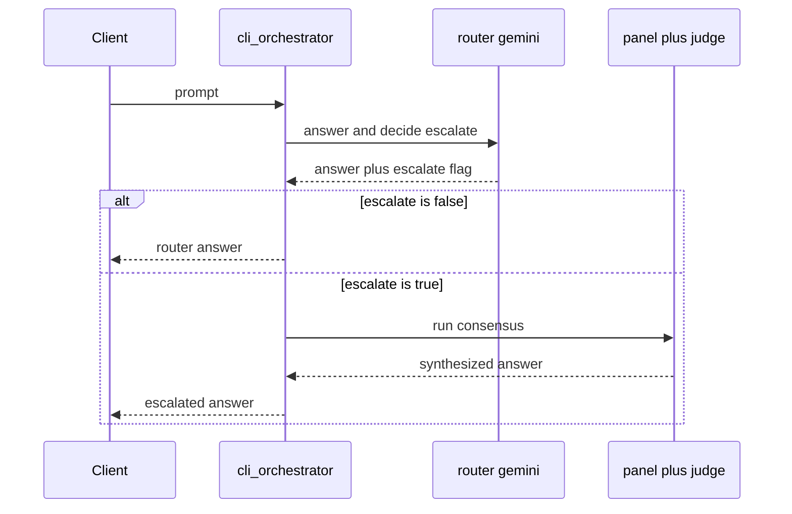
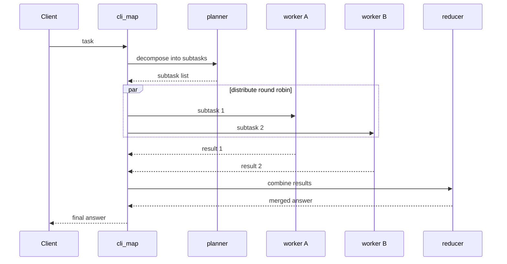
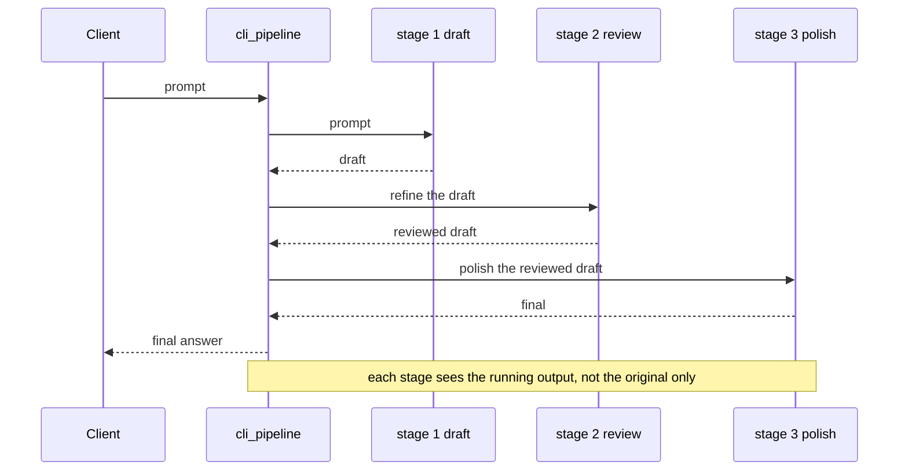
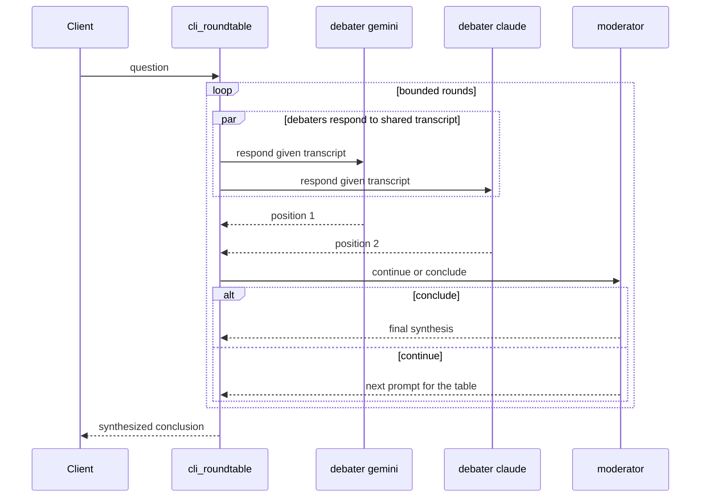
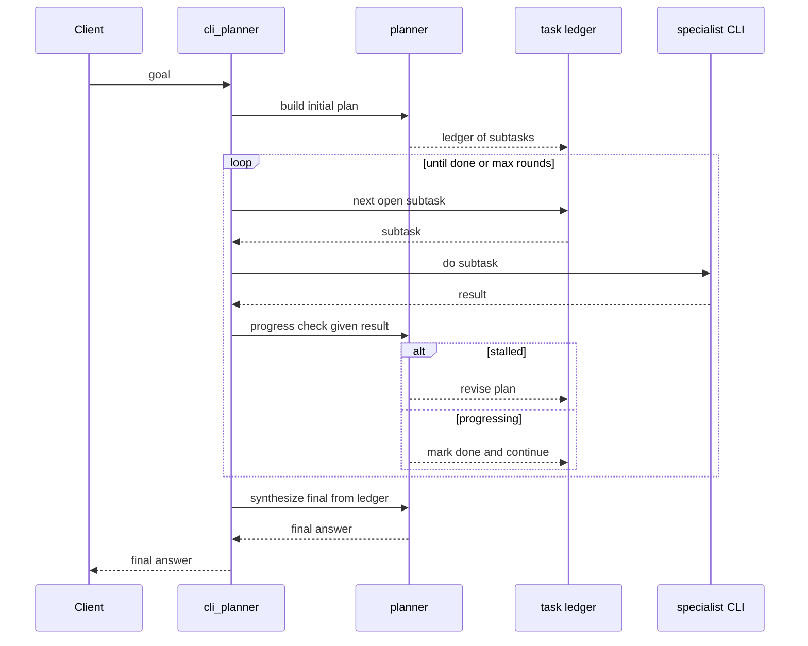

# Orchestration Patterns

Open Swarm exposes each multi-agent orchestration pattern as a **blueprint** — a
`model` id you select from any OpenAI client. This page gives a sequence diagram
for each, its status, and the field-standard pattern it mirrors (the same set
Microsoft's Agent Framework names: sequential, concurrent, handoff, group-chat,
Magentic-One).

All diagrams are GitHub-rendered Mermaid. Backends shown (`gemini`, `claude`,
`grok`) are illustrative — any configured CLI fills any role.

| Blueprint | Pattern | Status |
|---|---|---|
| [`cli_agent`](#cli_agent--single-backend) | single agent + failover | ✅ built |
| [`cli_fusion`](#cli_fusion--concurrent-panel--judge) | concurrent | ✅ built |
| [`cli_orchestrator`](#cli_orchestrator--handoff--escalation) | handoff / escalation | ✅ built |
| [`cli_map`](#cli_map--map-reduce) | map-reduce | ✅ built |
| [`cli_pipeline`](#cli_pipeline--sequential-refinement) | sequential | ⏳ planned |
| [`cli_roundtable`](#cli_roundtable--group-chat-debate) | group chat | ⏳ planned |
| [`cli_planner`](#cli_planner--magentic-one-ledger) | Magentic-One | ⏳ planned |

---

## `cli_agent` — single backend ✅

Expose one CLI over the API, with an ordered failover chain so a dead or
unauthenticated backend hands off to the next.

---

## `cli_fusion` — concurrent panel + judge ✅

Fan one prompt to a panel of CLIs **in parallel**, then a judge compares (not
concatenates) their answers and synthesizes one, optionally iterating a bounded
master-plan loop. Survivors carry the round if a panelist dies.

Live proof: [`docs/proofs/tri_cli_fusion_run.txt`](./proofs/tri_cli_fusion_run.txt).

---

## `cli_orchestrator` — handoff / escalation ✅

A cheap router CLI answers directly and decides whether the question is
high-stakes. Routine questions cost a single inference; only contested ones
escalate to a full consensus panel.

Live proof: [`docs/proofs/orchestrator_escalation_run.txt`](./proofs/orchestrator_escalation_run.txt).

---

## `cli_map` — map-reduce ✅

Split one task into independent subtasks, distribute them across worker CLIs in
parallel (round-robin), and reduce the results into one answer.

---

## `cli_pipeline` — sequential refinement ⏳ planned

A staged chain where each CLI refines the previous stage's output. Different
backends play to their strengths in order — for example a fast model drafts, a
strong model reviews, a third polishes. Distinct from `cli_fusion`: stages are
**sequential and dependent**, not a parallel panel.

---

## `cli_roundtable` — group-chat debate ⏳ planned

Several CLIs **debate in a shared transcript** across bounded rounds. Each round
every debater sees the others' latest positions; a moderator decides whether to
run another round or conclude, then synthesizes. Distinct from `cli_fusion`:
debaters react to each other across rounds, not just answer once.

---

## `cli_planner` — Magentic-One ledger ⏳ planned

A planner maintains a **task ledger**, delegates subtasks to specialist CLIs,
inspects results, and **re-plans on stall** up to a bound before synthesizing.
Distinct from `cli_map`: planning is iterative and reactive, not a single
decompose-then-reduce.

---

## Choosing a pattern

| If you want | Use |
|---|---|
| One CLI, with a backup if it is down | `cli_agent` |
| The best single answer from several models | `cli_fusion` |
| Cheap by default, rigorous only when it matters | `cli_orchestrator` |
| To split a big task across workers and merge | `cli_map` |
| Staged refinement, draft then review then polish | `cli_pipeline` ⏳ |
| Models to argue toward a conclusion | `cli_roundtable` ⏳ |
| A planner to drive specialists toward a goal | `cli_planner` ⏳ |

See [VISION.md](./VISION.md) for how these fit the larger picture, and
[CLI_FUSION.md](./CLI_FUSION.md) for configuration of the built blueprints.
