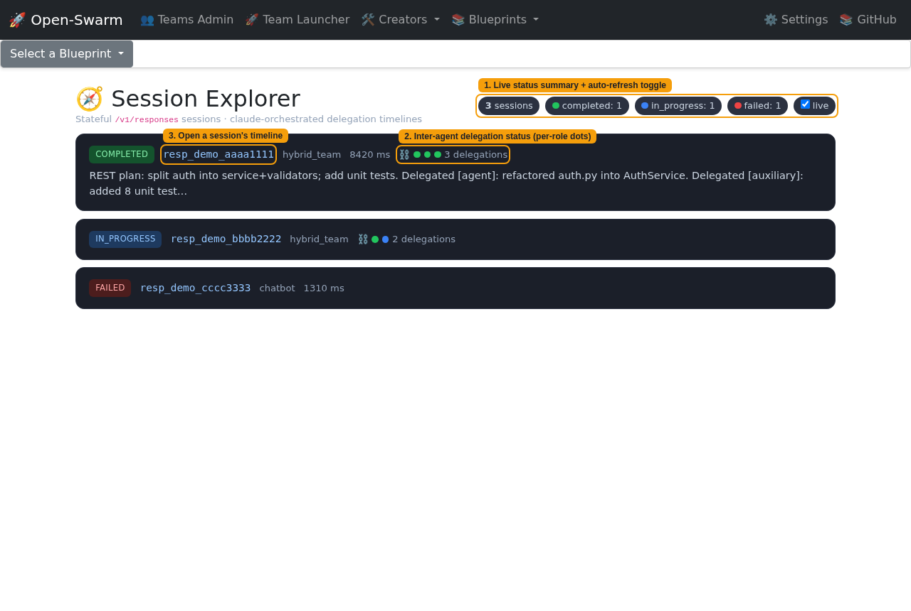
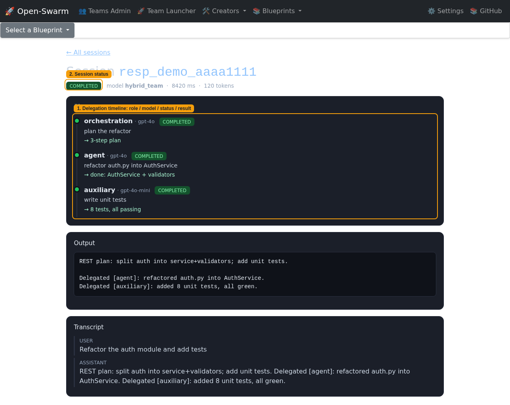

# Session Explorer — User Guide

The **Session Explorer** is a read-only observability UI for the stateful
`/v1/responses` API. It lets you browse every session the server has run —
including the **inter-agent delegation timeline** produced by `hybrid_team`'s
claude-orchestrated parallel delegation — without leaving the browser.

Open it at **`/sessions/`**.

## Session list

1. **Live status summary + auto-refresh toggle** — a running count of sessions by
   status (`completed` / `in_progress` / `failed` / …). The **`live`** checkbox
   auto-refreshes the list every few seconds from `/api/sessions/`, so long
   background runs update in place — no reload.
2. **Inter-agent delegation status** — each session card shows one coloured dot
   per delegated sub-task (green = completed, blue = in progress, red = failed),
   plus the delegation count, so you can see multi-agent fan-out at a glance.
3. **Open a session's timeline** — click the session id to drill into its detail.

Each card also shows the model, execution time, and a preview of the output.
Sessions are listed newest-first.

## Session detail + delegation timeline

1. **Delegation timeline** — a vertical, colour-coded timeline of the
   orchestration brain's delegations. Each node shows the **role**
   (`orchestration` / `agent` / `auxiliary`), the **model** it ran on (chosen by
   the `inference_profile` scorer), its **status**, and its **result** (or error).
   This is the inter-agent communication view: how claude planned the work and
   which model each sub-task executed on.
2. **Session status** — the overall session state, plus model, latency and token
   usage. The full output and input transcript follow below.

## How it works

The Explorer reads the file-backed session records persisted by
`swarm.core.responses_store` (one JSON per `response_id`, under
`$SWARM_RESPONSES_DIR`). The per-delegation timeline comes from the `progress`
array the async Responses worker streams as each parallel delegation completes —
so the timeline fills in live while a session is still running.

| Route | What |
|---|---|
| `GET /sessions/` | session list (HTML) |
| `GET /sessions/<response_id>/` | session detail + delegation timeline |
| `GET /api/sessions/` | JSON feed (used by the live refresh) |

> Screenshots above are captured headlessly via Playwright against an isolated
> instance seeded with sample sessions (`docs/screenshots/`), so the guide stays
> in sync with the real UI.
