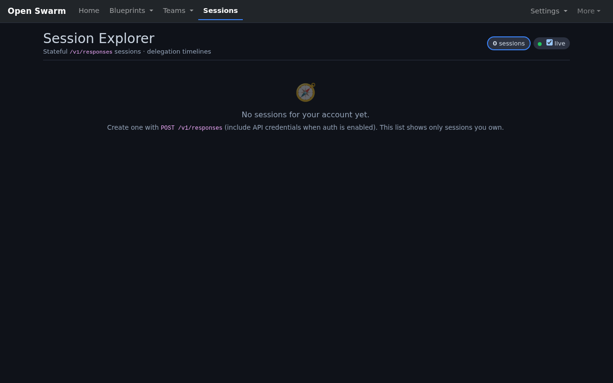
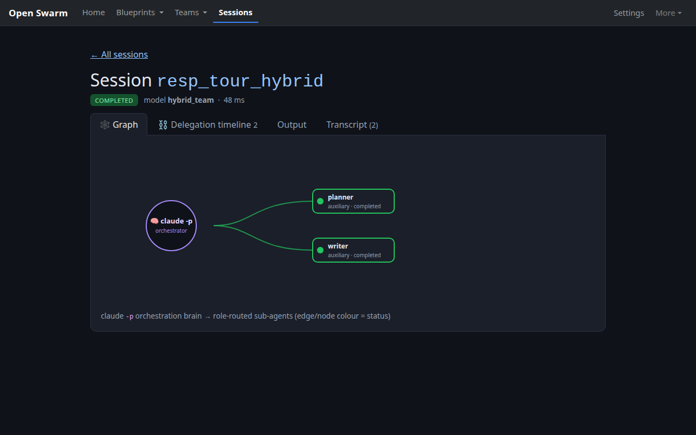

# Session Explorer — User Guide

The **Session Explorer** is a read-only observability UI for the stateful
`/v1/responses` API. It lets you browse every session the server has run —
including the **inter-agent delegation timeline** produced by `hybrid_team`'s
claude-orchestrated parallel delegation — without leaving the browser.

Open it at **`/sessions/`**.

## Screenshots (what we have today)

| View | PNG | Status |
|---|---|---|
| Session list | [`screenshots/sessions.png`](screenshots/sessions.png) | **Current** journey capture — fresh-db **empty state** only (`PAGES` stem `sessions`) |
| Session detail | [`screenshots/session-detail.png`](screenshots/session-detail.png) | **Current** journey capture — `PAGES` stem `session-detail`; seeded `responses_store` fixture (`resp_journey_seed`) so Graph / timeline tabs render |

There is **no** current journey PNG of a *populated* list (many live sessions).
The detail PNG is the real Django `/sessions/<id>/` UI against a capture-script
seed, not a fabricated mockup and not a live `POST /v1/responses` run.

An older still remains under
[`screenshots/archive/session-explorer-detail.png`](screenshots/archive/session-explorer-detail.png)
for history only.

## Session list

The current `sessions.png` capture is a **fresh-db empty state**: **0
sessions**, a **live** auto-refresh toggle, and a CTA to create sessions via
`POST /v1/responses`. Per-status filter chips (`completed` / `in_progress` /
`failed` / …) and the “Showing newest N of M (limit=50)” truncation banner are
**not** in this PNG — they appear only once sessions exist (and when the list
is truncated). Journey capture keeps the list empty on purpose: it seeds the
detail fixture *after* this PNG is taken.

When the store is populated, the same page also shows:

1. **Status filter chips + live toggle** — a total count plus one chip per
   status. The **`live`** checkbox (also present in the empty capture)
   auto-refreshes the list every few seconds from `/api/sessions/`, so long
   background runs update in place — no reload. The truncation banner appears
   when total sessions exceed the default list limit (50).
2. **Inter-agent delegation status** — each session card shows one coloured dot
   per delegated sub-task (green = completed, blue = in progress, red = failed),
   plus the delegation count, so you can see multi-agent fan-out at a glance.
3. **Open a session's timeline** — click the session id to drill into its detail.

Each card also shows the model, execution time, and a preview of the output.
Sessions are listed newest-first.

## Session detail + delegation timeline

> **Screenshot honesty:** `session-detail.png` is produced by
> [`scripts/capture_user_journey.py`](../scripts/capture_user_journey.py): after
> the empty list capture, the script writes a minimal `hybrid_team`-shaped
> record into an isolated `SWARM_RESPONSES_DIR` (`resp_journey_seed`, owned by
> the throwaway `journey-admin` principal) and screenshots
> `GET /sessions/resp_journey_seed/`. The Graph / tabs / chrome are the live
> template — only the JSON record is synthetic. This is **not** proof of a
> live multi-model run.

On a populated session (`GET /sessions/<response_id>/`), the page shows:

1. **Inter-agent communication graph** — a hub-and-spoke view of the run: the
   central `claude -p` **orchestration brain** with an edge to each delegated
   sub-agent node (role + the model it ran on). Edge and node colour encode
   status (green = completed, blue = in progress, red = failed), so you can see
   the fan-out and where work succeeded or stalled at a glance.
2. **Delegation timeline** — the same delegations as a vertical, colour-coded
   timeline: each entry shows the **role** (`orchestration` / `agent` /
   `auxiliary`), the **model** it ran on (chosen by the `inference_profile`
   scorer), its **status**, the **task**, and its **result** (or error).

Above these, the header shows the overall **session status**, model, latency and
token usage; the full output and input transcript follow below.

## How it works

The Explorer reads the file-backed session records persisted by
`swarm.core.responses_store` (one JSON per `response_id`, under
`$SWARM_RESPONSES_DIR`). The per-delegation timeline comes from the `progress`
array the async Responses worker streams as each parallel delegation completes —
so the timeline fills in live while a session is still running.

| Route | What |
|---|---|
| `GET /sessions/` | session list (HTML) |
| `GET /sessions/<response_id>/` | session detail + delegation timeline |
| `GET /api/sessions/` | JSON feed (used by the live refresh) |

> List view: current `sessions.png` from
> [`scripts/capture_user_journey.py`](../scripts/capture_user_journey.py)
> (`PAGES` stem `sessions` → `/sessions/`, empty isolated store).
> Detail/delegation graph: current `session-detail.png` (`PAGES` stem
> `session-detail` → `/sessions/resp_journey_seed/` after mid-run seed).
> Archive still:
> `docs/screenshots/archive/session-explorer-detail.png` (historical only).
