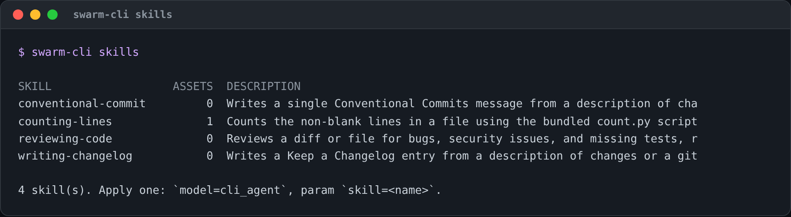
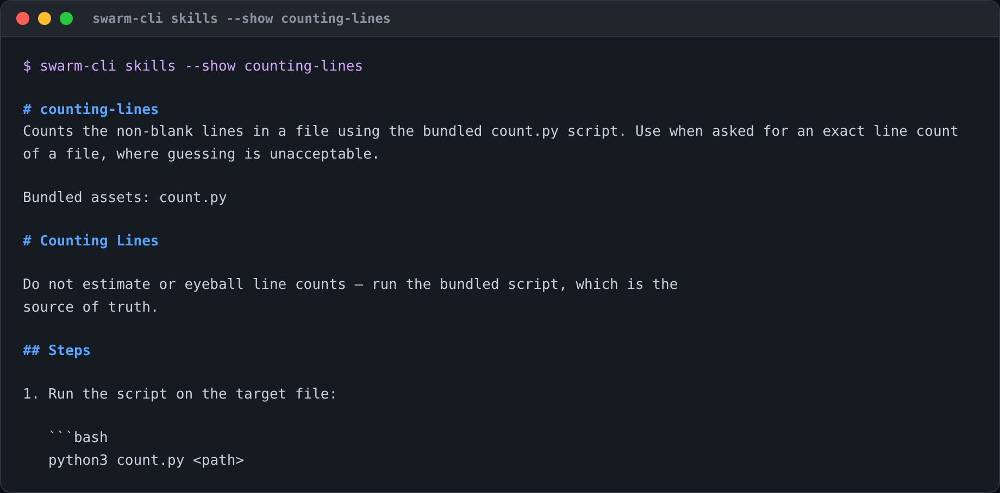
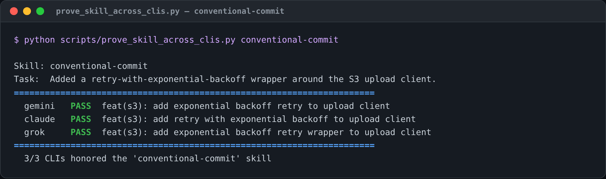
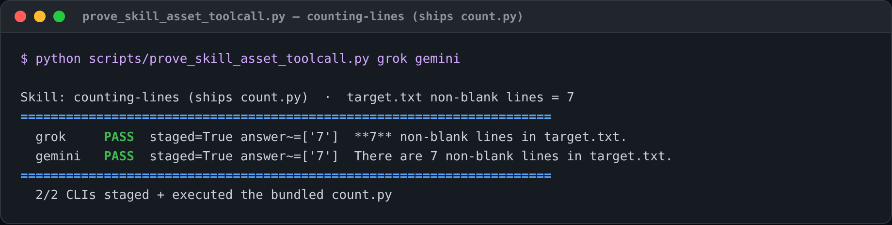
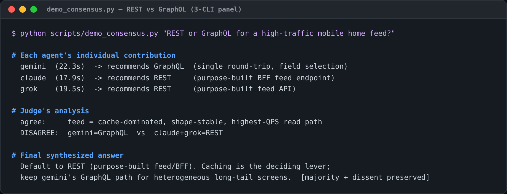

# Skills & Multi-CLI Consensus — a Walkthrough

This guide walks through two capabilities of Open Swarm's CLI Agent Fusion, end
to end, with the exact commands and their real output:

1. **Skills** — reusable, CLI-agnostic capabilities you apply to any agentic CLI.
2. **3-CLI consensus** — fanning a question to gemini + claude + grok and
   synthesizing one answer that shows how each agent contributed.

Every screenshot below is a real run against the live CLIs (gemini, `claude -p`,
grok). The proof scripts live in [`scripts/`](../scripts) and the captured
transcripts in [`docs/examples/`](examples).

---

## Part 1 — Skills

A **skill** is a directory containing a `SKILL.md` file: YAML frontmatter
(`name`, `description`) plus markdown instructions, optionally bundling helper
scripts. The format follows Anthropic's [Agent Skills](https://platform.claude.com/docs/en/agents-and-tools/agent-skills/overview)
open standard, so a skill authored here also loads in Claude Code and the Skills
API unchanged.

### 1.1 Discover what's available

`swarm-cli skills` lists every discoverable skill, its bundled-asset count, and
its description:



`--show <name>` prints a skill's full `SKILL.md` (and `--json` emits a
machine-readable form for tooling):



### 1.2 Apply a skill to any CLI

Applying a skill prepends its instructions to your prompt before the CLI runs —
so the *same* skill works on whichever CLI you pick. Through the API:

```bash
curl -sf localhost:8000/v1/chat/completions -H "Content-Type: application/json" -d '{
  "model": "cli_agent",
  "messages": [{"role":"user","content":"Added a retry-with-backoff wrapper around the S3 upload client."}],
  "extra_body": {"params": {"cli": "grok", "skill": "conventional-commit"}}
}'
```

`scripts/prove_skill_across_clis.py` runs one task through the
`conventional-commit` skill on all three CLIs and checks each output against the
skill's contract (`type(scope): summary`):



**3/3** — each CLI independently honored the skill, even converging on the same
`feat(s3):` framing. Skills are portable; the CLI is interchangeable.

### 1.3 Skills that bundle an executable

A skill can ship a script. The `counting-lines` skill bundles `count.py`; when
applied with a workdir, that file is **staged into the workdir** so a write-mode
CLI can execute it. We give it a file engineered so eyeballing is error-prone
(12 lines, 7 non-blank) — a correct answer is strong evidence the CLI actually
ran the script rather than guessing:



**2/2** — `staged=True` confirms `count.py` was placed in the workdir, and the
exact `7` confirms each CLI executed it. Skills and tool calling compose.

---

## Part 2 — 3-CLI Consensus

`scripts/demo_consensus.py` fans a question to a panel (gemini + claude + grok)
in parallel, has a judge (grok) compare their answers, and synthesizes one
result — surfacing each agent's individual contribution and any disagreement,
rather than blending it away.



This example is deliberately one where the panel **splits**: gemini argues for
GraphQL while claude and grok argue for REST. The judge records the disagreement
explicitly, then synthesizes a majority recommendation (REST for a
cache-dominated feed) while preserving gemini's dissent and the conditions under
which it would be the right call.

Full transcripts — every agent's complete answer, the judge's
agreement/disagreement/unique-insights/gaps breakdown, and the synthesis — are
in [`docs/examples/`](examples):

- [`consensus-slow-endpoint.md`](examples/consensus-slow-endpoint.md) — a case where the panel is unanimous.
- [`consensus-rest-vs-graphql.md`](examples/consensus-rest-vs-graphql.md) — the split decision shown above.
- [`skill-bundled-asset-toolcall.md`](examples/skill-bundled-asset-toolcall.md) — the tool-calling proof.

---

## Reproduce it yourself

```bash
# list / inspect skills
uv run swarm-cli skills
uv run swarm-cli skills --show counting-lines

# prove a skill is portable across every installed CLI
DJANGO_DEBUG=true python scripts/prove_skill_across_clis.py conventional-commit

# prove a bundled script is staged + executed
DJANGO_DEBUG=true python scripts/prove_skill_asset_toolcall.py grok gemini

# generate a fresh 3-CLI consensus transcript
DJANGO_DEBUG=true python scripts/demo_consensus.py "your question here" out.md
```

> Screenshots are regenerated from captured output with
> `webui/frontend/scripts/term-shot.mjs` (renders a terminal-style PNG via the
> already-installed Playwright — no extra tooling needed).
