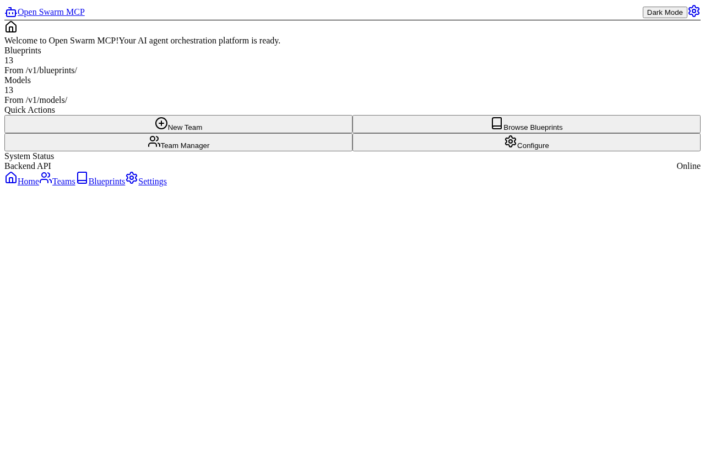
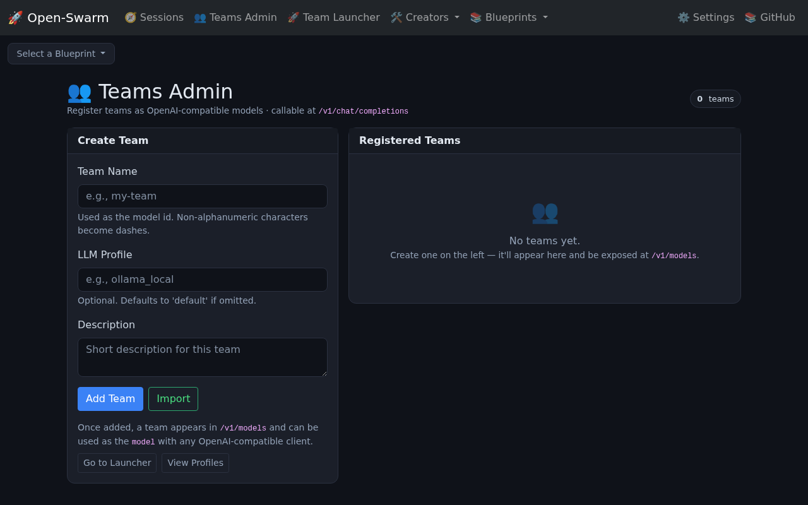
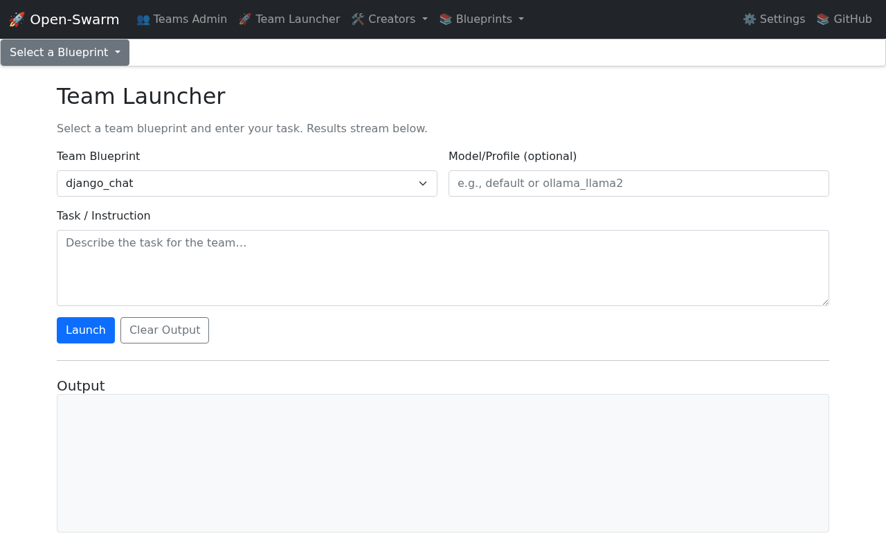
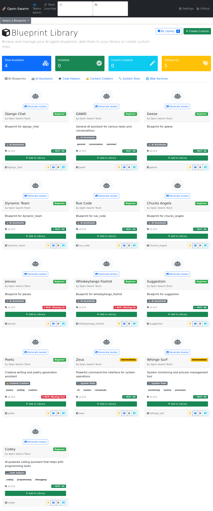
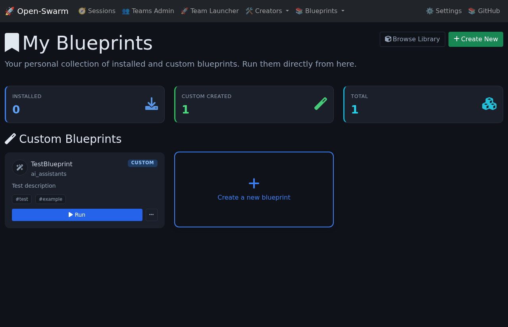
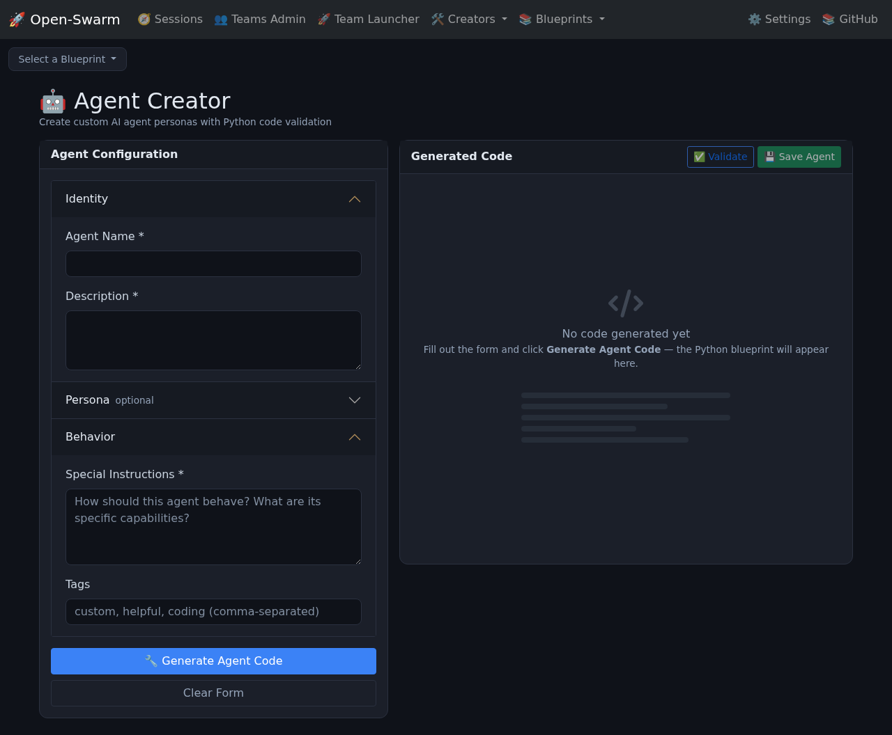
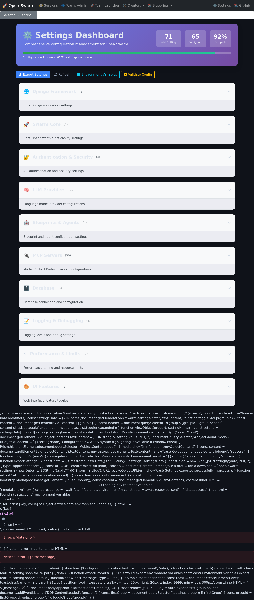

# Open Swarm: A User Journey

A walkthrough of Open Swarm from a fresh checkout to running agent teams —
on the command line, in the web UI, and over the OpenAI-compatible API.

Every terminal block below is real output captured on a development machine,
and every screenshot in [`docs/screenshots/`](./screenshots/) was captured from
a live local server by [`scripts/capture_user_journey.py`](../scripts/capture_user_journey.py).
Where a page shows demo, placeholder, or empty-state data, the caption says so.

> Screenshots captured 2026-06-11 with a fresh development database; terminal
> transcripts captured 2026-06-10 on `main`.

> **Documentation map:** [USERGUIDE.md](../USERGUIDE.md) is the `swarm-cli`
> reference, this file is the end-to-end story,
> [GUIDED_TOUR.md](./GUIDED_TOUR.md) is the screenshot-per-page visual tour of
> the web UI (including the React SPA pages), and
> [SCREENSHOTS.md](./SCREENSHOTS.md) is the capture registry.

---

## 1. Install

```bash
git clone https://github.com/matthewhand/open-swarm.git
cd open-swarm
uv sync --all-extras          # or: pip install -e .[dev]

# Configure an LLM key for real agent runs (not needed for the tour below)
export OPENAI_API_KEY="sk-..."   # preferred (OPENAI_BASE_URL optional; LITELLM_* aliases ok)
export OPENAI_BASE_URL="http://your-gateway:8000/v1"  # synthesizes gpt-5.5 default profile if no full llm profiles in config
# Profiles in swarm_config.json are primary (incl. complex mappings). DEFAULT_LLM/LITELLM_MODEL deprecated as selectors.
```

This guide uses the project virtualenv directly (`.venv/bin/...`); if you use
`uv`, prefix the same commands with `uv run` instead.

## 2. Meet the CLI

Open Swarm ships agent teams as **blueprints**. `swarm-cli list` shows what is
bundled and what you have installed:

```text
$ .venv/bin/swarm-cli list
--- Installed Blueprint Executables (in /home/user/.local/share/swarm/bin) ---
(No installed blueprint executables found in /home/user/.local/share/swarm/bin)
Try 'swarm-cli install-executable <blueprint_name>' or see 'swarm-cli list --available'.

--- Bundled Blueprints (available from package) ---
- django_chat (entry: apps.py)
- gawd (entry: apps.py)
- family_ties (entry: blueprint_family_ties.py)
- geese (entry: geese_memory_objects.py)
- dynamic_team (entry: blueprint_dynamic_team.py)
- poets (entry: poets_cli.py)
- flock (entry: blueprint_flock.py)
- stewie (entry: apps.py)
- rue_code (entry: blueprint_rue_code.py)
- chucks_angels (entry: blueprint_chucks_angels.py)
- digitalbutlers (entry: blueprint_digitalbutlers.py)
- jeeves (entry: blueprint_jeeves.py)
- zeus (entry: apps.py)
- common (entry: progress.py)
- whiskeytango_foxtrot (entry: apps.py)
- suggestion (entry: suggestion_cli.py)
- codey (entry: blueprint_codey.py)
- whinge_surf (entry: blueprint_whinge_surf.py)

--- User Blueprint Sources (in /home/user/.local/share/swarm/blueprints) ---
(No user blueprint sources found in /home/user/.local/share/swarm/blueprints)
You can add blueprints by copying their source folders to this directory.
```

### Try a blueprint without an API key (`SWARM_TEST_MODE`)

`SWARM_TEST_MODE=1` makes blueprints emit deterministic, canned output — the
same mechanism the 600+ test suite uses to run keyless. It also makes
`swarm-cli install` write a fast shell shim instead of compiling a PyInstaller
binary:

```text
$ SWARM_TEST_MODE=1 .venv/bin/swarm-cli install jeeves
Installing blueprint 'jeeves' as executable...
  Source: /home/user/open-swarm/src/swarm/blueprints/jeeves
  Entry Point: blueprint_jeeves.py
  Output Executable: /home/user/.local/share/swarm/bin/jeeves
Test-mode shim installed at: /home/user/.local/share/swarm/bin/jeeves

$ SWARM_TEST_MODE=1 .venv/bin/swarm-cli launch jeeves --message "What time is it?"
Launching 'jeeves' with: /home/user/.local/share/swarm/bin/jeeves --message What time is it?
--- jeeves Output ---
[SWARM_CONFIG_DEBUG] Trying: /home/user/open-swarm/swarm_config.json
[SWARM_CONFIG_DEBUG] Loaded: /home/user/open-swarm/swarm_config.json

--- 'jeeves' finished (Return Code: 0) ---
```

Each blueprint also has a direct CLI entry point. In test mode Jeeves renders
its full spinner-and-result-box UX (this is the canned test output, not a real
LLM answer):

```text
$ SWARM_TEST_MODE=1 .venv/bin/python -m swarm.blueprints.jeeves.jeeves_cli --message "What time is it?"
[SPINNER] Polishing the silver
╭──────────────────────────── Searching Filesystem ────────────────────────────╮
│ 🔍 Matches so far: 1                                                         │
│ [SPINNER] Polishing the silver                                               │
│                                                                              │
╰──────────────────────────────────────────────────────────────────────────────╯
[SPINNER] Generating.
╭──────────────────────────── Searching Filesystem ────────────────────────────╮
│ 🔍 Matches so far: 2                                                         │
│ [SPINNER] Generating.                                                        │
│                                                                              │
╰──────────────────────────────────────────────────────────────────────────────╯
[SPINNER] Generating..
╭──────────────────────────── Searching Filesystem ────────────────────────────╮
│ 🔍 Matches so far: 3                                                         │
│ [SPINNER] Generating..                                                       │
│                                                                              │
╰──────────────────────────────────────────────────────────────────────────────╯
[SPINNER] Generating...
╭──────────────────────────── Searching Filesystem ────────────────────────────╮
│ 🔍 Matches so far: 4                                                         │
│ [SPINNER] Generating...                                                      │
│                                                                              │
╰──────────────────────────────────────────────────────────────────────────────╯
[SPINNER] Running...
╭──────────────────────────── Searching Filesystem ────────────────────────────╮
│ 🔍 Matches so far: 5                                                         │
│ [SPINNER] Running...                                                         │
│                                                                              │
╰──────────────────────────────────────────────────────────────────────────────╯
```

With a real key configured (`OPENAI_API_KEY` plus `swarm_config.json` LLM
profiles), drop `SWARM_TEST_MODE` and the same commands run real agents.

## 3. Tour the web UI

Start the Django server in development mode. `ENABLE_WEBUI=true` enables the
template-rendered pages (teams, launcher, library, creator, settings):

```bash
ENABLE_WEBUI=true DJANGO_DEBUG=true .venv/bin/python manage.py runserver 8000
```

> In production set `DJANGO_SECRET_KEY`, `DJANGO_ALLOWED_HOSTS`, and
> `API_AUTH_TOKEN` instead of `DJANGO_DEBUG=true` — see
> [CONFIGURATION.md](../CONFIGURATION.md).

### Landing page — `/`



When the React frontend has been built (`webui/frontend/dist/` exists), `/`
serves the React SPA — now shipping styled (DaisyUI 5 / Tailwind 4) CSS. The
dashboard's blueprint/model counts are fetched live from `/v1/blueprints/`
and `/v1/models/`, and "Backend API: Online" is a real health indicator. The
SPA's inner pages (`/chat`, `/teams`, `/blueprints`, `/agent-creator`,
`/settings`) are wired to the real backend APIs — see the page-by-page
[guided tour](./GUIDED_TOUR.md#2-react-spa-tour) with captures of each
(`spa-chat.png`, `spa-teams.png`, `spa-blueprints.png`,
`spa-agent-creator.png`, `spa-settings.png` in
[`docs/screenshots/`](./screenshots/)). Remaining gaps are tracked in the
Roadmap (e.g. the chat websocket protocol ignores the blueprint selector).
Delete or skip building `webui/frontend/dist/` to get the Django template UI
at `/` instead; the template pages below remain the supported admin surface.

### Teams admin — `/teams/`



Register named teams that become OpenAI-compatible *models*. The "Registered
Teams" table is empty here because this is a fresh development database. Once
added, a team appears in `/v1/models` and can be used as the `model` field
with any OpenAI client.

### Team launcher — `/teams/launch/`



Pick a team blueprint (here the bundled `django_chat` is pre-selected), type a
task, and stream the team's output in the browser. The output panel is empty
because nothing has been launched yet in this fresh environment.

### Blueprint library — `/blueprint-library/`



Browse the bundled blueprints (Django Chat, GAWD, Geese, Dynamic Team, Rue
Code, Chucks Angels, Jeeves, Zeus, Codey, …) with per-blueprint requirement
badges (e.g. "MCP: OK" / "MCP: Missing") computed from your local
environment. The summary tiles (5 available / 0 installed / 0 custom /
5 categories) reflect this fresh dev setup.

### My blueprints — `/blueprint-library/my-blueprints/`



Your personal collection of installed and custom blueprints. Shown in its
empty state — a fresh environment with nothing added to the library yet.

### Agent creator — `/agent-creator/`



Build a custom agent persona from a form (name, personality, expertise,
communication style, special instructions); the right-hand panel generates,
validates, and saves the resulting Python blueprint code.

### Settings dashboard — `/settings/`



Configuration management grouped by category (Django, Swarm core, auth, LLM
providers, blueprints/agents, MCP servers, database, logging, performance, UI
features), with a configuration-progress meter and import/export of the
environment. Values shown are this dev machine's local configuration.

### Login page — `/accounts/login/`


The login form — deliberately minimal and unstyled. Both `/accounts/login/`
and `/login/` are wired to the `custom_login` view (earlier captures of this
journey reported them 404/500; that has been fixed). The "testuser/testpass"
hint is baked into the dev template; that account only exists when the
dev-only auto-login flag is enabled. Logging in is what enables the SPA chat
page's websocket session — the chat consumer rejects anonymous connections.

### Pages not captured

* **`/webui/`** — the legacy websocket-chat template page no longer ships;
  the URL now issues a redirect to `/` for old bookmarks, so there is nothing
  distinct to capture.

## 4. Use it as an OpenAI-compatible API

Everything in the web UI is also an API. List blueprints as *models*
(output truncated; real capture from a local dev server):

```text
$ curl -s http://localhost:8000/v1/models | python -m json.tool
{
    "object": "list",
    "data": [
        {
            "id": "django_chat",
            "object": "model",
            "created": 1781045533,
            "owned_by": "open-swarm"
        },
        {
            "id": "gawd",
            "object": "model",
            "created": 1781045533,
            "owned_by": "open-swarm"
        },
        ...
    ]
}
```

Chat with a blueprint using any OpenAI client — the `model` field selects the
blueprint. With `API_AUTH_TOKEN` set on the server, pass it as a bearer token:

```bash
curl -s http://localhost:8000/v1/chat/completions \
  -H "Content-Type: application/json" \
  -H "Authorization: Bearer ${API_AUTH_TOKEN}" \
  -d '{"model": "suggestion", "messages": [{"role":"user","content":"Say hello"}]}'
```

The response is a standard OpenAI chat-completion envelope. Captured on this
dev machine *without* a valid upstream LLM key, so the assistant content is an
error string — shown here to illustrate the envelope honestly:

```json
{
  "id": "chatcmpl-76e9038c-616e-45fd-930e-a1abf5448b1e",
  "object": "chat.completion",
  "created": 1781045545,
  "model": "suggestion",
  "choices": [
    {
      "index": 0,
      "message": {
        "role": "assistant",
        "content": "An error occurred: Error code: 401 - {'error': {'message': 'Incorrect API key provided: ...'}}"
      },
      "logprobs": null,
      "finish_reason": "stop"
    }
  ],
  "usage": {"prompt_tokens": 0, "completion_tokens": 0, "total_tokens": 0},
  "system_fingerprint": null
}
```

Configure a working LLM profile (via `OPENAI_API_KEY` + `swarm_config.json` `llm` profiles, or local Ollama) and the same request returns real agent output.
Streaming (`"stream": true`) is supported.

## 5. Regenerating this guide

The screenshots are maintained by a self-contained, re-runnable script:

```bash
.venv/bin/pip install playwright
.venv/bin/playwright install chromium
.venv/bin/python scripts/capture_user_journey.py
```

[`scripts/capture_user_journey.py`](../scripts/capture_user_journey.py):

1. starts its own Django dev server on port **8321**
   (`DJANGO_DEBUG=true ENABLE_WEBUI=true manage.py runserver 8321 --noreload`)
   and waits for readiness;
2. runs migrations, creates a throwaway superuser via `manage.py shell -c`,
   and logs in up front — the chat websocket consumer only accepts
   authenticated sessions, and logged-in pages render more realistically;
3. visits each page in its `PAGES` list (the React SPA routes plus the Django
   template pages) in headless Chromium at **1280x800** and writes full-page
   PNGs to `docs/screenshots/<kebab-name>.png`, overwriting the previous
   capture (SPA pages require a built `webui/frontend/dist/`);
4. skips (never fakes) any page that returns 4xx/5xx, then kills the server
   and prints a `captured/skipped` summary.

After re-running it, update the captions in this file and in
[`GUIDED_TOUR.md`](./GUIDED_TOUR.md) if pages changed, and move superseded
screenshots to `docs/screenshots/archive/` (same filename) per the convention
in the [screenshot registry](./SCREENSHOTS.md).
The terminal transcripts in section 2 and 4 can be refreshed by re-running the
commands shown and pasting the new output.
