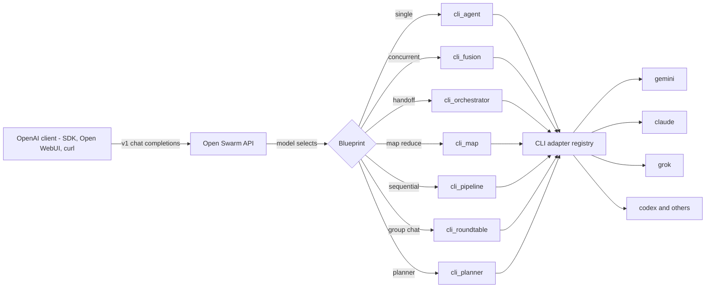

# Open Swarm — Vision

> **One sentence:** Open Swarm turns the agentic CLIs you already have — `claude`,
> `gemini`, `grok`, `codex`, `opencode`, and any future one — into a single
> OpenAI-compatible endpoint, and lets you **orchestrate them as a team**:
> consensus, routing, divide-and-conquer, sequential refinement, debate, and
> planner-led delegation.

This document is the front door. It states where we are going, then gives an
**honest** account of what is built and what is not. For the mechanics of each
orchestration pattern with sequence diagrams, see
[ORCHESTRATION_PATTERNS.md](./ORCHESTRATION_PATTERNS.md). For per-feature
evidence see [FEATURE_STATUS.md](../FEATURE_STATUS.md); for the nested checklist
see [ROADMAP.md](../ROADMAP.md).

---

## The vision

The agent ecosystem fractured into excellent, mutually-incompatible **agentic
CLIs**. Each vendor ships its own terminal tool with its own auth, its own tool
calling, its own model access. They do not talk to each other, and none of them
expose a standard API you can point an OpenAI client at.

Open Swarm closes that gap on two axes:

1. **Adapt** — wrap any agentic CLI as a first-class backend behind the
   OpenAI-compatible REST API (`/v1/chat/completions`, `/v1/responses`,
   `/v1/models`). Point Open WebUI, Cursor, the OpenAI SDK, or `curl` at one URL
   and reach every CLI on the box. The CLI keeps its own auth and tools; Open
   Swarm just gives it a standard door.

2. **Orchestrate** — compose those CLIs into multi-agent *teams* using named
   orchestration patterns, exposed as **blueprints** (each is a `model` id). The
   patterns are deliberately the same primitives the field has converged on —
   the ones Microsoft's Agent Framework calls sequential, concurrent, handoff,
   group-chat, and Magentic-One — but realized over heterogeneous CLIs instead
   of a single SDK's agents.

The thesis: **you do not need one model to be best at everything.** You need a
cheap fast model to triage, a strong model to arbitrate, and a way to make them
deliberate. A `gemini` flash panelist, a `claude` judge, and a `grok` dissenter
will, between them, beat any one of them alone on the questions that matter —
and Open Swarm makes wiring that a one-line `model:` choice.

### Why CLIs (not raw API keys)

- **Auth you already have.** Each CLI carries its own login (OAuth, subscription,
  or key). Open Swarm never sees or stores those credentials.
- **Tools you already have.** `claude` and `gemini` ship real tool calling — they
  read files, run commands, browse. Wrapping the CLI inherits that agentic
  behaviour for free (proven below).
- **No lock-in.** Add a CLI by adding a config block. Nothing in a blueprint
  names a vendor; backends are chosen by name, by failover chain, or by
  *inference profile* (desired traits, not a brand).

---

## What is built today (v0.4.11)

This is verified, shipped, and covered by an 1100+ test suite. Status marks:
✅ working · 🟡 partial.

| Capability | Status | Where |
|---|---|---|
| OpenAI-compatible API — `/v1/chat/completions` (+SSE), `/v1/models` | ✅ | `src/swarm/views/chat_views.py` |
| **Stateful** `/v1/responses` — `store`, `previous_response_id` chaining, GET/DELETE | ✅ | `src/swarm/views/responses_views.py`, `swarm/core/responses_store.py` |
| OpenAPI schema at `/api/schema/` (+ Swagger UI) | ✅ | `drf-spectacular` |
| **`cli_agent`** — expose one CLI, with failover and self-consensus | ✅ | `blueprints/cli_agent/` |
| **`cli_fusion`** — panel → judge → synthesize, bounded master-plan loop | ✅ | `blueprints/cli_fusion/` |
| **`cli_orchestrator`** — cheap router, escalate to a panel only when high-stakes | ✅ | `blueprints/cli_orchestrator/` |
| **`cli_map`** — decompose → distribute → reduce (divide-and-conquer) | ✅ | `blueprints/cli_map/` |
| **`cli_pipeline`** — sequential refinement (draft → review → polish) | ✅ | `blueprints/cli_pipeline/` |
| **`cli_roundtable`** — group-chat debate, moderated to a conclusion | ✅ | `blueprints/cli_roundtable/` |
| **`cli_planner`** — Magentic-One-style task ledger, re-plans on stall | ✅ | `blueprints/cli_planner/` |
| CLI autodiscovery + auth probe (`swarm-cli cli-agents --init/--check-auth`) | ✅ | `swarm/core/cli_adapter.py`, `cli_catalog.py` |
| Per-panelist **git-worktree isolation** for write-mode CLIs | ✅ | `cli_fusion` |
| **Inference profiles** — pick a backend by traits (intelligence/speed/cost), not brand | ✅ | `docs/examples/inference-profile-routing.md` |
| **Skills** — Anthropic Agent-Skills `SKILL.md`, applied to any CLI via `skill=` | ✅ | `docs/SKILLS_AND_CONSENSUS_WALKTHROUGH.md` |
| **Tool capabilities** — declare an abstract need, resolve to an MCP provider | 🟡 | `swarm/core/tool_capabilities.py` |
| Web UI Builder + dashboard + live websocket chat | 🟡 | Django UI supported; React SPA approaching parity |
| Opt-in cross-conversation **memory** (mem0) | 🟡 | wired, not yet validated against a live mem0 |

### Proof it actually works (captured live, this repo)

These are **real CLI transcripts**, not mocks. Re-runnable; raw output committed
under [`docs/proofs/`](./proofs/).

- **Cross-CLI consensus** — one prompt fanned to `gemini` + `claude` + `grok`
  concurrently, a `claude` judge synthesizing, with consensus / contradictions /
  gaps / unique-insight analysis across the three models in **27 s**. See
  [`docs/proofs/tri_cli_fusion_run.txt`](./proofs/tri_cli_fusion_run.txt).
- **Routing / escalation** — a `gemini` router resolves low-stakes questions
  directly with a stated reason, reserving the panel for contested ones. See
  [`docs/proofs/orchestrator_escalation_run.txt`](./proofs/orchestrator_escalation_run.txt).
- **Tool calling** — `gemini` and `claude` each *read a real file*
  (`pyproject.toml`) via their own tools and returned the exact version string.
  See [`docs/proofs/tool_calling_run.txt`](./proofs/tool_calling_run.txt).
- **Sequential / group-chat / planner** — `cli_pipeline` (gemini draft → claude
  review), `cli_roundtable` (gemini + grok debate, claude moderator concludes),
  and `cli_planner` (claude plans a ledger, a worker executes, planner concludes
  with a 12-point checklist). See the `pipeline_run`, `roundtable_run`, and
  `planner_run` transcripts in [`docs/proofs/`](./proofs/).
- **Full permutation matrix** — every installed CLI through every framework mode,
  12/12 passing: `scripts/prove_cli_permutations.py`.

---

## What remains (honest)

### Orchestration patterns — complete ✅

The standard pattern set is now built end to end: concurrent (`cli_fusion`),
handoff/escalation (`cli_orchestrator`), map-reduce (`cli_map`), sequential
(`cli_pipeline`), group-chat (`cli_roundtable`), and Magentic-One
(`cli_planner`). Each has a sequence diagram in
[ORCHESTRATION_PATTERNS.md](./ORCHESTRATION_PATTERNS.md), tests under
`tests/blueprints/`, and a live cross-CLI transcript in
[`docs/proofs/`](./proofs/). Remaining work here is depth, not coverage:
richer streaming progress for the multi-round patterns, and per-stage usage
accounting.

### Other known gaps (unchanged from the roadmap)

- **React SPA parity** with the Django UI — live on real APIs, not yet per-page
  complete; the Django templates UI remains the supported surface.
- **MCP server mode** (`ENABLE_MCP_SERVER`) — aspirational; the flag warns loudly.
- **Memory** — mem0 wired and opt-in, not yet validated end-to-end against a live
  mem0; `letta`/`langmem` are placeholders.
- **Deprecation-shim sunset** — import shims from the consolidation get removed in
  the release after v0.3.x.

---

## How the pieces fit

Every blueprint resolves backends through one **CLI adapter registry** built from
the `cli_agents` config block. Adding a CLI never touches a blueprint.

---

## Design principles

1. **OpenAI-compatible or it does not exist.** Every capability ships as a
   `model` id reachable from a stock OpenAI client.
2. **Blueprints name patterns, not vendors.** Backend selection is by name,
   failover, or inference profile — never hardcoded.
3. **Credentials stay with the CLI.** Open Swarm never reads or stores a CLI's
   auth. Config holds command-lines, not secrets.
4. **Honest status.** Partial is marked partial; planned is marked planned;
   proofs are real transcripts you can re-run.
5. **Graceful degradation.** A dead panelist must not sink a round; consensus
   comes from survivors, and failures are surfaced, not swallowed.

---

## See also

- [ORCHESTRATION_PATTERNS.md](./ORCHESTRATION_PATTERNS.md) — sequence diagrams for every pattern
- [CLI_FUSION.md](./CLI_FUSION.md) — the CLI-fusion blueprints in depth
- [ROADMAP.md](../ROADMAP.md) · [FEATURE_STATUS.md](../FEATURE_STATUS.md) — granular status
- [docs/archive/](./archive/) — superseded architectures, kept for the record
