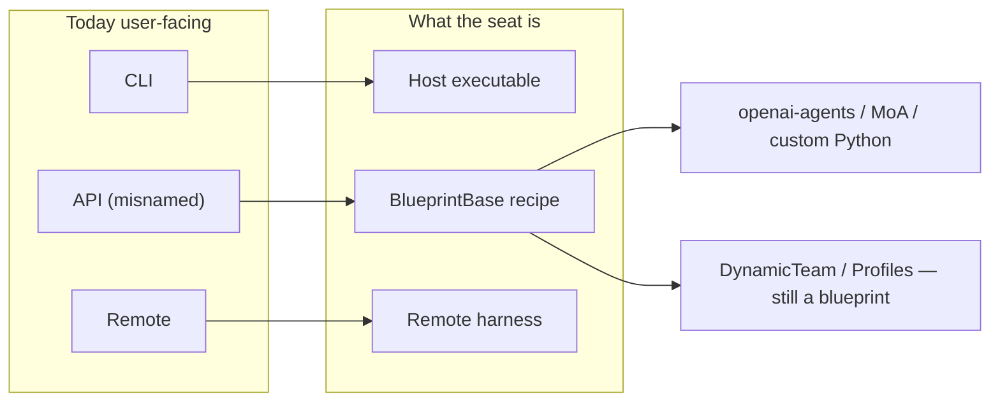
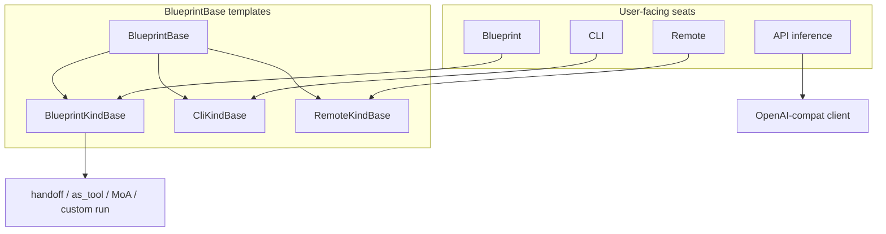

# ADR-006: Separate API (inference seat) from Blueprint (programmatic)

- **Status:** Proposed (look-only; no runtime or UI change in this PR)
- **Date:** 2026-09-04
- **Issue:** [#652](https://github.com/matthewhand/open-swarm/issues/652) (REQ-193) — Phase 0
- **Related:** [#570](https://github.com/matthewhand/open-swarm/issues/570) / [PR #578](https://github.com/matthewhand/open-swarm/pull/578) (ADR-005 kind bases), [#640](https://github.com/matthewhand/open-swarm/issues/640) (Add-agent tabs), [#595](https://github.com/matthewhand/open-swarm/issues/595) (rail filter), [#564](https://github.com/matthewhand/open-swarm/issues/564) (openai-agents graphs), [#586](https://github.com/matthewhand/open-swarm/issues/586) (manage CLI/API from wizard)
- **Amends:** ADR-005 (PR #578, not yet on `main`) — the `ApiKindBase` slot conflated inference with programmatic graphs. This ADR splits that slot.
- **Supersedes:** none. Complements [ADR-001](../ADR-001-primary-ui.md) (UI chrome) and [ADR-002](./002-config-ownership.md) (config / secrets).

**Decision:** Four user-facing kinds — **CLI | API | Blueprint | Remote**.

Today’s stored `api` means “not CLI, not remote” and is **actually Blueprint** (a programmatic recipe). **Rename** those seats to `blueprint`, then **introduce** a true `api` kind: a simple OpenAI-compatible inference seat (base URL / model / key-env). Do not keep `api` as the programmatic bucket.

This ADR is **look-only**. It records what `main` (`781db565`) does, then picks one target model. No runtime, no Add-agent code, no secrets.

---

## Issue quote (REQ-193)

**Intent:** Users can attach a simple inference seat without picking a programmatic blueprint; blueprints stay the power path.

| Kind | Meaning (Issue) |
|------|-----------------|
| **API agent** | User wires an agent **directly to an LLM inference API** (OpenAI-compat base URL / model / key env). Chat completions style. Not a programmatic graph. |
| **Blueprint agent** | **Programmatic** recipe (openai-agents handoffs, MoA, custom Python blueprint, etc.). May *use* inference underneath, but the seat is the blueprint. |

Also keep existing **CLI** and **Remote**. Pick one coherent model: four kinds, *or* rename today’s API → Blueprint and introduce a true API.

**Success (this Phase 0):** Document today’s conflation; target model; migration for existing “API” seats that are actually blueprints; UI copy (Add-agent tabs, Settings, rail). Child Issues own Phase 1 (UI) and Phase 2 (runtime).

**Constraints:** ADR look-only OK first. No secrets. Coordinate #640 tabs. No Neon.

---

## 1. Today (honest conflation)

The product already has three **user-facing** kinds and a separate **blueprint** vocabulary. They overlap. Users who want “just talk to this LLM” are sent through a recipe.

### 1.1 Three kinds in code

| Surface | Values | Evidence |
|---------|--------|----------|
| Python classifier | `api` \| `cli` \| `remote` | `src/swarm/core/agent_kind.py` — anything not `cli:` / `remote:` **defaults to `api`**, including “API blueprints such as `cli_agent`” |
| SPA classifier | same three | `webui/frontend/src/lib/agentKind.ts` |
| Agent-router types | `AGENT_TYPES = ("api", "cli", "remote")` | `src/swarm/core/agent_types.py` |
| Stored fine `kind` | `builtin` / `personality` / `swarm` / `blueprint` / `cli` / `remote` / `api` | `KIND_TO_TYPE` maps **builtin, personality, swarm, blueprint → `api`** |
| SPA `AgentType` | `'api' \| 'cli' \| 'remote'` | `webui/frontend/src/types/agent.ts`, `webui/frontend/src/lib/agent-types.ts` |
| Team roster | `kind: api\|cli\|remote\|team\|herdr` | [GLOSSARY](../GLOSSARY.md) |
| Add-agent wizard | CLI / API / Remote | `webui/frontend/src/components/AddAgentWizard.tsx` |
| Agent Router rail | sections **API, CLI, Remote** | `webui/frontend/src/components/AgentSidebar/AgentSidebar.tsx` + test “groups visible agents under API, CLI, then Remote” |
| Starters | Support + CLI + **API agent** + Remote | `webui/frontend/src/lib/starter-agents.ts` |

`src/swarm/core/agent_types.py` states the conflation in one paragraph:

> **api** — LiteLLM / OpenAI-compatible chat, implemented as openai-agents `Agent`s. … Built-in specialists, personality designs, swarm designs, and **coded blueprints are all API agents.**

There is **no Django Agent-kind model**. `src/swarm/models/core_models.py` `Blueprint` is a **marketplace** row (`marketplace_blueprint`), not a chat seat. Chat seats live in blueprint discovery, `blueprint_library.json` customs, `swarm_config.json` CLI/remotes, team rosters, and SPA localStorage overlays.

### 1.2 What “API” create actually writes

Add-agent **API** is labelled “Autonomous assistant with custom prompt and code”. Submit calls `createCustomBlueprint` with `category: 'ai_assistants'` and `tags: ['api']` (`AddAgentWizard.tsx`). Fields are **name / description / system prompt** — not base URL, model, or key-env.

The manage list for that tab is **every non-CLI blueprint** (catalog + customs). Open navigates to `/chat?blueprint=<id>`.

CLI create also writes a custom blueprint (`category: 'cli'`). Remote create writes a remotes catalog row (`base_url` + optional token) — the only kind whose create form already looks like an endpoint.

### 1.3 Runtime: “API agent” = blueprint runner

| Path | What happens |
|------|----------------|
| `/v1/chat/completions` `model` | Blueprint id (`src/swarm/core/blueprint_spec.py`: “id used as the API model name”) |
| SPA chat | `?blueprint=` ; BackendSelect on `agent_type=api` shows **LiteLLM profile + Blueprint picker** (`BackendSelect.tsx` title: “Coded BlueprintBase team to run for this API agent”) |
| Starter `starter-api` | Name “API agent”; specialty “LiteLLM + coded blueprint”; copy “OpenAI-compatible chat. **Pick a BlueprintBase team to run.**” |
| Store | `blueprintByAgent` is “Per-agent coded blueprint id **for API agents**” (`agent-store.ts`) |
| Swarm-owned features | Message edit (REQ-49), Safety elicit (REQ-55), session create (REQ-65) are “API agents only” — meaning **not CLI/remote**, i.e. the blueprint bucket |

A thin chat-completions proxy already exists: `DynamicTeamBlueprint` (`src/swarm/blueprints/dynamic_team/blueprint_dynamic_team.py`) reads an LLM profile (`base_url`, `model`, `api_key`) and calls `AsyncOpenAI`. That is the **Profiles** surface (`/v1/teams/` aliases — [GLOSSARY](../GLOSSARY.md)), still wrapped as a `BlueprintBase`. It is the closest code to a true API seat, and it is **not** what Add-agent API creates.

LLM profiles themselves (`swarm_config.json` `llm` / Settings → LLM profiles) are **shared inference config**, not a kind. API agents *overlay* a profile on a blueprint. Users cannot create a seat that *is* the endpoint.

### 1.4 Settings: Blueprints vs Definition

SPA Settings (`SettingsSheet.tsx`):

| Section | Today |
|---------|--------|
| **Blueprints** | Catalog list of `BlueprintBase` recipes; inspect Python. Copy: “not Remotes or other instance Settings.” |
| **Definition** | Explain/edit `role` \| `blueprint` \| `team` source (`definitionExplain.ts`). Blueprint definition is the recipe, not an inference endpoint. |
| **LLM profiles** | Default + per-task model pick (REQ-43). Shared by every `agent_type=api` seat. |

Django `/blueprint-library/` and `/agent-creator/` stay the operator SoT for recipes ([ADR-001](../ADR-001-primary-ui.md)).

### 1.5 Related Issues (do not collapse them)

| Issue | How it touches this split |
|-------|---------------------------|
| **#570 / #578 ADR-005** | Three kind *bases* (`ApiKindBase` / `CliKindBase` / `RemoteKindBase`) as `BlueprintBase` templates. `ApiKindBase` = “OpenAI-compatible / blueprints; **only kind that fully hosts** handoff graphs.” That freezes **API = blueprint**. Matthew: absorb REQ-193 before UI locks. |
| **#640** | Add-agent becomes **tabs** CLI \| API \| Remote. Comment: may become CLI \| API \| **Blueprint** \| Remote — **hold hardcoding three tabs**. |
| **#595** | Rail/Search list **blueprint catalog as agents** (`GET /v1/blueprints/` → rail). Preferred SoT: `metadata.rail: true`, default deny. Compatible: catalog stays templates; **Blueprint seats** (user-created / `rail: true`) are instances, not every recipe. |
| **#564** | openai-agents handoff graphs — a **Blueprint** strategy, not a reason to call those seats “API”. |

### 1.6 One-line diagnosis

**“API agent” is the leftover bucket for everything swarm runs itself.** That bucket is implemented as blueprints. **There is no first-class inference seat.** Users who want chat-completions-against-this-endpoint must pick (or invent) a programmatic recipe.

---

## 2. Target model (one recommendation)

**Four user-facing kinds:**

| Kind | Stored id | Meaning | Create asks for | Chat path (Phase 2) |
|------|-----------|---------|-----------------|---------------------|
| **CLI** | `cli` | Host executable (grok, agy, claude, …) | Name, command, optional folder | Native CLI session (`CliAdapter`) |
| **API** | `api` | **Inference seat** — OpenAI-compatible chat completions | Name; **base URL**; **model**; **key-env name** (or pick an existing LLM profile) | Inference client **directly**. No `BlueprintBase`. No graph. |
| **Blueprint** | `blueprint` | **Programmatic recipe** | Pick or create a recipe (catalog, custom Python, openai-agents graph, MoA, …) | Today’s blueprint runner |
| **Remote** | `remote` | Another agentic framework (OpenMausBot, Hermes, Herdr, nested swarm, …) | Kind + base URL (+ auth env) | Native remote harness |

Teams still compose members **across** kinds. A Blueprint may *call* an API seat or an LLM profile underneath; the **seat kind** is still Blueprint.

### 2.1 Why this option (not “keep API = recipe”)

The Issue offered two phrasings that are the **same user model**:

1. Four tabs: CLI \| API \| Blueprint \| Remote.
2. Rename today’s API → Blueprint, then introduce a true API.

This ADR picks **both as one path**: four kinds in the UI, and **rename-then-introduce** in storage. Keeping stored `api` as “programmatic” would leave the lie in every classifier, roster, and test forever.

Rejected: a fifth id such as `inference` while `api` stays the recipe bucket — same lie, extra synonym.

### 2.2 Kind bases (amends ADR-005)

ADR-005 (#578) said: no fourth *harness* without a new ADR; Support subclasses `ApiKindBase` / `CliKindBase` / `RemoteKindBase`.

This **is** that ADR, and it is **not** a fourth harness:

| Template | Kind | Notes |
|----------|------|--------|
| *(none — not a `BlueprintBase`)* | `api` | Config + inference client. Do **not** wrap a new API seat in `DynamicTeamBlueprint` just to reuse discovery. |
| `BlueprintKindBase` | `blueprint` | Rename of ADR-005 `ApiKindBase`. Only kind that **hosts** programmatic graphs. |
| `CliKindBase` | `cli` | Unchanged. |
| `RemoteKindBase` | `remote` | Unchanged. |

MoA, persona swarms, hybrid, `sdlc_handoff` remain **strategies on `BlueprintKindBase`**, not new kinds (ADR-005 already rejected extra harnesses).

Until #578 lands, in-tree recipes still subclass `BlueprintBase` directly. Follow-up: emit `BlueprintKindBase` (not `ApiKindBase`) from wizard / library / Support.

### 2.3 Catalog vs seat (#595)

| Object | What it is | Rail / Search |
|--------|------------|---------------|
| Blueprint **catalog** row | Discoverable recipe (`object=blueprint`) | **Off** unless `metadata.rail: true` (#595) |
| Blueprint **agent** | User (or starter) **seat** that *runs* a recipe | On rail under **Blueprint** |
| API **agent** | Seat that *is* an endpoint | On rail under **API** |

Do not list the recipe pack as “API agents”. Deep links `?blueprint=` and `/v1/models` stay for recipes.

### 2.4 Secrets (ADR-002)

API create stores **`${ENV_VAR}` names** (and/or a profile id), never raw keys. Same rule as LLM profiles in `swarm_config.json`. Settings may collect a key into the environment; the seat record does not persist the secret.

---

## 3. Migration sketch (existing “API” seats are blueprints)

**Inventory on `main`:** every seat with `agent_type=api` or fine `kind` in `{api, builtin, personality, swarm, blueprint}` is a **Blueprint** seat. None is a bare inference seat.

| Existing object | After |
|-----------------|--------|
| Catalog blueprints (non-CLI) listed as API agents | `agent_type=blueprint`. Rail still gated by #595 `rail` flag. |
| Custom blueprints with `tags: ['api']` from Add-agent | `blueprint`. Keep id, chats, localStorage overlays. |
| Fine kinds `builtin` / `personality` / `swarm` | Stay as **Blueprint subtypes** (or `recipe` field). Do not invent new harnesses. |
| `starter-api` (“Pick a BlueprintBase team”) | **`starter-blueprint`**. Copy and rail section move to Blueprint. |
| `starter-support` (`kind=api`, role=support) | Blueprint (Support is a recipe). |
| Team roster `kind=api` pointing at a recipe | `kind=blueprint`. |
| `classify_agent_kind` default | Unprefixed / unknown ids → **`blueprint`**, not `api`. New inference seats are explicit `kind=api` (optional `api:` prefix). |
| `KIND_TO_TYPE` | `builtin` / `personality` / `swarm` / `blueprint` → `blueprint`. New `api` → `api`. |
| Chat `?blueprint=` | Unchanged for Blueprint seats. API seats use agent id (not a blueprint query). |
| BackendSelect | API seat: profile / endpoint fields only. Blueprint seat: recipe picker; optional inference overlay. |
| `DynamicTeamBlueprint` / Profiles | Keep as a **legacy thin blueprint**. New API seats do not require one. Optional later: migrate a Profile alias into an API seat. |
| REQ-49 / 55 / 65 “API only” | Treat **swarm-owned** = `api` **or** `blueprint`. CLI/remote stay external. |

**Compat window (Phase 1):** read stored `api` **without** inference config as `blueprint`. After Phase 2, `api` means inference only.

**No data loss:** agent ids, websocket sessions, and favourites stay. Only the kind label and rail heading change.

**Idempotent rule:** if a record already has `base_url` + `model` + no blueprint id, Phase 2 may classify it as `api`. Nothing on `main` looks like that except remotes (stay `remote`) and LLM *profiles* (not seats).

---

## 4. UI copy implications

Phase 1 (#640 + child of #652). Not this PR.

### 4.1 Add-agent tabs (coordinate #640)

| Tab | Today | Target |
|-----|--------|--------|
| **CLI** | Host binary; list + create | Unchanged meaning. |
| **API** | “Autonomous assistant with custom prompt and code”; lists **blueprints**; create → custom blueprint | **Inference only.** Subtitle: “Wire an OpenAI-compatible LLM (base URL, model, key env).” List existing **API seats**. Create fields: name, base URL, model, key-env (or profile picker). No recipe picker. |
| **Blueprint** | *(missing)* | **Programmatic.** Subtitle: “Run a coded recipe (openai-agents, MoA, custom Python).” List existing Blueprint **seats**. Create: pick catalog / custom / paste `BlueprintBase`. |
| **Remote** | OpenMausBot / HTTP worker | Unchanged. OpenMousBot not “OMB”. |

Tab order: **CLI | API | Blueprint | Remote**. Icons may stay; labels and empty states must not say “API” for recipes.

Empty states: “No API agents yet” vs “No Blueprint agents yet”. Manage headings split the same way.

Hold any #640 implementation that hardcodes **three** tabs until this ADR is accepted.

### 4.2 Other chrome

| Surface | Today | Target |
|---------|--------|--------|
| Rail headings | API, CLI, Remote | API, CLI, **Blueprint**, Remote |
| Search / rail filter (#595) | Catalog recipes appear as agents, often under API | Agents only (or `rail: true`). Blueprint catalog in Settings / Add-agent Blueprint tab. Labels must not call a recipe “API agent”. |
| Starters | “API agent” = blueprint picker | Split: inference starter vs Blueprint starter. Support stays Blueprint. |
| Agent type chip | `API · LiteLLM` / `API · openai-agents` / `API · blueprint` | `API · {model or profile}` vs `Blueprint · {recipe id}` |
| Settings → Blueprints | Recipe catalog | Stay **Blueprints**. Do not retitle to API. |
| Settings → Definition | role / blueprint / team | Blueprint + Team unchanged. API seats: thin definition (endpoint + model + key-env **name**), not Python. |
| Settings → LLM profiles | Global / per-task | Shared store. API create may **reference** a profile. |
| GLOSSARY Team | “API, CLI, and remote” | “API, CLI, Blueprint, and remote” once Phase 1 ships. |
| Support briefing | “code a BlueprintBase for an API agent” | Two paths: wire inference **or** code/pick a Blueprint. |
| `#640` / wizard tests | “creates an API agent” = custom blueprint | Split fixtures. |

---

## 5. Phased success (child Issues)

This umbrella (#652) stays open. **Do not `Fixes` #652 from this docs PR.**

| Phase | Owner (Issue) | Success |
|-------|----------------|---------|
| **0 — this ADR** | Cursor | Conflation documented; four-kind table; rename-then-introduce migration; Add-agent / Settings / rail copy. |
| **1 — UI** | agy after ADR | Tabs CLI \| API \| Blueprint \| Remote. API create = inference fields only. Blueprint create = pick/create recipe. Rail + Search labels. Coordinate #640, #595. **Child Issue.** |
| **2 — Runtime** | Cursor / engineer | API chat path = inference client; Blueprint path = runner. Tests for both. Compat: old `api` without inference config → blueprint. **Child Issue.** |

Suggested child titles (not created here):

- REQ-193 Phase 1 — Add-agent / rail distinguish API vs Blueprint
- REQ-193 Phase 2 — Inference client path for API seats

---

## 6. Rejected alternatives

| Option | Why not |
|--------|---------|
| Keep three kinds; API stays recipes | Users still cannot attach a simple endpoint. Copy keeps lying. |
| Four kinds but stored `api` = recipe, new `inference` | Extra synonym; classifiers and #578 `ApiKindBase` stay wrong. |
| Subtype only (`api.inference` / `api.blueprint`) | Hides the split in Add-agent tabs; #640 needs a first-class tab. |
| Wrap every API seat in `DynamicTeamBlueprint` | Keeps “API = blueprint” in the runner. Phase 2 must skip `BlueprintBase` for inference seats. |
| Force-migrate #578 `ApiKindBase` name in this PR | #578 is not on `main`. This ADR names `BlueprintKindBase`; #578 should absorb before merge. |
| Implement UI or runtime here | Phase 0 is look-only. |

---

## 7. Cross-links

- [GLOSSARY — Blueprint / Team / Profiles](../GLOSSARY.md)
- [ADR-005 kind bases](https://github.com/matthewhand/open-swarm/pull/578) (PR #578)
- [REQ-58 — Blueprint is a picker on an agent](https://github.com/matthewhand/open-swarm/issues/382)
- [CONFIGURATION.md](../../CONFIGURATION.md) — LLM profiles (`base_url`, model, `${KEY}` placeholders)
- [docs/technical/blueprint_guide.md](../technical/blueprint_guide.md)
