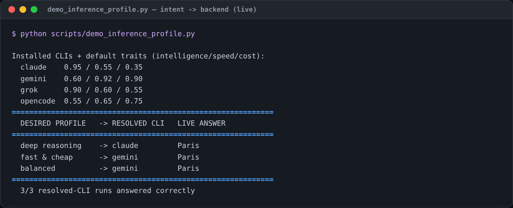

### Inference profiles — blueprint intent → backend (live)

A blueprint declares *what kind of thinking it wants* (intelligence / speed /
cost, each a 0–1 priority) instead of naming a model. Open Swarm maps that to the
best-matching installed CLI by each backend's capability traits (see
`swarm.core.inference_profile`).

**Live result** (`scripts/demo_inference_profile.py`, against the host's
installed CLIs using the default `CLI_TRAITS`):

| Desired profile | Resolved CLI | Why |
|---|---|---|
| deep reasoning (`intelligence 1.0`) | **claude** | highest intelligence trait (0.95) |
| fast & cheap (`speed 1.0, cost 1.0`) | **gemini** | highest speed (0.92) + cheapness (0.90) |
| balanced (`0.6 / 0.6 / 0.6`) | **gemini** | highest *aggregate* capability |

All three resolved CLIs then answered the live prompt correctly (3/3).

#### Modeling note (worth tuning)

Selection is a weighted dot product of priorities × capabilities. A consequence:
when priorities are **equal** ("balanced"), the backend with the highest *total*
trait sum wins — here gemini, because its high speed+cost outweigh a mid
intelligence. If you'd rather "balanced" favor a generalist, options are to (a)
tune the per-backend `traits` for your plans, (b) normalize priorities, or (c)
switch the metric to distance-from-ideal. The defaults are a starting point; the
user is expected to label their own models' traits in config.
