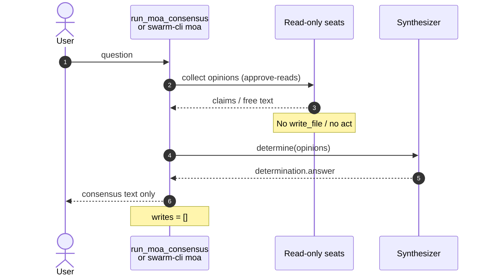
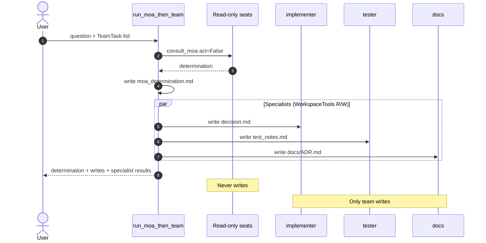
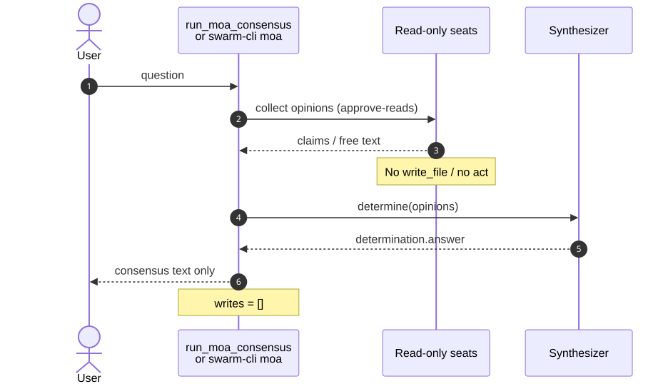
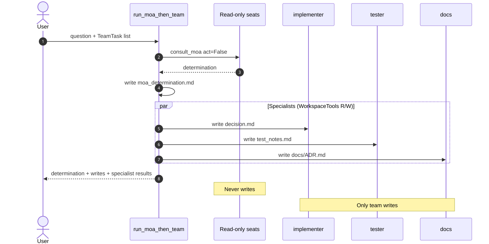

# Example: simple MoA consensus vs consensus that drives a team

**No openai-agents required.** This walkthrough contrasts two pure MoA paths
that share the same read-only panel and orchestrator-owned determination:

| Path | API | What happens | Writes? |
|------|-----|--------------|---------|
| **A. Consensus only** | `run_moa_consensus` / `swarm-cli moa` | Multi-seat opinions → one determination | **No** (panel never mutates) |
| **B. Consensus → team** | `run_moa_then_team` | Same MoA step, then purpose specialists | **Yes** — implementer / tester / docs / researcher only |

When you also want openai-agents coordinator objects / live Runner mode, see
[`../moa-orchestrator/`](../moa-orchestrator/) (`run_moa_agents_orchestrator`).
That mode **reuses** the same team runner for its scripted body.

Related: [MOA.md](../../MOA.md) · [SWARM_WORKFLOWS.md](../../SWARM_WORKFLOWS.md)

---

## 1. Mental model

```text
                    ┌─────────────────────────────┐
  User question ───►│  MoA panel (read-only)      │
                    │  analyst · critic · …       │
                    └──────────────┬──────────────┘
                                   ▼
                    ┌─────────────────────────────┐
                    │  Orchestrator determination │
                    │  (synthesize / pick primary)│
                    └──────────────┬──────────────┘
                                   │
              ┌────────────────────┴────────────────────┐
              ▼                                         ▼
     Path A: stop here                         Path B: drive a team
     return consensus text                     implementer → decision.md
                                               tester      → test_notes.md
                                               docs        → docs/ADR.md
```

| Rule | Enforcement |
|------|-------------|
| Panel is read-only | `consult_moa(..., act=False)` + `approve-reads` |
| Determination is orchestrator-owned | local `default_synthesize`, not a panel vote-to-write |
| Team writes only after consensus | specialists scheduled only in path B |

---

## 2. Sequence diagrams

### 2.1 Path A — consensus only



### 2.2 Path B — consensus then team



Rendered SVG: [`assets/diagram-consensus-only.svg`](./assets/diagram-consensus-only.svg) ·
[`assets/diagram-then-team.svg`](./assets/diagram-then-team.svg)





---

## 3. Side-by-side code

### Path A — consensus only

```python
import asyncio
from swarm.core.moa.team import run_moa_consensus

async def main():
    result = await run_moa_consensus(
        "Should we default public APIs to token-bucket rate limiting?",
        moa_backend="fake",
        moa_participants=["analyst", "critic"],
        moa_fake_responses={
            "analyst": '{"claim":"yes token bucket at edge","confidence":0.9}',
            "critic": '{"claim":"yes token bucket with metrics","confidence":0.85}',
        },
    )
    assert result.mode == "consensus_only"
    assert result.writes == []
    print(result.determination)

asyncio.run(main())
```

CLI equivalent:

```bash
swarm-cli moa "Should we default public APIs to token-bucket rate limiting?" \
  --backend fake \
  --participants analyst,critic \
  --fake-responses 'analyst={"claim":"yes token bucket at edge","confidence":0.9}||critic={"claim":"yes token bucket with metrics","confidence":0.85}' \
  --json
```

Captured: [`assets/01-consensus-only.json`](./assets/01-consensus-only.json)

### Path B — consensus then team

```python
import asyncio
from pathlib import Path
from swarm.core.moa.team import TeamTask, run_moa_then_team

async def main():
    ws = Path("./.moa-team-example")
    result = await run_moa_then_team(
        ws,
        "Should we enable edge rate limiting?",
        specialist_tasks=[
            TeamTask("implementer", "Apply decision", "decision.md"),
            TeamTask("tester", "Verify", "test_notes.md"),
            TeamTask("docs", "Write ADR", "docs/ADR.md"),
        ],
        seed_files={"notes.txt": "Public API; abuse risk high."},
        moa_backend="fake",
        moa_participants=["analyst", "critic"],
        moa_fake_responses={
            "analyst": '{"claim":"yes token bucket","confidence":0.9}',
            "critic": '{"claim":"yes token bucket with metrics","confidence":0.85}',
        },
    )
    assert result.mode == "consensus_then_team"
    print("determination:", result.determination[:200])
    print("specialists:", [s.persona for s in result.specialist_results])
    print("writes:", result.writes)

asyncio.run(main())
```

**CLI** (no openai-agents — same runner as the library):

```bash
swarm-cli moa "Should we enable edge rate limiting?" \
  --backend fake \
  --participants analyst,critic \
  --fake-responses 'analyst={"claim":"yes token bucket","confidence":0.9}||critic={"claim":"yes token bucket with metrics","confidence":0.85}' \
  --team \
  --workdir /tmp/moa-team-demo \
  --team-tasks 'implementer:Apply@decision.md|tester:Verify|docs:ADR|researcher:Scan' \
  --json -v
```

Captured: [`assets/02-consensus-then-team.txt`](./assets/02-consensus-then-team.txt) ·
[`assets/03-team-workspace-tree.txt`](./assets/03-team-workspace-tree.txt) ·
[`assets/05-demo-contrast.json`](./assets/05-demo-contrast.json)

---

## 4. What differs in the artifacts

| Check | Path A | Path B |
|-------|--------|--------|
| `result.mode` | `consensus_only` | `consensus_then_team` |
| `result.writes` | `[]` | `moa_determination.md`, `decision.md`, … |
| Workspace files | none required | specialist outputs |
| openai-agents import | **not used** | **not used** |
| Panel `permission_mode` | `approve-reads` | `approve-reads` |

### Annotated team capture

```text
mode: consensus_then_team
determination: yes token bucket …          # same MoA step as path A
specialists: ['implementer', 'tester', 'docs']
writes: ['moa_determination.md', 'decision.md', 'test_notes.md', 'docs/ADR.md']
# seats never appear in writes
```

---

## 5. When to pick which path

| Situation | Path |
|-----------|------|
| Design review, risk ranking, multi-model judgment | **A** consensus only |
| Decision must become files (ADR, decision log, test plan) | **B** consensus → team |
| Live LLM coordinator that *chooses* specialists at runtime | openai-agents mode → [`moa-orchestrator`](../moa-orchestrator/) |
| Single implementer after MoA (blueprint) | model id `hybrid_moa` (uses scripted hybrid; still champagne) |

---

## 6. Pointers into the codebase

| Concern | Location |
|---------|----------|
| Pure consensus / team APIs | `src/swarm/core/moa/team.py` |
| CLI consensus | `swarm-cli moa` → `src/swarm/core/moa/cli.py` |
| Collect / determine policy | `src/swarm/core/moa/orchestrator.py` |
| openai-agents wrapper (optional) | `src/swarm/core/moa/agents_orchestrator.py` |

---

## 7. Trace logs (verify champagne path)

INFO logs on `swarm.core.moa.orchestrator` / `swarm.core.moa.team` record the sequence:

```text
moa.team consensus_only|consensus_then_team start
moa.run start act=False
moa.collect / moa.consult … permission=approve-reads
moa.determine primary=…
moa.run done act=False
# path B only:
moa.team after_panel panel_writes=[]
moa.team specialist … write_file(…)
moa.team consensus_then_team done writes=[…]
```

Captured trace: [`assets/04-trace-run.log`](./assets/04-trace-run.log)

```python
import logging
logging.basicConfig(level=logging.INFO)
# then call run_moa_consensus / run_moa_then_team
```

Or:

```bash
PYTHONPATH=src python scripts/trace_moa_champagne.py
PYTHONPATH=src python scripts/demo_moa_consensus_vs_team.py -v
swarm-cli moa "…" --backend fake --team --workdir /tmp/ws -v
```

## 8. Regenerate assets

```bash
bash docs/examples/moa-consensus-vs-team/scripts/capture_example_runs.sh
bash docs/examples/moa-consensus-vs-team/scripts/render_diagrams.sh   # optional SVG
PYTHONPATH=src python scripts/demo_moa_consensus_vs_team.py -v
PYTHONPATH=src python scripts/trace_moa_champagne.py 2>&1 \
  | tee docs/examples/moa-consensus-vs-team/assets/04-trace-run.log
```

## 9. Tests

```bash
pytest tests/core/test_moa_team.py tests/cli/test_moa_command.py \
  tests/core/test_moa_agents_orchestrator.py -q --no-cov
```
