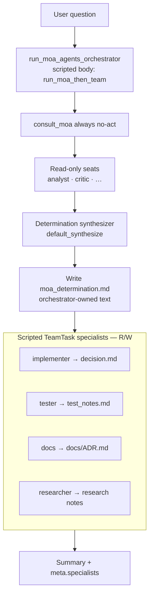
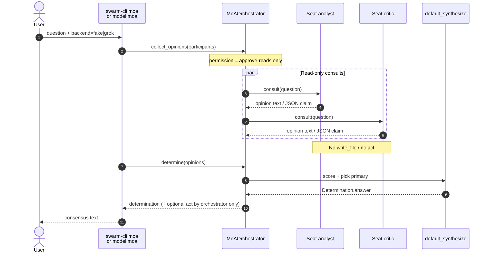
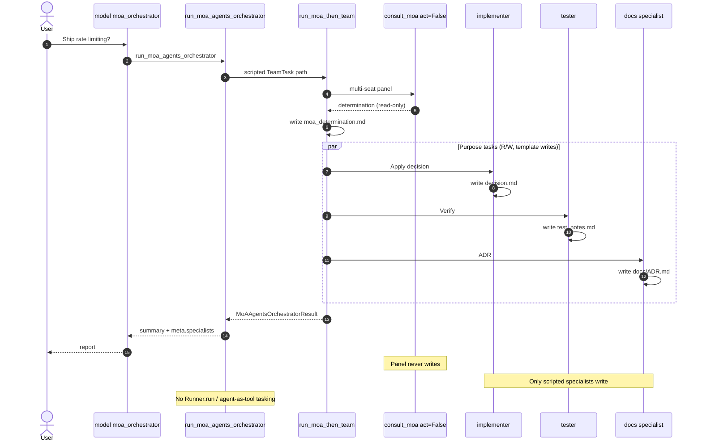
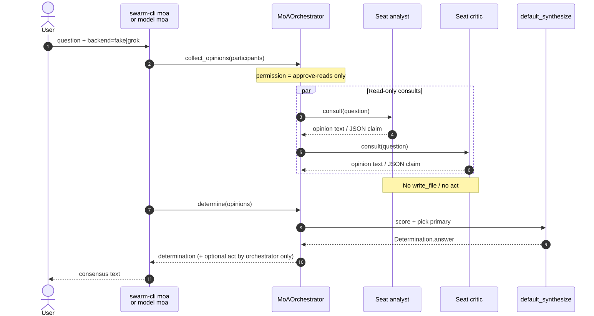
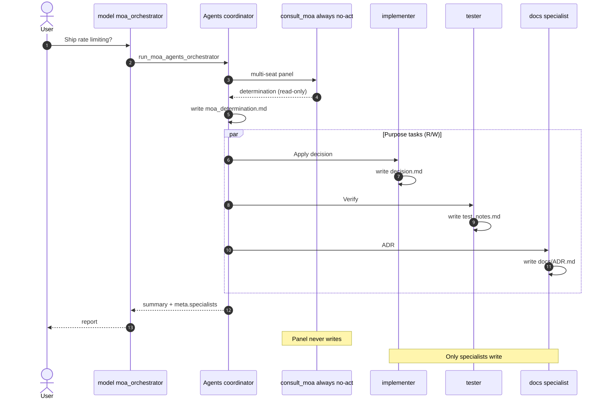
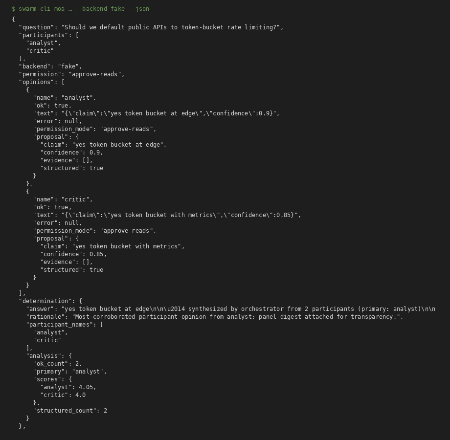
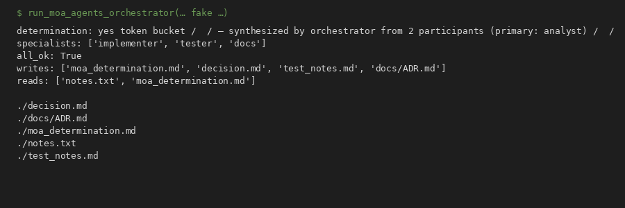

# First-class example: MoA orchestrator surface (scripted specialists)

**Canonical walkthrough** for open-swarm’s champagne consensus path:
**read-only multi-seat panel → orchestrator-owned determination → purpose R/W specialists.**

| Term | Meaning |
|------|---------|
| **MoA participants** | Read-only seats (fake / Grok / optional acpx). Opinions only. |
| **Orchestrator determination** | Open-swarm synthesizes consensus — panel does not “vote write.” |
| **Purpose specialists** | Scripted R/W roles (`implementer`, `tester`, `docs`, `researcher`) after consensus via `WorkspaceTools`. |

**Honest default:** `run_moa_agents_orchestrator` and the `moa_orchestrator`
blueprint **do not** start a live openai-agents `Runner`. They wrap
`run_moa_then_team` and return a lightweight name roster. Optional live
`Agent` objects come only from `build_moa_orchestrator_agents` (not this
dogfood path).

**Not the primary name:** fusion / ensemble (legacy aliases only → MoA).

Related product docs: [MOA.md](../../MOA.md) · [SWARM_WORKFLOWS.md](../../SWARM_WORKFLOWS.md) · [OPENWEBUI_MOA.md](../../OPENWEBUI_MOA.md)

> **Prefer the pure team API?** See
> **[moa-consensus-vs-team](../moa-consensus-vs-team/)** —
> `run_moa_consensus` vs `run_moa_then_team` (same champagne rules, no
> agents-shaped wrapper).

| You want… | Jump to |
|-----------|---------|
| Understand the architecture | [§1](#1-what-you-are-building) + [§2 diagrams](#2-sequence-diagrams) |
| Run consensus only (CI-safe) | [§4 step 2](#step-2--consensus-only-fake-panel-ci-safe) |
| Pure team path (no agents pkg) | [moa-consensus-vs-team](../moa-consensus-vs-team/) |
| Run specialists after consensus | [§4 step 4](#step-4--orchestrator-surface--scripted-teamtask-specialists) |
| See captured terminal / JSON | [§5](#5-captured-screenshots-terminal--json) |
| Regenerate assets | [§5 regenerate](#regenerate-assets) |

---

## 1. What you are building

```text
User question
    │
    ▼
┌──────────────────────────────────────────────┐
│  run_moa_agents_orchestrator (scripted)      │
│  • MoA → read-only multi-seat panel          │
│  • determine → single consensus text         │
│  • TeamTask specialists (run_moa_then_team)  │
└──────────────────────────────────────────────┘
         │                         │
         ▼                         ▼
   analyst / critic          implementer → decision.md
   (read-only, no act)       tester      → test_notes.md
                             docs        → docs/ADR.md
```

### Architecture flowchart



### Why this split?

| Phase | Who | Why |
|-------|-----|-----|
| **Collect opinions** | N independent seats | Diversity without shared mutable state |
| **Determine** | Orchestrator synthesizer | One accountable consensus; no “majority writes” |
| **Act / implement** | Purpose specialists | Writes happen only after a decision exists |

This is **model A (MoA) then scripted TeamTask specialists** from
[SWARM_WORKFLOWS.md](../../SWARM_WORKFLOWS.md) — not live model-B persona-swarm
or agent-as-tool tasking. Champagne consensus (panel never mutates), then
purpose specialists write via `run_moa_then_team`.
`build_moa_orchestrator_agents` can build optional openai-agents objects for
inspection; `run_moa_agents_orchestrator` does **not** construct them or call
`Runner.run` until a real Runner path exists.

### How we enforce / encourage read-only panelists

| Mechanism | Strength |
|-----------|----------|
| `consult_moa` (no `act` parameter; always no-act) | Hard — panel cannot act |
| Permission only `approve-reads` / `deny-all` | Hard — `approve-all` raises |
| Grok `--disallowed-tools` includes Write/Edit and Bash/Shell | Strong for tool use (not a full OS sandbox) |
| acpx `--approve-reads` (never `--approve-all`) | Strong when using acpx |
| Prompt preamble “read-only consultant” | Soft |
| Scripted specialists write only via sandboxed `WorkspaceTools` | Hard for dogfood path (not shell) |

---

## 2. Sequence diagrams

### 2.1 Collect → determine (MoA only)



### 2.2 Orchestrator → specialists (after consensus)



Rendered SVG exports of these diagrams (for PR previews / offline) live in [`assets/`](./assets/):

| Diagram | Source heading | SVG |
|---------|----------------|-----|
| Collect → determine | §2.1 | [diagram-collect.svg](./assets/diagram-collect.svg) |
| Orchestrator → specialists | §2.2 | [diagram-specialists.svg](./assets/diagram-specialists.svg) |
| Architecture flowchart | §1 | [diagram-architecture.svg](./assets/diagram-architecture.svg) |





---

## 3. Three model ids (when to use which)

| Model id | What it does | Writes? |
|----------|--------------|---------|
| **`moa`** | Panel opinions + determination only | Only if you pass orchestrator `act` explicitly |
| **`hybrid_moa`** | MoA then one implementer | Implementer writes `decision.md` |
| **`moa_orchestrator`** | MoA then scripted multi-purpose TeamTask specialists | implementer / tester / docs / researcher |

Legacy aliases for MoA only: `mixture_of_agents`, `cli_fusion`, `cli_ensemble` (not multi-writer fusion).

---

## 4. Numbered walkthrough (zero → specialists)

### Step 0 — Environment

```bash
# From repo root, with package on PYTHONPATH or installed
export PYTHONPATH=src
# Optional live Grok: ensure `grok` is on PATH and logged in
which grok || true
```

### Step 1 — Install MoA config block

```bash
# Dry-run: print default moa block
swarm-cli moa-init

# Persist into your swarm_config.json (XDG or --config path)
swarm-cli moa-init --write

# Open WebUI / OpenAI client JSON
swarm-cli moa-init --show-openwebui
```

Template also in [`../moa.swarm_config.json`](../moa.swarm_config.json). Full Open WebUI notes: [OPENWEBUI_MOA.md](../../OPENWEBUI_MOA.md).

### Step 2 — Consensus only (fake panel, CI-safe)

```bash
swarm-cli moa "Should we default public APIs to token-bucket rate limiting?" \
  --backend fake \
  --participants analyst,critic \
  --fake-responses 'analyst={"claim":"yes token bucket at edge","confidence":0.9}||critic={"claim":"yes token bucket with metrics","confidence":0.85}' \
  --json
```

**Expect:** two opinions with `permission_mode: approve-reads`, one `determination`, empty participant writes.

Captured run: [`assets/01-moa-consensus-fake.json`](./assets/01-moa-consensus-fake.json).

### Step 3 — Same via library

```python
import asyncio
from swarm.core.moa.cli import run_moa_cli

async def main():
    p = await run_moa_cli(
        "Should we rate-limit?",
        ["analyst", "critic"],
        backend="fake",
        fake_responses={
            "analyst": '{"claim":"yes token bucket","confidence":0.9}',
            "critic": '{"claim":"yes with metrics","confidence":0.85}',
        },
    )
    print(p["determination"]["answer"])

asyncio.run(main())
```

### Step 4 — orchestrator surface + scripted TeamTask specialists

```python
import asyncio
from pathlib import Path
from swarm.core.moa.agents_orchestrator import SpecialistTask, run_moa_agents_orchestrator
# SpecialistTask is a back-compat alias of TeamTask (swarm.core.moa.team).
# Body delegates to run_moa_then_team; result.agents is a name roster only.

async def main():
    ws = Path("./.moa-example-workspace")
    result = await run_moa_agents_orchestrator(
        ws,
        "Should we enable edge rate limiting?",
        specialist_tasks=[
            SpecialistTask("implementer", "Apply decision", "decision.md"),
            SpecialistTask("tester", "Verify", "test_notes.md"),
            SpecialistTask("docs", "Write ADR", "docs/ADR.md"),
        ],
        seed_files={"notes.txt": "Public API; abuse risk high."},
        moa_backend="fake",
        moa_participants=["analyst", "critic"],
        moa_fake_responses={
            "analyst": '{"claim":"yes token bucket","confidence":0.9}',
            "critic": '{"claim":"yes token bucket with metrics","confidence":0.85}',
        },
    )
    print("determination:", result.determination[:200])
    print("writes:", result.writes)
    print("specialists:", [s.persona for s in result.specialist_results])
    print("agents roster:", result.agents)  # inspection-only names, not live Agents

asyncio.run(main())
```

**Expect:** `moa_determination.md` + specialist files; panel did not invent those writes.
Real openai-agents objects are **not** built on this path.

Captured run: [`assets/02-moa-orchestrator-specialists.txt`](./assets/02-moa-orchestrator-specialists.txt).

### Step 5 — Blueprint / API model id

With swarm-api running and `SWARM_API_KEY` set:

```bash
curl -s "$OPENAI_BASE_URL/chat/completions" \
  -H "Authorization: Bearer $OPENAI_API_KEY" \
  -H "Content-Type: application/json" \
  -d '{
    "model": "moa_orchestrator",
    "messages": [{"role": "user", "content": "Ship rate limiting?"}],
    "params": {
      "backend": "fake",
      "workdir": "/tmp/moa-orch-demo",
      "participants": ["analyst", "critic"],
      "fake_responses": {
        "analyst": "{\"claim\":\"ship carefully\",\"confidence\":0.9}",
        "critic": "{\"claim\":\"ship carefully with tests\",\"confidence\":0.85}"
      },
      "tasks": "implementer:apply|tester:verify|docs:adr"
    }
  }'
```

`system_fingerprint` for pure `moa` looks like `moa:analyst+critic`.

### Step 6 — Optional live multi-seat Grok

```bash
# Requires grok on PATH + session
python scripts/demo_moa_grok_multiseat.py
# or:
swarm-cli moa "Rate limit public APIs?" --backend grok -p analyst,critic --cwd .
```

If Grok is unavailable, the demo script falls back to fake and still writes a report. Live evidence is optional; fake path is gating.

---

## 5. Captured “screenshots” (terminal / JSON)

These are **real runs** of shipped entry points (fake backend), stored as reviewable text/JSON. Prefer checking these into git so PR reviewers and offline readers see the same evidence without re-running CLIs.

| Asset | Source command | Shows |
|-------|----------------|-------|
| [assets/01-moa-consensus-fake.json](./assets/01-moa-consensus-fake.json) | `swarm-cli moa … --backend fake --json` | Multi-seat opinions + determination |
| [assets/01-moa-consensus-fake.run2.json](./assets/01-moa-consensus-fake.run2.json) | same (second run) | Stability of fake path |
| [assets/02-moa-orchestrator-specialists.txt](./assets/02-moa-orchestrator-specialists.txt) | library `run_moa_agents_orchestrator` | Specialists + write list |
| [assets/03-workspace-tree.txt](./assets/03-workspace-tree.txt) | `find` after orchestrator run | Files created by specialists only |
| [assets/01-moa-consensus-fake.png](./assets/01-moa-consensus-fake.png) | rendered terminal shot | Visual screenshot of JSON run |
| [assets/02-moa-orchestrator-specialists.png](./assets/02-moa-orchestrator-specialists.png) | rendered terminal shot | Specialists + workspace tree |
| [assets/diagram-collect.svg](./assets/diagram-collect.svg) | Mermaid §2.1 | Collect → determine |
| [assets/diagram-specialists.svg](./assets/diagram-specialists.svg) | Mermaid §2.2 | Orchestrator → specialists |
| [assets/diagram-architecture.svg](./assets/diagram-architecture.svg) | Mermaid §1 flowchart | End-to-end architecture |

### Annotated consensus JSON (what to look for)

```jsonc
{
  "backend": "fake",
  "permission": "approve-reads",
  "opinions": [
    {
      "name": "analyst",
      "ok": true,
      "permission_mode": "approve-reads",  // ← hard: not approve-all
      "proposal": { "claim": "…", "confidence": 0.9, "structured": true }
    },
    { "name": "critic", "ok": true, "permission_mode": "approve-reads" }
  ],
  "determination": {
    "answer": "…",             // ← orchestrator-owned consensus
    "rationale": "…",
    "analysis": { "primary": "analyst", "scores": { "…": 0 } }
  },
  "act": null,                 // ← panel path never acts
  "writes": []                 // ← no participant writes
}
```

### Annotated specialist capture (what to look for)

```text
determination: yes token bucket ...     # from MoA, not a specialist
specialists: ['implementer', 'tester', 'docs']
all_ok: True
writes: [..., 'decision.md', 'test_notes.md', 'docs/ADR.md', 'moa_determination.md']
# Panel seats never appear in writes
```

### Workspace tree after specialists

Expect something like:

```text
./decision.md
./docs/ADR.md
./moa_determination.md
./notes.txt              # seed only
./test_notes.md
```

### Regenerate assets

```bash
# From repo root (uses .venv/bin/python)
bash docs/examples/moa-orchestrator/scripts/capture_example_runs.sh

# Optional: SVG from Mermaid + terminal PNG
bash docs/examples/moa-orchestrator/scripts/render_diagrams.sh

# Optional: copy artifacts into a scratch dir for goal evidence
MOA_EXAMPLE_SCRATCH=/tmp/my-scratch \
  bash docs/examples/moa-orchestrator/scripts/capture_example_runs.sh
```





---

## 6. Roles cheat sheet

| Role | Reads | Writes | How invoked |
|------|-------|--------|-------------|
| MoA seat (analyst/critic/grok) | Yes | **No** | `collect_opinions` / `consult_moa` |
| Determination synthesizer | N/A | No (text only) | `MoAOrchestrator.determine` |
| Orchestrator surface | Yes | Optional notes only | `run_moa_agents_orchestrator` → `run_moa_then_team` (scripted) |
| implementer / tester / docs / researcher | Yes | **Yes** | scripted `TeamTask` / `SpecialistTask` (alias) / `params.tasks` |
| Optional agent objects | N/A | N/A | `build_moa_orchestrator_agents` only (inspection; unused by run) |

---

## 7. Pointers into the codebase

| Concern | Location |
|---------|----------|
| Collect / determine / act | `src/swarm/core/moa/orchestrator.py` |
| Grok / fake / acpx backends | `src/swarm/core/moa/backends.py` |
| Permission policy | `src/swarm/core/moa/policy.py` |
| Agents orchestrator | `src/swarm/core/moa/agents_orchestrator.py` |
| Pure team path (no agents pkg) | `src/swarm/core/moa/team.py`; CLI `swarm-cli moa --team --workdir` |
| CLI | `swarm-cli moa`, `swarm-cli moa-init` (`src/swarm/core/swarm_cli.py`) |
| Blueprints | `moa`, `hybrid_moa`, `moa_orchestrator` |

---

## 8. Related proofs & tests

```bash
pytest tests/core/test_moa*.py \
  tests/core/test_moa_agents_orchestrator.py \
  tests/unit/blueprints/test_moa_orchestrator_blueprint.py \
  tests/integration/test_hybrid_moa_persona.py \
  tests/cli/test_moa_command.py tests/cli/test_moa_init_command.py \
  -q --no-cov
```

---

## 9. Troubleshooting

| Symptom | Likely cause | Fix |
|---------|--------------|-----|
| `approve-all` / permission error | Backend built with write mode | Use `approve-reads` only; never pass approve-all to MoA |
| Empty determination | Fake responses missing / parse fail | Pass `--fake-responses 'a=…\|\|b=…'` or structured JSON claims |
| Specialists don’t write | Wrong model id (`moa` vs `moa_orchestrator`) | Use `moa_orchestrator` or call `run_moa_agents_orchestrator` |
| Live Grok fails | `grok` not on PATH / not logged in | Fake backend for CI; optional live demo only |
| Circular import on `from swarm.core.moa import …` in CLI path | Package `__init__` cycle | Prefer `from swarm.core.moa.orchestrator import MoAOrchestrator` |

---

## 10. Checklist (example pack complete when…)

- [x] README explains model A (MoA) → scripted TeamTask specialists with roles table
- [x] Mermaid sequence diagrams for collect and specialists
- [x] Architecture flowchart
- [x] Captured fake consensus JSON (×2 runs)
- [x] Captured orchestrator specialist run + workspace tree
- [x] Cross-links from [MOA.md](../../MOA.md) and [SWARM_WORKFLOWS.md](../../SWARM_WORKFLOWS.md)
- [x] Regenerate scripts under `scripts/`
- [x] Optional SVG / PNG under `assets/`
