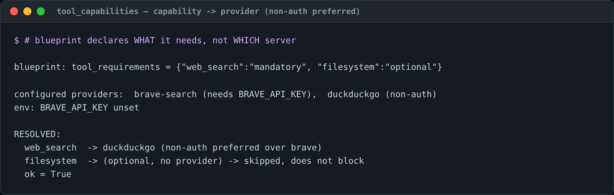

### Tool capabilities — blueprint needs a *capability*, not a server

A blueprint declares the abstract tool capabilities it needs (mandatory or
optional) instead of naming a specific MCP server:

```python
# in a blueprint's metadata
tool_requirements = {"web_search": "mandatory", "filesystem": "optional"}
```

Each configured MCP server declares what it `provides` (or inherits a catalog
default by name). The resolver maps each capability to a usable provider,
**preferring non-auth** ones, and never lets an unmet *optional* need block the
run (see `swarm.core.tool_capabilities`).



So the same blueprint runs with Brave if you configured it, or a non-auth
DuckDuckGo/fetch server if you didn't — your host, your provider.

#### Configuring an example MCP — prefer non-auth

`tool_capabilities.suggest_mcp_config([...])` emits a ready-to-paste
`mcpServers` block that prefers servers needing **no API key**, so the example
runs out of the box. For `web_search` + `web_fetch`:

```jsonc
{
  "mcpServers": {
    "duckduckgo": { "command": "uvx", "args": ["duckduckgo-mcp-server"], "provides": ["web_search"] },
    "fetch":      { "command": "uvx", "args": ["mcp-server-fetch"],       "provides": ["web_fetch"] }
  }
}
```

Add the authenticated alternative only when you want it — the resolver still
prefers the non-auth provider unless the auth one is the only option **and** its
key is present:

```jsonc
"brave-search": {
  "command": "npx", "args": ["-y", "@modelcontextprotocol/server-brave-search"],
  "provides": ["web_search"],
  "env": { "BRAVE_API_KEY": "${BRAVE_API_KEY}" }
}
```

Known non-auth servers in the catalog: `duckduckgo` (web_search), `fetch`
(web_fetch), `filesystem`, `git`, `time`. Verify exact package names against the
upstream MCP registry before relying on them.
