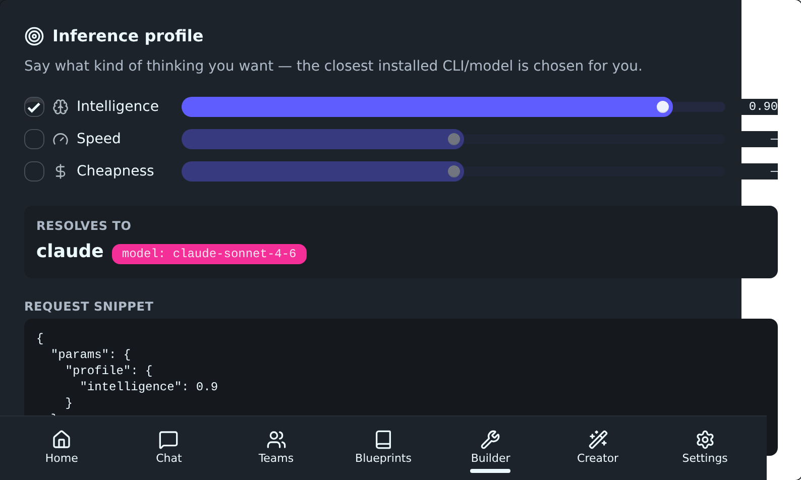
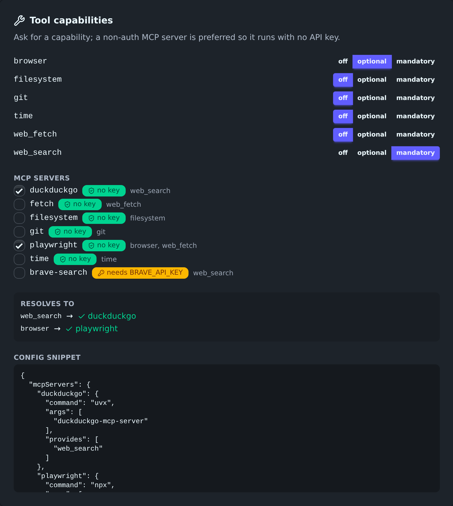
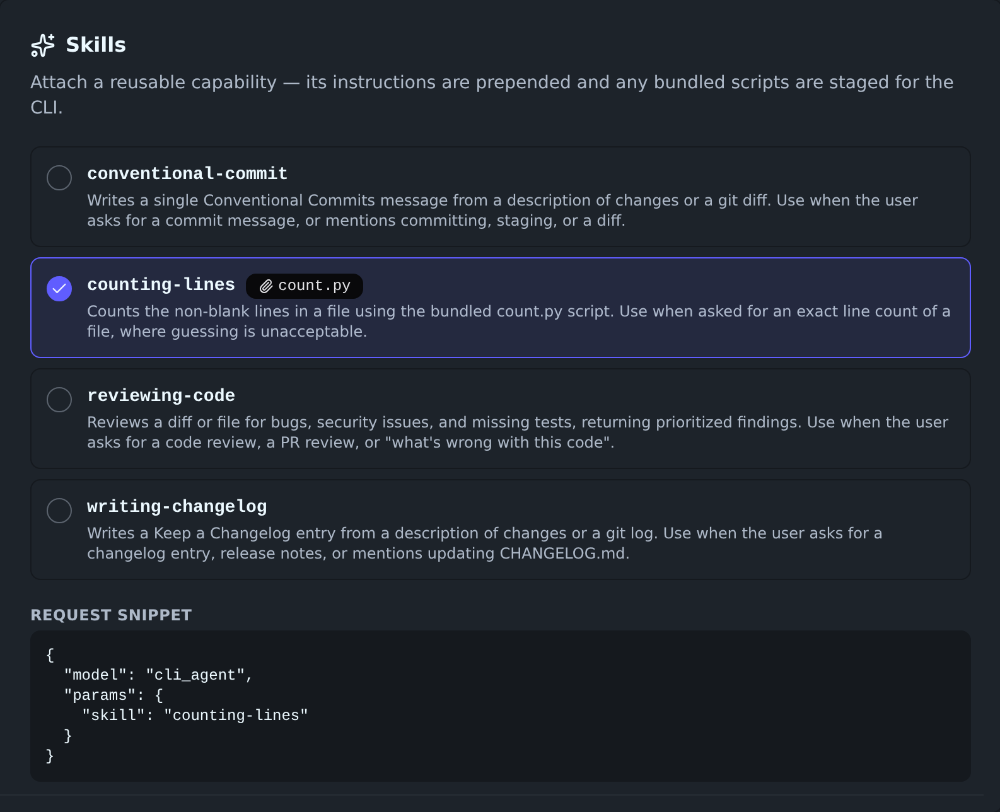
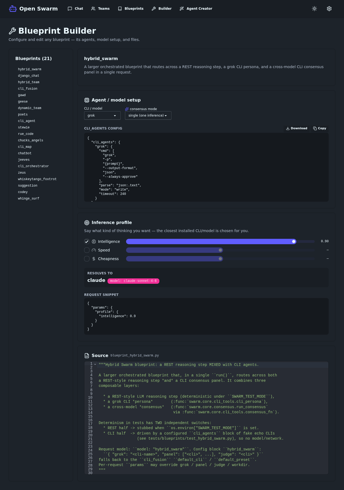
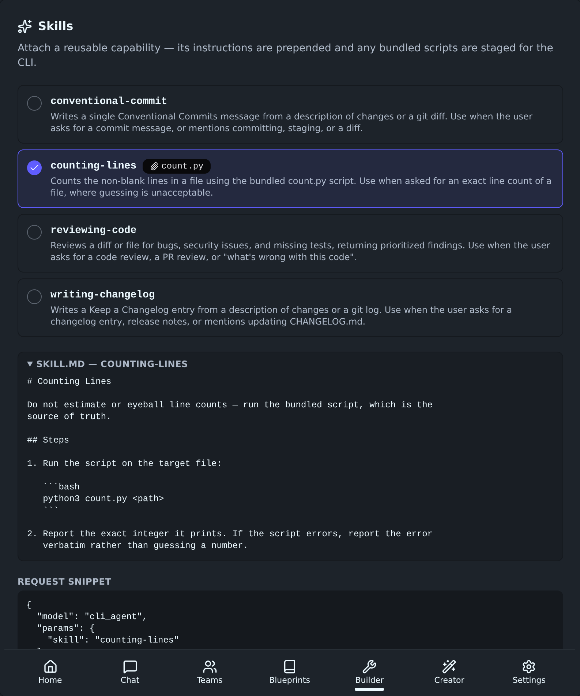
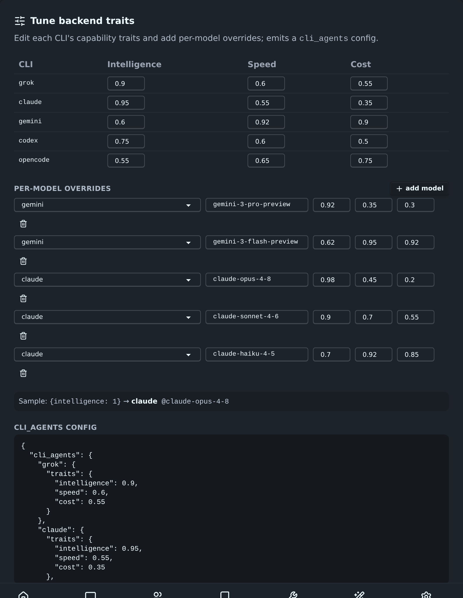

# Builder config panels (web UI)

Proof of the Builder UI panels that configure the decoupling features, each
bound to `GET /v1/config-options/`. Built on the existing React + TanStack Query
+ DaisyUI stack. 0 axe violations (full ruleset, light/dark, desktop/mobile).

## Panel 1 — Inference profile (+ per-model traits)

Declare what kind of inference you want (intelligence / speed / cost, each an
optional 0–1 target) and the Builder live-previews which CLI/model it resolves
to — mirroring `swarm.core.inference_profile` (distance-from-ideal over only the
axes you enable). Per-model candidates (`<cli>@<model>`) are included, so e.g.
asking for intelligence 0.90 resolves to `claude` model `claude-sonnet-4-6`
(its 0.90 is closer than opus's 0.98).



It emits a request snippet (`{"params": {"profile": {...}}}`) you can paste into
any OpenAI-compatible call.

**Verification**
- Pure resolver mirror `src/lib/inferenceProfile.ts` unit-tested (6 cases:
  single-axis, fast+cheap, balanced→all-rounder, tie-break, empty) + a
  `buildCandidates` test. 26 vitest tests pass.
- `npx tsc --noEmit` clean; `npm run build` succeeds.
- axe full-ruleset audit: **0 violations** across builder light/dark, desktop/mobile.

_(Panels 2 (tool capabilities/MCP) and 3 (skills picker) follow.)_

## Panel 2 — Tool capabilities / MCP

Declare abstract capabilities (off / optional / mandatory) and pick MCP
providers. Non-auth servers are surfaced first with a green "no key" badge;
`brave-search` is opt-in with a key badge. The panel live-resolves each required
capability to a provider (non-auth preferred) and emits `mcpServers` +
`tool_requirements`.



Example above: `web_search` (mandatory) → `duckduckgo`, `browser` (optional) →
`playwright` — both non-auth, runnable with no API key.

**Verification**
- Pure resolver `src/lib/toolCapabilities.ts` unit-tested (6 cases: non-auth
  preference, missing mandatory, optional skip, auth-key gating, suggestion,
  config emission). 32 vitest tests pass; `tsc` clean; build OK.
- axe full-ruleset audit: **0 violations**, now stable across runs.

### Fixed: a11y-audit theme-forcing (item 4)

The audit set `data-theme` only on existing `[data-theme]` nodes, leaving a
white `<body>`; axe then saw dark text on white and reported false
`color-contrast` failures that flaked between desktop/mobile dark. Fixed by
seeding the theme via `addInitScript` before load and setting `data-theme` on
`<html>`, plus waiting for a real selector instead of `networkidle`. Result: 0
violations, deterministic across repeated runs.

## Panel 3 — Skills picker

Browse discovered skills (name, description, bundled-asset badges) and attach one
to a `cli_agent` request. Selecting `counting-lines` shows its `count.py` asset
and emits `{"model":"cli_agent","params":{"skill":"counting-lines"}}`.



**Verification**
- Pure helper `src/lib/skills.ts` (`buildSkillRequest`) unit-tested.
- axe full-ruleset audit: **0 violations**.

### Fixed: vitest collected the Playwright e2e spec

`npx vitest run` was pulling in `e2e/smoke.spec.ts` (a Playwright spec), which
errors at collection (`test() not expected here`). Scoped vitest's `include` to
`src/**/*.{test,spec}.{ts,tsx}` so unit tests run under vitest and e2e stays
under Playwright. 6 files / 34 tests pass clean.

### Builder — all three panels



## Builder e2e (Playwright)

`e2e/builder.spec.ts` route-mocks the API (deterministic, no backend) and drives
the real panels:

```
✓ inference profile panel resolves to a CLI
✓ tool capabilities panel resolves web_search to the non-auth duckduckgo
✓ skills panel emits a request snippet on selection
3 passed (2.9s)
```

Run with `npm run test:e2e` (opt-in; not in the default `npm test`, and vitest's
`include` excludes `e2e/`). Asserts the inference panel resolves to a CLI, the
tool-capabilities panel resolves `web_search → duckduckgo` (non-auth preferred)
after selecting mandatory + duckduckgo, and the skills panel emits a
`{"skill": ...}` request snippet on selection.

## Bug-hunt: profile resolution declines when there's nothing to score

Edge-case probing of the new code found a wart: an **empty or all-unknown-axis**
inference profile silently resolved to the alphabetically-first backend (every
candidate ties at distance 0). Fixed in both the Python (`inference_profile.resolve`)
and the TS mirror — with no scorable axis, `resolve` now returns `None`/`null`,
so the caller falls through to its normal default (`default_cli` / first
available) instead of an arbitrary pick. Tests added both sides. Backend 1183
pass; frontend vitest + e2e green; 0 a11y.

Other probes (None mcpServers entries, unknown capabilities, uppercase skill
names, list-shaped frontmatter, unknown trait keys) all already behaved
correctly — no further bugs.

## Polish: SKILL.md preview in the skills picker

`/v1/config-options/` now includes each skill's full `instructions` (SKILL.md
body). The skills picker renders it in a collapsible "SKILL.md — <name>" section
on select, so you can read exactly what a skill does before attaching it.



**Verification**: api test asserts `instructions` is served; vitest 35 pass; e2e
asserts the preview renders the instructions on select (3 pass); 0 a11y violations.

## Polish: per-model trait editing

The "Tune backend traits" panel makes the inference traits editable: a table of
each CLI's intelligence/speed/cost, plus add/remove per-model override rows
(model id + traits). A live sample shows where `{intelligence: 1}` resolves given
your edits, and it emits a `cli_agents` config with `traits` + `models` blocks.



**Verification**: pure helpers `buildTraitsConfig` + `candidatesFromEdits`
unit-tested; 38 vitest pass; e2e asserts the config + sample resolution (4 pass);
0 a11y. (The emitted grok traits were verified via DOM read = `{intelligence:0.9,
speed:0.6,cost:0.55}` — the low-res screenshot only *looked* like 0.0.)

## Wired: capability → MCP provider resolution endpoint (item D)

`GET /v1/blueprints/<id>/tools` resolves a blueprint's declared
`tool_requirements` to concrete MCP providers via
`tool_capabilities.resolve_mcp_servers` — the decoupling is now consumable, not
just a library. Also fixed blueprint discovery, which was **whitelisting**
metadata fields and silently dropping `tool_requirements` (so it never reached
any consumer); added it to the extracted metadata + `BlueprintMetadata` TypedDict.

Live (jeeves / whiskeytango_foxtrot, which declare `tool_requirements`):

```
GET /v1/blueprints/whiskeytango_foxtrot/tools
  requirements: {browser: mandatory, web_search: optional}
  satisfied:    {browser: playwright, web_search: <configured or duckduckgo>}
  ok: true
```

With no user config the mandatory `browser` auto-provisions the non-auth official
**playwright-mcp** (zero config). 3 api tests (deterministic via mocked config),
404 on unknown blueprint.

## Polish: Copy + Download on every panel snippet (item E)

Extracted a shared `ConfigSnippet` component (Copy to clipboard + Download as
`.json`, keyboard-focusable + labelled) and swapped it into all four panels'
config snippets, replacing four near-duplicate `<pre>` blocks. Pure `toFilename`
helper unit-tested; 40 vitest pass; e2e 4 pass; 0 a11y.
