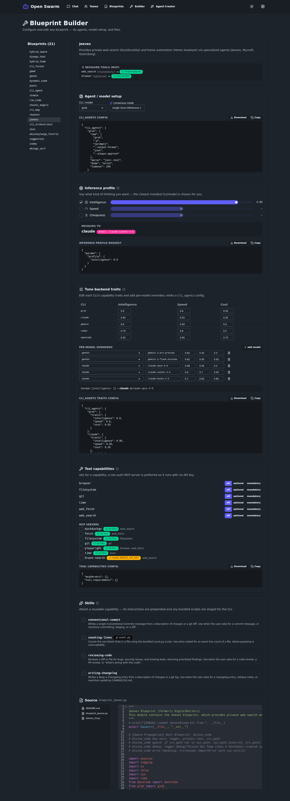
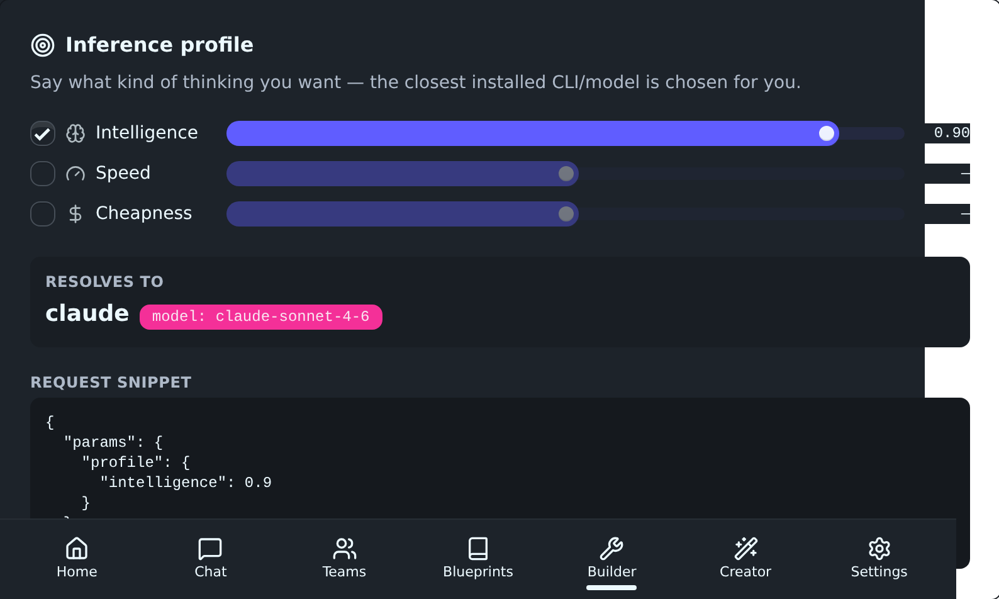
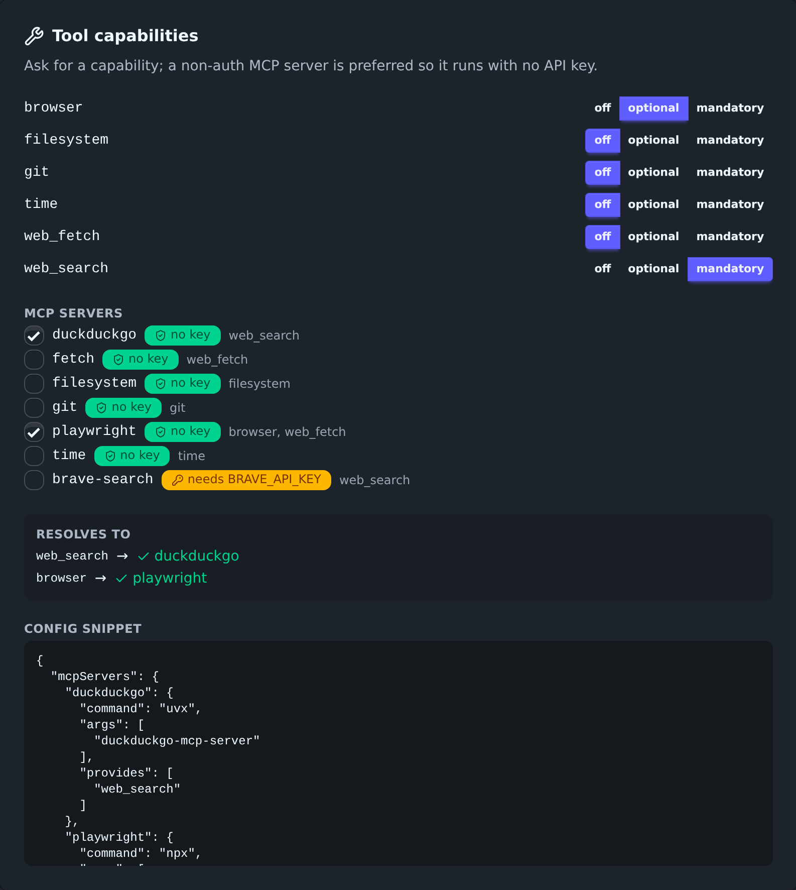
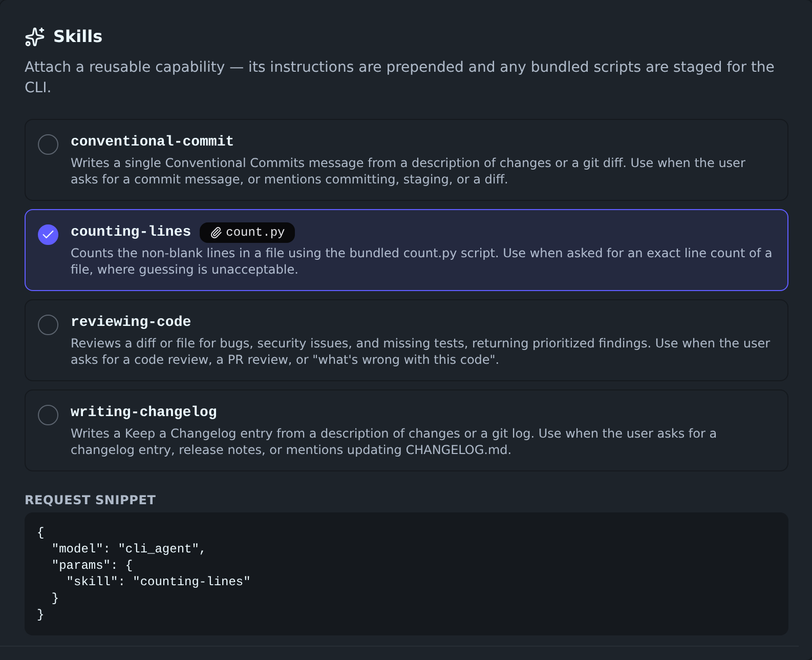
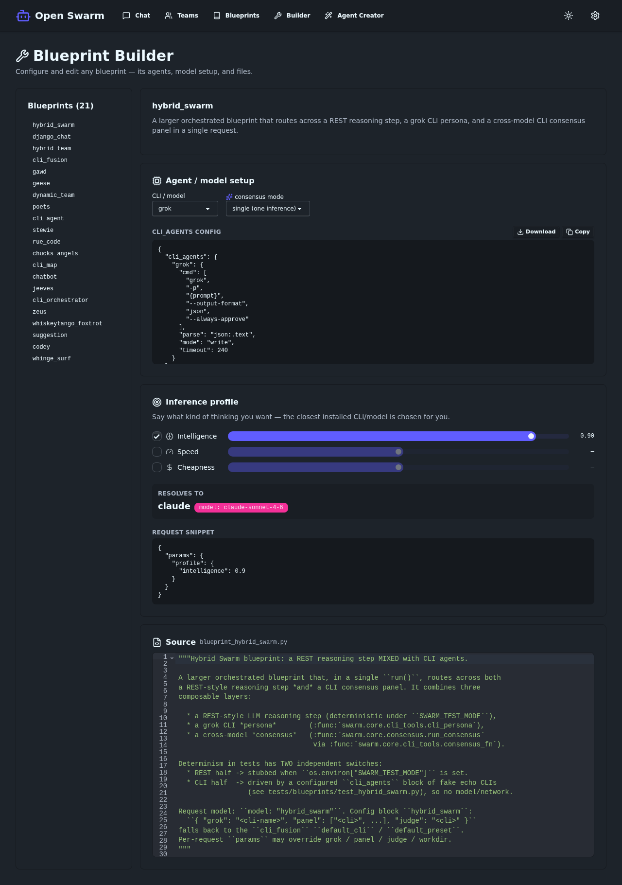
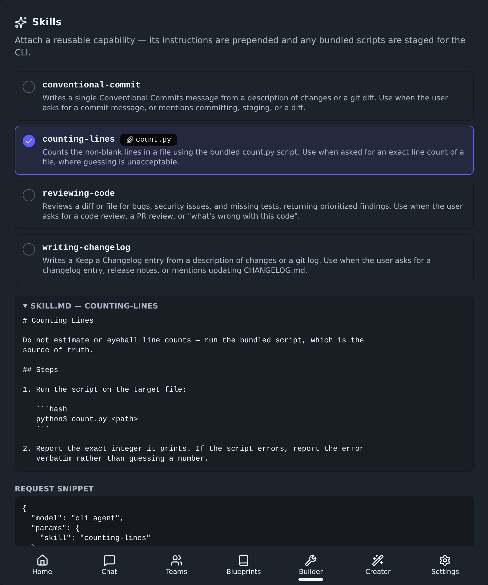
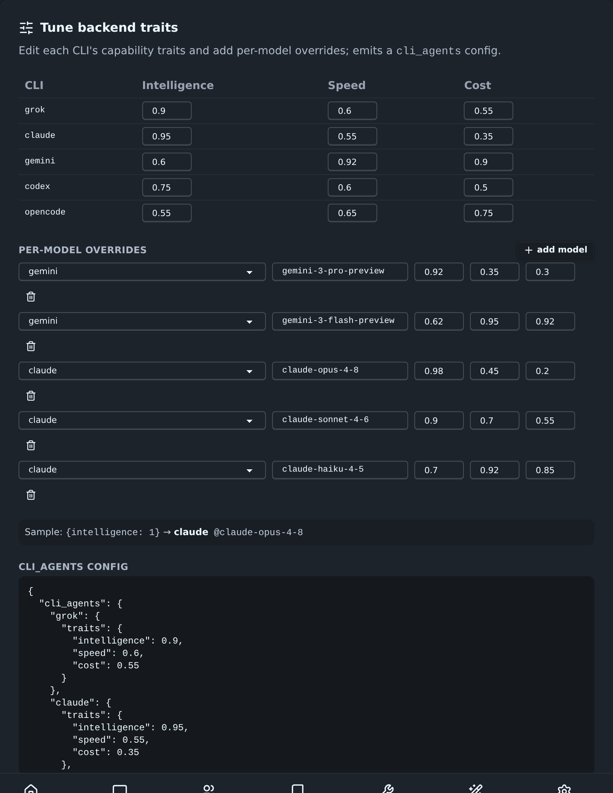
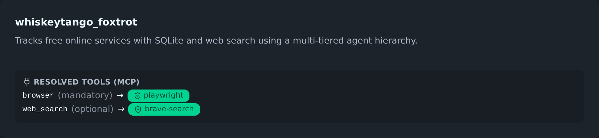

# Builder config panels (web UI) — historical

> **Redirect (REQ-74 / #419):** Blueprints are **CLI/API only**. They do not
> ship a webpage or a builder UI. The Grok-like SPA (`/` + `/chat`) is the
> product web UI. Do not treat this page as a live “blueprint as WebUI” guide.
>
> **Orphaned / historical (2026-08):** `BuilderPage` **and** its React panel
> components were **deleted** with the ADR-001 SPA cut (`App.tsx` mounts `/` +
> `/chat` only). Screenshots below document a former SPA surface. Day-to-day
> agent creation is the Django operator UI at **`/agent-creator/`**. Pure helpers
> (`inferenceProfile.ts`, `toolCapabilities.ts`, `skills.ts`) and unit tests
> remain valid; do not remount Builder.

This page is a **capture log** of the deleted SPA Builder panels that configured
decoupling features against `GET /v1/config-options/`. It was built on the
React + TanStack Query + DaisyUI stack. Historical axe runs reported 0
violations (full ruleset, light/dark, desktop/mobile) while `/builder` was
mounted.

**Status at last mount:** all four config panels + the resolved-MCP badge were
live, each header with an accessible info tooltip. Figures and verification
counts below (vitest / Playwright / axe) are **historical snapshots from that
mount** — not a claim that `/builder` is a live audited surface today.
`e2e/builder.spec.ts` was deleted with the SPA cut; current Playwright e2e
covers live stems only (`smoke` / `nav` / `interaction`).



## Panel 1 — Inference profile (+ per-model traits)

Declared what kind of inference you wanted (intelligence / speed / cost, each an
optional 0–1 target) and the Builder live-previewed which CLI/model it resolved
to — mirroring `swarm.core.inference_profile` (distance-from-ideal over only the
axes you enable). Per-model candidates (`<cli>@<model>`) were included, so e.g.
asking for intelligence 0.90 resolved to `claude` model `claude-sonnet-4-6`
(its 0.90 is closer than opus's 0.98).



It emitted a request snippet (`{"params": {"profile": {...}}}`) you could paste
into any OpenAI-compatible call.

**Verification (at last mount)**
- Pure resolver mirror `src/lib/inferenceProfile.ts` unit-tested (6 cases:
  single-axis, fast+cheap, balanced→all-rounder, tie-break, empty) + a
  `buildCandidates` test. Snapshot: 26 vitest tests pass.
- `npx tsc --noEmit` clean; `npm run build` succeeds.
- axe full-ruleset audit: **0 violations** across builder light/dark,
  desktop/mobile (while mounted).

_(Panels 2 (tool capabilities/MCP) and 3 (skills picker) follow.)_

## Panel 2 — Tool capabilities / MCP

Declared abstract capabilities (off / optional / mandatory) and picked MCP
providers. Non-auth servers were surfaced first with a green "no key" badge;
`brave-search` was opt-in with a key badge. The panel live-resolved each
required capability to a provider (non-auth preferred) and emitted `mcpServers`
+ `tool_requirements`.



Example above: `web_search` (mandatory) → `duckduckgo`, `browser` (optional) →
`playwright` — both non-auth, runnable with no API key.

**Verification (at last mount)**
- Pure resolver `src/lib/toolCapabilities.ts` unit-tested (6 cases: non-auth
  preference, missing mandatory, optional skip, auth-key gating, suggestion,
  config emission). Snapshot: 32 vitest tests pass; `tsc` clean; build OK.
- axe full-ruleset audit: **0 violations**, then stable across runs.

### Fixed: a11y-audit theme-forcing (item 4)

The audit set `data-theme` only on existing `[data-theme]` nodes, leaving a
white `<body>`; axe then saw dark text on white and reported false
`color-contrast` failures that flaked between desktop/mobile dark. Fixed by
seeding the theme via `addInitScript` before load and setting `data-theme` on
`<html>`, plus waiting for a real selector instead of `networkidle`. Result at
last mount: 0 violations, deterministic across repeated runs.

## Panel 3 — Skills picker

Browsed discovered skills (name, description, bundled-asset badges) and attached
one to a `cli_agent` request. Selecting `counting-lines` showed its `count.py`
asset and emitted `{"model":"cli_agent","params":{"skill":"counting-lines"}}`.



**Verification (at last mount)**
- Pure helper `src/lib/skills.ts` (`buildSkillRequest`) unit-tested.
- axe full-ruleset audit: **0 violations** (while mounted).

### Fixed: vitest collected the Playwright e2e spec

`npx vitest run` was pulling in `e2e/smoke.spec.ts` (a Playwright spec), which
errors at collection (`test() not expected here`). Scoped vitest's `include` to
`src/**/*.{test,spec}.{ts,tsx}` so unit tests run under vitest and e2e stays
under Playwright. Snapshot after the fix: 6 files / 34 tests pass clean.

### Builder — all three panels



## Builder e2e (Playwright) — removed

`e2e/builder.spec.ts` historically route-mocked the API and drove the panels
when `/builder` was mounted. The stub was **deleted** with the ADR-001 SPA cut
(`App.tsx` mounts `/` + `/chat` only). Prefer Django `/agent-creator/` for
operator creation flows.

## Bug-hunt: profile resolution declines when there's nothing to score

Edge-case probing of the new code found a wart: an **empty or all-unknown-axis**
inference profile silently resolved to the alphabetically-first backend (every
candidate ties at distance 0). Fixed in both the Python (`inference_profile.resolve`)
and the TS mirror — with no scorable axis, `resolve` now returns `None`/`null`,
so the caller falls through to its normal default (`default_cli` / first
available) instead of an arbitrary pick. Tests added both sides. That fix
**still holds** in the remaining helpers / backend. Historical UI check at last
mount: frontend vitest + Builder e2e green; 0 a11y.

Other probes (None mcpServers entries, unknown capabilities, uppercase skill
names, list-shaped frontmatter, unknown trait keys) all already behaved
correctly — no further bugs.

## Polish: SKILL.md preview in the skills picker

`/v1/config-options/` **still** includes each skill's full `instructions`
(SKILL.md body). At last mount the skills picker rendered it in a collapsible
"SKILL.md — <name>" section on select, so you could read exactly what a skill
does before attaching it.



**Verification (at last mount)**: api test asserts `instructions` is served;
snapshot vitest 35 pass; Builder e2e asserted the preview rendered the
instructions on select (3 pass); 0 a11y violations.

## Polish: per-model trait editing

The "Tune backend traits" panel made the inference traits editable: a table of
each CLI's intelligence/speed/cost, plus add/remove per-model override rows
(model id + traits). A live sample showed where `{intelligence: 1}` resolved
given your edits, and it emitted a `cli_agents` config with `traits` + `models`
blocks.



**Verification (at last mount)**: pure helpers `buildTraitsConfig` +
`candidatesFromEdits` unit-tested; snapshot vitest 38 pass; Builder e2e asserted
the config + sample resolution (4 pass); 0 a11y. (The emitted grok traits were
verified via DOM read = `{intelligence:0.9, speed:0.6,cost:0.55}` — the low-res
screenshot only *looked* like 0.0.)

## Wired: capability → MCP provider resolution endpoint (item D)

`GET /v1/blueprints/<id>/tools` **still** resolves a blueprint's declared
`tool_requirements` to concrete MCP providers via
`tool_capabilities.resolve_mcp_servers` — the decoupling is consumable, not
just a library. Also fixed blueprint discovery, which was **whitelisting**
metadata fields and silently dropping `tool_requirements` (so it never reached
any consumer); added it to the extracted metadata + `BlueprintMetadata` TypedDict.

Live (jeeves / whiskeytango_foxtrot, which declare `tool_requirements`):

```
GET /v1/blueprints/whiskeytango_foxtrot/tools
  requirements: {browser: mandatory, web_search: optional}
  satisfied:    {browser: playwright, web_search: <configured or duckduckgo>}
  ok: true
```

With no user config the mandatory `browser` auto-provisions the non-auth official
**playwright-mcp** (zero config). 3 api tests (deterministic via mocked config),
404 on unknown blueprint.

## Polish: Copy + Download on every panel snippet (item E)

Extracted a shared `ConfigSnippet` component (Copy to clipboard + Download as
`.json`, keyboard-focusable + labelled) and swapped it into all four panels'
config snippets, replacing four near-duplicate `<pre>` blocks. That UI component
went away with the Builder delete; the pure `toFilename` helper pattern was
unit-tested at the time. Snapshot: 40 vitest pass; Builder e2e 4 pass; 0 a11y.

## UI: resolved-MCP badge on the Builder source card (item G)

When a selected blueprint declared `tool_requirements`, the Builder showed a
"Resolved tools (MCP)" section (via `GET /v1/blueprints/<id>/tools`) listing each
capability resolved to its concrete MCP provider. Rendered nothing for blueprints
without tool needs. **UI deleted with ADR-001**; the endpoint above remains.



Live API example on `whiskeytango_foxtrot`: browser (mandatory) → playwright,
web_search (optional) → brave-search. **Verification (at last mount)**: snapshot
47 vitest pass; Builder e2e asserted the badge rendered + resolved (5 pass); 0
a11y.

## Bug-hunt: model→CLI prefix mis-attribution

Probing the inference panel's model→CLI matching exposed a real bug: it used
`model.startsWith(cli)`, so with overlapping CLI names (e.g. a CLI `c` and
`claude`) a model like `claude-opus-4-8` was attributed to `c`, not `claude`.
Fixed with a shared `cliForModel` helper that matches the **longest** CLI name at
a hyphen boundary (`claude-opus` → `claude`, never `c`), used by both
`buildCandidates` and the trait-editor seeding. That helper logic **remains** in
`inferenceProfile.ts`. Tests added; snapshot 61 vitest pass at last mount.
(The Python backend was unaffected — it uses explicit config `models` blocks, no
prefix matching.)

## Bug-hunt round 2 (Python robustness)

Two more real edge-case bugs found by probing and fixed with tests:
- `tool_capabilities`: a server's `provides` given as a **string** (not a list) was
  `list()`-ed into individual characters, so the capability silently went
  unmatched. Now a string `provides` is tolerated as a single capability.
- `cli_catalog.apply_model`: pinning a model on an entry with **no `cmd`**
  fabricated a flag-only `cmd: ['-m', 'm']`. Now it's a no-op (nothing to pin).

Other probes (CRLF / BOM / trailing-space names in SKILL.md; two non-auth
providers for one capability — deterministic non-auth-first pick; `with_model`
for a CLI with no model flag; `suggest_mcp_config` for an unknown capability)
all already behaved correctly.
